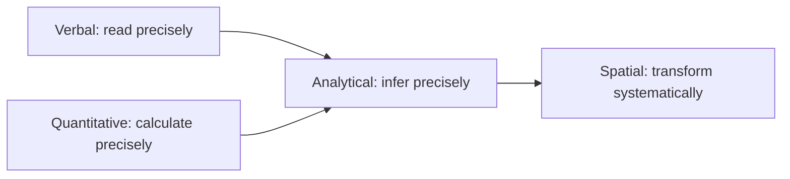

# General Aptitude

> **Paper:** CS+DA · **Weight:** 15 marks · **Priority:** P0

General Aptitude is common to both papers and contributes 15 of 100 marks. Study it in short, frequent sessions: reading and grammar are skill based, while arithmetic and reasoning improve through timed practice.

| Order | Chapter | Focus |
|---|---|---|
| 1 | [Verbal aptitude](verbal-aptitude.md) | Grammar, vocabulary, reading, sequencing |
| 2 | [Quantitative aptitude](quantitative-aptitude.md) | Arithmetic, charts, elementary probability |
| 3 | [Analytical aptitude](analytical-aptitude.md) | Deduction, patterns, arrangements |
| 4 | [Spatial aptitude](spatial-aptitude.md) | Transformations and visual patterns |

**Mental model:** Every question gives enough information. Identify what is being asked, represent the given facts, then eliminate choices that add assumptions.

Connections: [propositional logic](../01-discrete-mathematics/propositional-logic.md) formalises conditional language; [probability basics](../02-probability-statistics/probability-basics.md) extends elementary counting; [exam strategy](../EXAM-STRATEGY.md) helps allocate time.

[Cheatsheet](CHEATSHEET.md) · [Checkpoint](CHECKPOINT.md) · [Roadmap](../ROADMAP.md) · [Connections](../CONNECTIONS.md) · [Progress](../PROGRESS.md)
