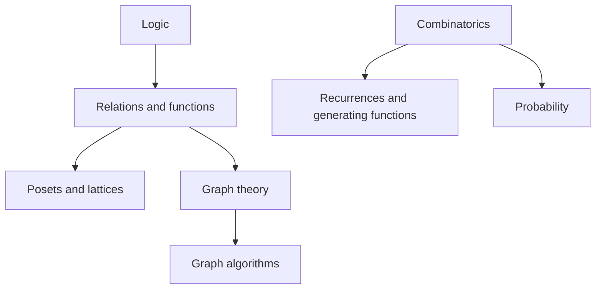

# Discrete Mathematics

> **Paper:** CS · **Priority:** P0/P1

Discrete mathematics provides the language for algorithms, automata, databases, and logic. Start with logic and sets, then study orders and algebra, then counting and graphs; recurrences connect the counting ideas to algorithm analysis.

| Order | Chapter | Priority | Main use |
|---|---|---|---|
| 1 | [Propositional logic](propositional-logic.md) | P0 | Truth, implication, equivalence |
| 2 | [First-order logic](first-order-logic.md) | P1 | Predicates and quantifiers |
| 3 | [Sets, relations, functions](sets-relations-functions.md) | P0 | Relations, equivalence, mappings |
| 4 | [Posets and lattices](posets-and-lattices.md) | P1 | Partial orders and bounds |
| 5 | [Algebraic structures](algebraic-structures.md) | P1 | Monoids and groups |
| 6 | [Combinatorics](combinatorics.md) | P0 | Count without omission or duplication |
| 7 | [Graph theory](graph-theory.md) | P0 | Connectivity, matching, colouring |
| 8 | [Recurrences and generating functions](recurrences-and-generating-functions.md) | P0 | Sequences and algorithm cost |

Connections: [algorithms](../08-algorithms/README.md), [compiler design](../12-compiler-design/README.md), [theory of computation](../11-theory-of-computation/README.md), and [AI logic](../17-artificial-intelligence/logic-and-inference.md).

[Cheatsheet](CHEATSHEET.md) · [Checkpoint](CHECKPOINT.md) · [Roadmap](../ROADMAP.md) · [Connections](../CONNECTIONS.md) · [Progress](../PROGRESS.md)
