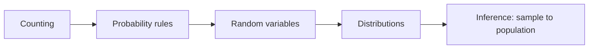

# Probability and Statistics

> **Paper:** CS+DA · **Priority:** P0/P1

Probability quantifies uncertainty; statistics uses samples to reason about a population. First learn events and conditional probability, then random variables and distributions, then inference. DA includes deeper continuous distributions and tests; see [coverage](../COVERAGE.md) for paper tags.

| Order | Chapter | Focus |
|---|---|---|
| 1 | [Probability basics](probability-basics.md) | Counting, events, conditional probability, Bayes |
| 2 | [Random variables and moments](random-variables-and-moments.md) | PMF/PDF/CDF, expectation, variance |
| 3 | [Discrete distributions](discrete-distributions.md) | Bernoulli, binomial, geometric, Poisson |
| 4 | [Continuous distributions](continuous-distributions.md) | Uniform, exponential, normal, t, chi-square |
| 5 | [Statistical inference](statistical-inference.md) | Sampling, CLT, intervals, hypothesis tests |

Connections: [combinatorics](../01-discrete-mathematics/combinatorics.md) counts outcomes; [linear algebra](../03-linear-algebra/README.md) represents covariance and PCA; [ML foundations](../16-machine-learning/ml-foundations.md) uses likelihood and validation.

[Cheatsheet](CHEATSHEET.md) · [Checkpoint](CHECKPOINT.md) · [Roadmap](../ROADMAP.md) · [Connections](../CONNECTIONS.md) · [Progress](../PROGRESS.md)
