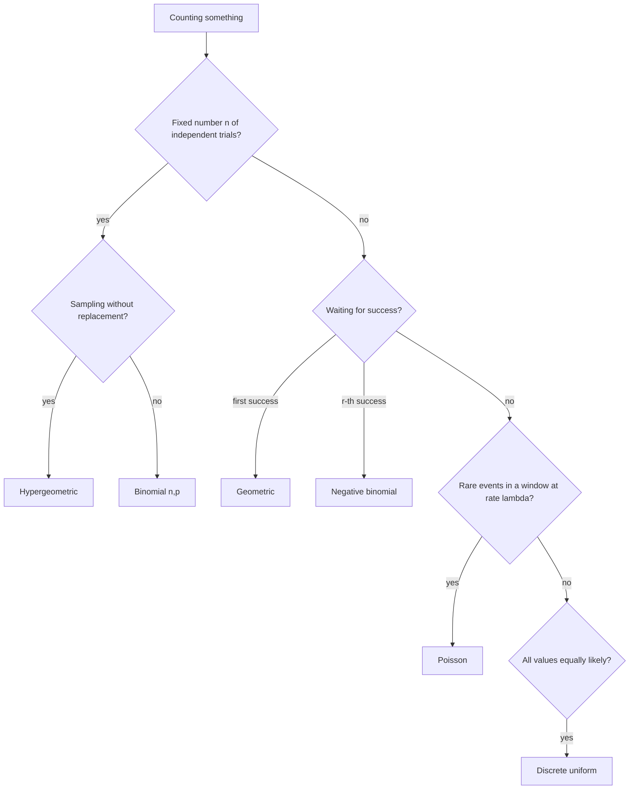

# Discrete distributions

> **Paper:** CS+DA · **Priority:** P0 · **Plan topics:** Bernoulli distribution; Binomial distribution; Uniform distribution (discrete); Poisson distribution (plus geometric, negative binomial, hypergeometric as needed extras)
> **Prerequisites:** [Random variables and moments](random-variables-and-moments.md) · **Leads to:** [Continuous distributions](continuous-distributions.md) · [Statistical inference](statistical-inference.md)

## Quick glance

| Distribution | PMF | Mean | Variance |
|---|---|---|---|
| Bernoulli$(p)$ | $p^x(1-p)^{1-x}$, $x\in\{0,1\}$ | $p$ | $pq$ |
| Binomial$(n,p)$ | $\binom nkp^kq^{n-k}$ | $np$ | $npq$ |
| Discrete uniform on $\{a..b\}$ | $\frac1{b-a+1}$ | $\frac{a+b}2$ | $\frac{(b-a+1)^2-1}{12}$ |
| Geometric$(p)$ (trials) | $q^{k-1}p$, $k\ge1$ | $1/p$ | $q/p^2$ |
| Poisson$(\lambda)$ | $e^{-\lambda}\lambda^k/k!$ | $\lambda$ | $\lambda$ |

- Binomial = number of successes in $n$ independent Bernoulli trials; Poisson = binomial limit with $n\to\infty$, $p\to0$, $np=\lambda$ (rare events).
- **Geometric is memoryless**: $P(X>s+t\mid X>s)=P(X>t)$.
- Poisson mean = variance; sum of independent Poissons is Poisson with summed rates.
- **#1 trap:** geometric has two conventions (trials vs failures). GATE usually uses "number of trials until first success", mean $1/p$.

## 1. Bernoulli distribution

One trial, success with probability $p$ ($q=1-p$). $X=1$ on success, $0$ otherwise.

- $E[X]=p$; $E[X^2]=p$, so $\mathrm{Var}=p-p^2=pq$. Maximum variance $\frac14$ at $p=\frac12$.
- An **indicator variable** $I_A$ of an event $A$ is Bernoulli$(P(A))$.

## 2. Binomial distribution

**Setting.** $n$ independent Bernoulli$(p)$ trials; $X$ = number of successes. Write $X=\sum_{i=1}^nI_i$.

$$P(X=k)=\binom nkp^kq^{n-k},\ k=0..n$$

**Mean and variance by indicators:** $E[X]=\sum E[I_i]=np$; independence gives $\mathrm{Var}X=\sum\mathrm{Var}I_i=npq$.

| Fact | Statement |
|---|---|
| Mode | $\lfloor(n+1)p\rfloor$ (two modes $(n+1)p-1,\ (n+1)p$ if $(n+1)p$ is an integer) |
| Ratio | $\dfrac{P(k+1)}{P(k)}=\dfrac{(n-k)p}{(k+1)q}$ |
| Additivity | $\mathrm{Bin}(n_1,p)+\mathrm{Bin}(n_2,p)=\mathrm{Bin}(n_1+n_2,p)$ (independent, same $p$) |
| Symmetry | $p=\frac12$: $P(k)=P(n-k)$ |
| Complement | $n-X\sim\mathrm{Bin}(n,q)$ |

**Worked example 1 — exact value.** $X\sim\mathrm{Bin}(10,0.3)$, $P(X=3)=\binom{10}3(0.3)^3(0.7)^7=120\times0.027\times0.0823543=\mathbf{0.2668}$. Mode $=\lfloor11\times0.3\rfloor=3$ ✓.

**Worked example 2 — at least one.** 5 independent items each defective with prob $0.2$: $P(\ge1\text{ defective})=1-0.8^5=1-0.32768=\mathbf{0.6723}$.

**Worked example 3 — cumulative.** Fair coin tossed 6 times: $P(X\le2)=\frac{\binom60+\binom61+\binom62}{64}=\frac{1+6+15}{64}=\frac{22}{64}=0.34375$. And $P(\ge6\text{ heads in 10})=\frac{210+120+45+10+1}{1024}=\frac{386}{1024}=0.3770$.

**Worked example 4 — recover $n,p$.** Mean $6$, variance $4$: $np=6$, $npq=4\Rightarrow q=\frac23,\ p=\frac13,\ n=18$.

**Worked example 5 — guessing.** 10 four-option MCQs guessed at random: $X\sim\mathrm{Bin}(10,0.25)$; $P(X\ge8)=\binom{10}8(0.25)^8(0.75)^2+\binom{10}9(0.25)^9(0.75)+(0.25)^{10}=0.000416$.

**Hypergeometric (sampling without replacement).** $N$ items, $K$ successes, draw $n$ without replacement; $P(X=k)=\dfrac{\binom Kk\binom{N-K}{n-k}}{\binom Nn}$, $E[X]=n\frac KN$, $\mathrm{Var}=n\frac KN\left(1-\frac KN\right)\frac{N-n}{N-1}$. Example: 5 cards, exactly 2 hearts: $\frac{\binom{13}2\binom{39}3}{\binom{52}5}=\frac{78\times9139}{2598960}=0.2743$. When $N\gg n$ it is close to $\mathrm{Bin}(n,K/N)$.

## 3. Discrete uniform distribution

$X$ equally likely on $\{a,a+1,\dots,b\}$, $m=b-a+1$ values: $P(X=k)=1/m$.

- $E[X]=\dfrac{a+b}2$; $\mathrm{Var}X=\dfrac{m^2-1}{12}$.
- Derivation for $\{1..m\}$: $E[X]=\frac{m+1}2$, $E[X^2]=\frac{(m+1)(2m+1)}6$, so $\mathrm{Var}=\frac{(m+1)(2m+1)}6-\frac{(m+1)^2}4=\frac{m^2-1}{12}$.

**Worked example 6 — fair die.** $m=6$: mean $3.5$, variance $\frac{35}{12}=2.917$. For $\{10,\dots,20\}$: $m=11$, mean $15$, variance $\frac{120}{12}=10$.

## 4. Geometric distribution

**Setting.** Independent Bernoulli$(p)$ trials; $X$ = **trial number of the first success**, $k=1,2,\dots$

$$P(X=k)=q^{k-1}p,\quad P(X>k)=q^k,\quad E[X]=\frac1p,\quad \mathrm{Var}X=\frac q{p^2}$$

(Alternative convention counts **failures** before the first success: $Y=X-1$, $P(Y=k)=q^kp$, $E[Y]=q/p$, same variance.)

**Memoryless:** $P(X>s+t\mid X>s)=\dfrac{q^{s+t}}{q^s}=q^t=P(X>t)$ — the process "forgets" past failures. It is the only memoryless discrete distribution.

**Worked example 7 — rolling for a six.** $p=\frac16$. $P(X=3)=(\frac56)^2\frac16=0.1157$; $E[X]=6$; $\mathrm{Var}=\frac{5/6}{1/36}=30$. $P(X>6\mid X>3)=P(X>3)=(\frac56)^3=0.5787$.

**Derivation of the mean** by tail sum: $E[X]=\sum_{k\ge0}P(X>k)=\sum q^k=\frac1{1-q}=\frac1p$.

**Negative binomial.** Trials until the $r$-th success: $P(X=k)=\binom{k-1}{r-1}p^rq^{k-r}$, $k\ge r$; mean $r/p$, variance $rq/p^2$ (sum of $r$ independent geometrics). Example: fair coin, 3rd head on toss 5: $\binom42\frac1{32}=\frac6{32}=0.1875$; expected tosses $=3/0.5=6$.

## 5. Poisson distribution

**Setting.** Counts of events occurring independently at a constant average rate $\lambda$ per interval (calls per minute, typos per page, packets per second, defects per metre).

$$P(X=k)=\frac{e^{-\lambda}\lambda^k}{k!},\quad k=0,1,2,\dots;\quad E[X]=\mathrm{Var}X=\lambda$$

**Check it is a PMF:** $\sum_k\lambda^k/k!=e^\lambda$, so the probabilities sum to 1.

**Mean:** $\sum_kk\frac{e^{-\lambda}\lambda^k}{k!}=\lambda e^{-\lambda}\sum_{k\ge1}\frac{\lambda^{k-1}}{(k-1)!}=\lambda$. Similarly $E[X(X-1)]=\lambda^2$, so $E[X^2]=\lambda^2+\lambda$ and $\mathrm{Var}=\lambda$.

**Mode:** $\lfloor\lambda\rfloor$ (and also $\lambda-1$ when $\lambda$ is an integer). Ratio $P(k+1)/P(k)=\lambda/(k+1)$.

**Additivity:** independent $X_i\sim\mathrm{Pois}(\lambda_i)$ $\Rightarrow\sum X_i\sim\mathrm{Pois}(\sum\lambda_i)$. Rate scales with the window: $\lambda$ per minute $\Rightarrow$ $\lambda t$ in $t$ minutes.

**Poisson as a binomial limit.** Put $p=\lambda/n$:

$$\binom nk\Big(\frac\lambda n\Big)^k\Big(1-\frac\lambda n\Big)^{n-k}=\frac{\lambda^k}{k!}\cdot\frac{n(n-1)\cdots(n-k+1)}{n^k}\cdot\Big(1-\frac\lambda n\Big)^n\Big(1-\frac\lambda n\Big)^{-k}\ \xrightarrow{n\to\infty}\ \frac{\lambda^k}{k!}\cdot1\cdot e^{-\lambda}\cdot1.$$

Use it when $n$ is large ($\ge50$) and $p$ small ($\le0.1$).

**Worked example 8 — calls.** Calls arrive at $\lambda=3$ per minute.

- $P(X=2)=e^{-3}\frac{9}{2}=0.04979\times4.5=\mathbf{0.2240}$.
- $P(X\ge1)=1-e^{-3}=\mathbf{0.9502}$.
- $P(X\le2)=e^{-3}(1+3+4.5)=8.5\times0.04979=0.4232$.
- In 2 minutes $\lambda=6$: $P(\text{no calls})=e^{-6}=0.002479$.
- Modes: $\lambda=3$ is an integer, so $P(2)=P(3)=0.2240$.

**Worked example 9 — Poisson approximating binomial.** $X\sim\mathrm{Bin}(100,0.02)$: exact $P(X=3)=\binom{100}3(0.02)^3(0.98)^{97}=0.18228$. Poisson with $\lambda=2$: $e^{-2}\frac{8}{6}=0.18045$. Close ($\sim1\%$ error).

**Worked example 10 — find $\lambda$.** $P(X=1)=P(X=2)$: $\lambda e^{-\lambda}=\frac{\lambda^2}2e^{-\lambda}\Rightarrow\lambda=2$. Then $P(X=3)=e^{-2}\frac86=0.1804$ and $P(X\le1)=3e^{-2}=0.4060$.

**Poisson process.** Events at rate $\lambda$ with independent, stationary increments: count in $[0,t]$ is $\mathrm{Pois}(\lambda t)$ and **inter-arrival times are $\mathrm{Exp}(\lambda)$** — see [Continuous distributions](continuous-distributions.md). Thinning: if each event is kept independently with prob $r$, the kept events form a Poisson process of rate $r\lambda$.

## 6. Choosing a distribution

## Master table of discrete distributions

| Distribution | Parameters | Support | PMF | Mean | Variance | Typical use |
|---|---|---|---|---|---|---|
| Bernoulli | $p$ | $\{0,1\}$ | $p^x q^{1-x}$ | $p$ | $pq$ | single yes/no trial, indicator |
| Binomial | $n,p$ | $0..n$ | $\binom nkp^kq^{n-k}$ | $np$ | $npq$ | successes in $n$ trials |
| Discrete uniform | $a,b$ | $a..b$ | $\frac1{b-a+1}$ | $\frac{a+b}2$ | $\frac{m^2-1}{12}$ | die, random index |
| Geometric | $p$ | $1,2,\dots$ | $q^{k-1}p$ | $\frac1p$ | $\frac q{p^2}$ | trials to first success |
| Negative binomial | $r,p$ | $r,r+1,\dots$ | $\binom{k-1}{r-1}p^rq^{k-r}$ | $\frac rp$ | $\frac{rq}{p^2}$ | trials to $r$-th success |
| Hypergeometric | $N,K,n$ | $\max(0,n-N+K)..\min(n,K)$ | $\frac{\binom Kk\binom{N-K}{n-k}}{\binom Nn}$ | $\frac{nK}N$ | $n\frac KN\frac{N-K}N\frac{N-n}{N-1}$ | sampling without replacement |
| Poisson | $\lambda$ | $0,1,2,\dots$ | $\frac{e^{-\lambda}\lambda^k}{k!}$ | $\lambda$ | $\lambda$ | rare events per interval |

## Formulas and facts to memorise

| Item | Formula / fact | When to use |
|---|---|---|
| Binomial | $\binom nkp^kq^{n-k}$, $np$, $npq$ | fixed trials |
| Binomial mode | $\lfloor(n+1)p\rfloor$ | most likely count |
| Geometric | $q^{k-1}p$, $P(X>k)=q^k$, mean $1/p$ | first success |
| Memoryless | $P(X>s+t\mid X>s)=P(X>t)$ | geometric, exponential |
| Poisson | $e^{-\lambda}\lambda^k/k!$, mean = var = $\lambda$ | rare events |
| Poisson ≈ Binomial | $n\ge50$, $p\le0.1$, $\lambda=np$ | approximate cumulative |
| Poisson additivity | $\lambda=\sum\lambda_i$ | merged streams |
| Discrete uniform | var $=(m^2-1)/12$ | die: $35/12$ |
| Hypergeometric | mean $nK/N$ | without replacement |

## GATE traps

- **Geometric convention:** "trials until first success" ($k\ge1$, mean $1/p$) vs "failures before first success" ($k\ge0$, mean $q/p$). Read the question.
- **Poisson rate must match the window:** $\lambda=3$ per minute becomes $6$ for two minutes — rescale before using the formula.
- **Binomial needs independence and constant $p$;** drawing without replacement is hypergeometric.
- **Poisson variance equals the mean**; if a question gives mean $\ne$ variance, it is not Poisson.
- **Binomial variance $npq$, not $np$.** Maximum at $p=\frac12$.
- **Mode of Poisson with integer $\lambda$ has two values** ($\lambda-1$ and $\lambda$).
- **Discrete uniform variance** uses the number of values $m$ in $\frac{m^2-1}{12}$, not $b-a$ (that is for the continuous uniform: $\frac{(b-a)^2}{12}$).
- **"At least" problems:** complement ($1-P(X=0)$ or $1-P(X\le k-1)$); watch strict vs non-strict inequalities for discrete $X$.
- **Sum of independent binomials is binomial only if $p$ is the same.**

## Connections

- [Random variables and moments](random-variables-and-moments.md) — indicators give $np$ and the hypergeometric mean; moment formulas are applied here.
- [Probability basics](probability-basics.md) — binomial = counting + independence; hypergeometric = classical probability.
- [Continuous distributions](continuous-distributions.md) — exponential waiting times of a Poisson process; geometric $\to$ exponential limit; normal approximates the binomial and Poisson.
- [Statistical inference](statistical-inference.md) — CLT with binomial sums; tests and CIs for proportions.
- [Hashing](../08-algorithms/hashing.md) — balls-into-bins loads are binomial/Poisson; expected probes use geometric.
- [Computer networks: data-link layer](../15-computer-networks/data-link-layer.md) — slotted ALOHA success $=Gp e^{-G}$ with Poisson arrivals; stop-and-wait with error probability uses geometric retransmissions.
- [Classification methods (ML)](../16-machine-learning/classification-methods.md) — Bernoulli/multinomial naive Bayes; logistic regression models a Bernoulli outcome.

## Practice

**Q1 (NAT).** $X\sim\mathrm{Bin}(4,\frac12)$. Find $P(X=2)$.

Answer

**Answer:** 0.375  
**Solution:** $\binom42/16=6/16=0.375$.

**Q2 (MCQ).** A Binomial random variable has mean 6 and variance 4. Then $n$ is
(A) 12 (B) 18 (C) 20 (D) 36

Answer

**Answer:** (B)  
**Solution:** $np=6$, $npq=4\Rightarrow q=2/3$, $p=1/3$, $n=18$.

**Q3 (NAT).** For $X\sim\mathrm{Poisson}(\lambda)$ with $P(X=1)=P(X=2)$, find $P(X=3)$ to 3 decimals.

Answer

**Answer:** 0.180  
**Solution:** $\lambda e^{-\lambda}=\frac{\lambda^2}2e^{-\lambda}\Rightarrow\lambda=2$. $P(3)=e^{-2}2^3/6=0.13534\times1.3333=0.1804$.

**Q4 (NAT).** A fair die is rolled until a 6 appears. Expected number of rolls, and $P(\text{more than 6 rolls needed}\mid\text{more than 3 needed})$ to 3 decimals; report the second.

Answer

**Answer:** 0.579 (mean = 6)  
**Solution:** Geometric $p=1/6$, mean $6$. Memorylessness: $P(X>6\mid X>3)=P(X>3)=(5/6)^3=0.5787$.

**Q5 (MSQ).** Which are correct?
(A) Poisson distribution has equal mean and variance.
(B) The sum of two independent Poisson variables is Poisson.
(C) Geometric distribution is memoryless.
(D) $\mathrm{Bin}(5,0.5)+\mathrm{Bin}(5,0.2)\sim\mathrm{Bin}(10,\cdot)$.

Answer

**Answer:** (A), (B), (C)  
**Solution:** (D) false: binomial additivity needs the same $p$; the sum has mean $3.5$ and variance $1.25+0.8=2.05$, which no $\mathrm{Bin}(10,p)$ matches ($10p=3.5\Rightarrow p=0.35$, variance $2.275$).

**Q6 (NAT).** $X\sim\mathrm{Bin}(100,0.02)$. Using the Poisson approximation, $P(X\le1)$ to 3 decimals.

Answer

**Answer:** 0.406  
**Solution:** $\lambda=2$; $e^{-2}(1+2)=3\times0.13534=0.4060$. (Exact binomial: $0.98^{100}+100(0.02)(0.98)^{99}=0.4033$.)

**Q7 (NAT).** A hash table has 100 slots; 20 keys are hashed uniformly and independently. Expected number of pairs of keys that collide.

Answer

**Answer:** 1.9  
**Solution:** $\binom{20}2/100=190/100=1.9$ (indicator per pair, $P=1/100$).

**Q8 (NAT).** A fair coin is tossed until the third head. Find the probability that exactly 5 tosses are needed, and the expected number of tosses; report the product $P\times E$ to 3 decimals.

Answer

**Answer:** 1.125  
**Solution:** Negative binomial $r=3,p=\frac12$: $P(X=5)=\binom42\frac1{32}=0.1875$; $E=r/p=6$. Product $=1.125$.

---
[Probability & Statistics README](README.md) · [Cheat sheet](CHEATSHEET.md) · [Checkpoint](CHECKPOINT.md)
