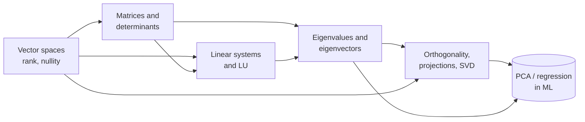

# 03 · Linear Algebra

> **Paper:** CS+DA · **Prerequisites:** [Sets, relations, functions](../01-discrete-mathematics/sets-relations-functions.md) (functions, basic proofs) · school-level matrices
> **Weightage:** CS paper about 2–3 marks, DA paper about 8–12 marks. In DA this is one of the highest-yield subjects; in CS it is a quick, high-accuracy source of marks.
> **Quick links:** [CHEATSHEET](CHEATSHEET.md) · [CHECKPOINT](CHECKPOINT.md)

## Why this subject matters / mental model

A matrix is a **machine that transforms vectors**. Everything in the subject answers one of four questions about that machine:

1. **What can it reach and what does it destroy?** Column space, null space, rank, nullity ([Vector spaces](vector-spaces.md)).
2. **Can I undo it, and what happens to volumes?** Inverse, determinant, special matrices ([Matrices and determinants](matrices-and-determinants.md)).
3. **Given the output, what was the input?** Solving Ax = b, elimination, LU ([Linear systems and LU](linear-systems-and-lu.md)).
4. **Which directions does it only stretch?** Eigenvectors, eigenvalues, and for rectangular matrices singular values ([Eigenvalues](eigenvalues-and-eigenvectors.md), [Orthogonality, projections, SVD](orthogonality-projections-svd.md)).

The same few numbers decide most questions: **rank, determinant, trace and eigenvalues**. Learn to move between them quickly (trace = sum of eigenvalues, det = product, rank = number of non-zero singular values, rank = trace for projections).

For DA, linear algebra is the language of [regression](../16-machine-learning/linear-and-logistic-regression.md), [PCA](../16-machine-learning/dimensionality-reduction-pca.md) and [neural networks](../16-machine-learning/neural-networks.md).

## Reading order

| # | Chapter | Priority | Plan topics covered |
|---|---|---|---|
| 1 | [Vector spaces](vector-spaces.md) | P0 | Vectors and vector spaces; Subspaces; Linear dependence and independence; Rank; Nullity |
| 2 | [Matrices and determinants](matrices-and-determinants.md) | P0 | Matrices and matrix operations; Determinants; Idempotent matrices; Partition matrices and properties; Quadratic forms |
| 3 | [Linear systems and LU](linear-systems-and-lu.md) | P0 | Systems of linear equations and solutions; Gaussian elimination; LU decomposition |
| 4 | [Eigenvalues and eigenvectors](eigenvalues-and-eigenvectors.md) | P0 | Eigenvalues and eigenvectors (also determinants, rank links) |
| 5 | [Orthogonality, projections, SVD](orthogonality-projections-svd.md) | P1 | Orthogonal matrices; Projection matrices; Projections; Singular value decomposition |

## Chapter dependencies

## Study advice
- Do the chapters in order; each takes 1–2 sittings. After each, redo the practice questions without looking.
- Drill by hand: 2 × 2 and 3 × 3 determinants, row reduction to find rank, characteristic polynomials via trace/det shortcuts. These are NAT staples with tiny margin for arithmetic error.
- Memorise the **special-matrix eigenvalue table** and the **consistency conditions** for Ax = b; they appear almost every year.

## Connections to other subjects
- [Probability and statistics](../02-probability-statistics/random-variables-and-moments.md) — covariance matrices are symmetric positive semi-definite; Markov chain steady states are eigenvectors for λ = 1.
- [Calculus and optimisation](../04-calculus-optimization/maxima-minima-optimization.md) — Hessian definiteness (quadratic forms) classifies critical points; least squares minimises a quadratic.
- [Discrete mathematics: graph theory](../01-discrete-mathematics/graph-theory.md) — adjacency and Laplacian matrices, spectra, powers of the adjacency matrix count walks.
- [Recurrences](../01-discrete-mathematics/recurrences-and-generating-functions.md) — matrix powers and diagonalisation solve linear recurrences.
- [Linear and logistic regression](../16-machine-learning/linear-and-logistic-regression.md), [PCA](../16-machine-learning/dimensionality-reduction-pca.md), [neural networks](../16-machine-learning/neural-networks.md) — matrices, projections, eigen/SVD, matrix products everywhere.
- [Probabilistic reasoning](../17-artificial-intelligence/probabilistic-reasoning.md) — transition matrices, Gaussian covariances.
- [Algorithms](../08-algorithms/asymptotic-analysis.md) — Gaussian elimination Θ(n³), matrix multiplication (Strassen) in divide and conquer ([D&C](../08-algorithms/divide-and-conquer.md)).

[Roadmap](../ROADMAP.md) · [Connections](../CONNECTIONS.md) · [Progress](../PROGRESS.md)
