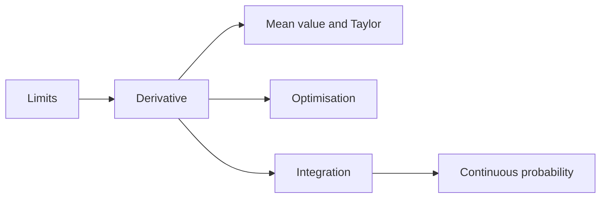

# Calculus and Optimization

> **Paper:** CS+DA · **Priority:** P0/P1

Calculus studies local change (derivatives) and accumulated change (integrals). Optimisation uses derivatives to find candidate extrema, then checks constraints and boundaries.

| Order | Chapter | Focus |
|---|---|---|
| 1 | [Limits, continuity, differentiability](limits-continuity-differentiability.md) | Local behaviour and derivatives |
| 2 | [Mean value theorems and Taylor](mean-value-theorems-and-taylor.md) | Global consequences and approximation |
| 3 | [Maxima, minima, optimization](maxima-minima-optimization.md) | Critical points and constrained extrema |
| 4 | [Integration](integration.md) | Accumulation and area |

Connections: [linear algebra](../03-linear-algebra/README.md) supplies quadratic forms; [ML regression](../16-machine-learning/linear-and-logistic-regression.md) minimises loss; [continuous probability](../02-probability-statistics/continuous-distributions.md) integrates densities.

[Cheatsheet](CHEATSHEET.md) · [Checkpoint](CHECKPOINT.md) · [Roadmap](../ROADMAP.md) · [Connections](../CONNECTIONS.md) · [Progress](../PROGRESS.md)
