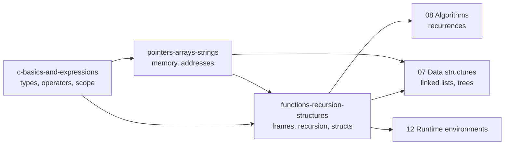

# 05 · C Programming

> **Paper:** CS (the DA paper tests Python instead: see [Python programming](../06-python-programming/README.md)) · **Priority:** P0
> **Prerequisites:** [Number representation](../09-digital-logic/number-representation-and-arithmetic.md) (two's complement) · **Leads to:** [Data structures](../07-data-structures/README.md), [Algorithms](../08-algorithms/README.md), [Compiler design: runtime environments](../12-compiler-design/runtime-environments.md)

## Weightage

C and Data Structures ("Programming and Data Structures") together carry about **8-12 marks** in the CS paper every year. Typical split: 2-4 marks of pure C tracing (output of a program, pointer arithmetic, recursion, static variables), 2-3 marks of data-structure code (linked list, tree, stack), the rest data-structure theory. C tracing questions are among the most reliably scoring marks: no formula to forget, only discipline.

## Why this subject matters / mental model

C is the "language of the exam": almost every code snippet in GATE, in every subject (algorithms, OS, DS, compilers), is C or C-like. The language is small, so questions test whether you can **simulate the machine precisely**: what bytes live where, which operand is converted, which side effect has happened, which frame a variable belongs to.

Mental model in three layers:

1. **Values and types**: every expression has a type; conversions (promotion, signed to unsigned) happen silently and change results.
2. **Memory**: variables are named byte ranges; pointers are addresses; arrays are consecutive elements; the stack holds frames, the heap holds `malloc` blocks.
3. **Control and calls**: evaluation order, short-circuit, loops, and calls that push and pop frames (recursion).

Whenever a trace feels ambiguous, draw memory boxes and the call stack on paper. Machine assumption used throughout: **LP64 (`int` 4, `long`/pointer 8), little-endian, two's complement**; always obey sizes stated in the question.

## Reading order

| # | Chapter | Priority | Plan topics covered |
|---|---|---|---|
| 1 | [C basics and expressions](c-basics-and-expressions.md) | P0 | C syntax and semantics; Tracing C programs and expressions |
| 2 | [Pointers, arrays, strings](pointers-arrays-strings.md) | P0 | Pointers; Arrays in C; Memory and pointer reasoning |
| 3 | [Functions, recursion, structures](functions-recursion-structures.md) | P0 | Functions; Recursion in C; Structures; Memory and pointer reasoning |

Revision aids: [CHEATSHEET](CHEATSHEET.md) · [CHECKPOINT](CHECKPOINT.md)

## Connections to other subjects

- [Number representation](../09-digital-logic/number-representation-and-arithmetic.md) — two's complement explains unsigned wrap, `~x = -x-1`, signed/unsigned conversions.
- [Data structures](../07-data-structures/README.md) — every DS implementation question is C with structs, pointers and recursion.
- [Algorithms](../08-algorithms/README.md) — recursive code to recurrences; array-based algorithm tracing.
- [Compiler design: runtime environments](../12-compiler-design/runtime-environments.md) — activation records, static vs dynamic scoping, parameter-passing modes.
- [Operating systems: memory management](../13-operating-systems/memory-management.md) — process image (text, data, heap, stack), virtual addresses.
- [Computer organization](../10-computer-organization/instruction-sets-and-addressing.md) — endianness, addressing modes behind `a[i]`, cache behaviour of row-major traversal.
- [Python programming](../06-python-programming/README.md) — the DA counterpart: same tracing skills, different semantics (references, scoping).

[Roadmap](../ROADMAP.md) · [Connections](../CONNECTIONS.md) · [Progress](../PROGRESS.md)
