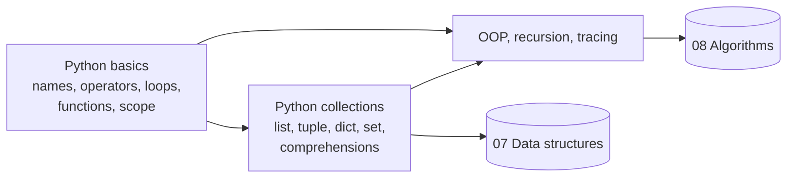

# 06 · Python Programming (DA)

**Prerequisites:** none strictly; [C basics and expressions](../05-c-programming/c-basics-and-expressions.md) helps for the contrast between C and Python semantics. Basic loops and functions are assumed.

**Paper:** DA only (the CS paper tests C instead). **Approximate weightage:** about 2 to 4 questions (roughly 4 to 6 marks) in the DA paper, almost always as *output prediction* or *tracing* items. Together with [Data structures](../07-data-structures/README.md) and [Algorithms](../08-algorithms/README.md) it forms the programming block of the DA paper.

## Why this subject matters / mental model

GATE DA does not ask you to write Python. It gives a 5 to 15 line program and asks what it prints, how many times something executes, or what a variable holds at the end. The marks are lost on a handful of *semantic* surprises, not on syntax.

The mental model that resolves almost all of them: **a variable is a label stuck on an object**. Assignment copies the label, never the object. Mutable objects (list, dict, set, instances) can change under every label; immutable ones (int, str, tuple) can only be re-labelled. Add three more rules and you are done: floor division and sign of `%`, default arguments are evaluated once, and name lookup follows LEGB (late binding for closures).

Always trace on paper with a table of variable values (and a call tree for recursion), then confirm.

## Reading order

| Chapter | Priority | Plan topics covered |
| --- | --- | --- |
| [Python basics](python-basics.md) | P0 | Python syntax; Variables and expressions; Functions; Iteration and loops |
| [Python collections](python-collections.md) | P0 | Lists; Tuples; Dictionaries; Sets; Comprehensions |
| [Python OOP, recursion, tracing](python-oop-recursion-tracing.md) | P0 | Classes/basic OOP; Recursion; Tracing Python programs |

Revision aids: [CHEATSHEET.md](CHEATSHEET.md) (one page) · [CHECKPOINT.md](CHECKPOINT.md) (12 mixed questions).

## Dependency of chapters

## Connections to other subjects

- [C programming](../05-c-programming/README.md) — same style of question (predict the output), but C truncates division, has fixed-width ints, call-by-value and raw pointers; Python floors, has big ints and shares references.
- [Data structures](../07-data-structures/README.md) — list = dynamic array, `append`/`pop` = stack, `collections.deque` = queue, dict/set = hash table.
- [Algorithms](../08-algorithms/README.md) — recursion, memoization (top-down DP), sorting with `sorted`, counting loop iterations for complexity.
- [Machine learning](../16-machine-learning/README.md) — NumPy/pandas style code relies on slicing, comprehensions and aliasing rules from this section.
- [Discrete mathematics](../01-discrete-mathematics/README.md) — set operations, relations as sets of tuples, recurrences implemented recursively.

[Roadmap](../ROADMAP.md) · [Connections](../CONNECTIONS.md) · [Progress](../PROGRESS.md)
