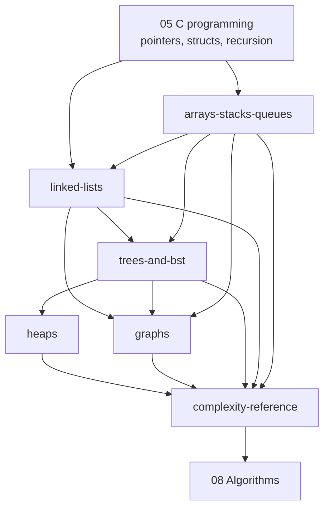

# 07 · Data Structures

> **Paper:** CS+DA (the DA syllabus lists the same structures plus hash tables, whose analysis lives in [hashing](../08-algorithms/hashing.md))
> **Prerequisites:** [C programming](../05-c-programming/README.md) (CS) or [Python programming](../06-python-programming/README.md) (DA) · **Leads to:** [Algorithms](../08-algorithms/README.md), [Databases (indexing)](../14-databases/file-organization-and-indexing.md), [Operating systems](../13-operating-systems/README.md)

## Weightage

Together with C programming, "Programming and Data Structures" is worth about **8-12 marks** in the CS paper every year; in the DA paper data structures appear as 2-5 marks (stacks, queues, trees, heaps, graphs, complexity). Typical questions: output/trace of a stack or queue program, infix/postfix, BST/AVL insertion and traversal, heap construction, linked-list code completion, tree counting properties, representation and operation costs.

## Why this subject matters / mental model

A data structure is a **contract between operations and cost**. The same collection of keys can live in an array (fast index, slow insert), a linked list (fast insert, slow index), a heap (fast min), a BST (fast ordered operations), or a hash table (fast lookup, no order). Almost every algorithm in [08 Algorithms](../08-algorithms/README.md) is a data-structure choice plus a loop: BFS = queue, DFS = stack, Dijkstra = heap, Kruskal = sorted edge list + union-find.

Mental model: for every structure, memorise (1) its **invariant** (LIFO; sorted inorder; parent ≥ children; |balance factor| ≤ 1), (2) the **picture** (draw it), (3) the **cost** of the five operations (access, search, insert, delete, min). GATE questions are then either "apply the invariant by hand" (traces) or "state the cost" (complexity).

## Reading order

| # | Chapter | Priority | Plan topics covered |
|---|---|---|---|
| 1 | [Arrays, stacks, queues](arrays-stacks-queues.md) | P0 | Arrays; Stacks; Queues |
| 2 | [Linked lists](linked-lists.md) | P0 | Linked lists |
| 3 | [Trees and BST](trees-and-bst.md) | P0 | Trees; Binary search trees (incl. AVL) |
| 4 | [Heaps](heaps.md) | P0 | Binary heaps (priority queues) |
| 5 | [Graphs](graphs.md) | P0 | Graphs (terminology, representations) |
| 6 | [Complexity reference](complexity-reference.md) | P0 | Data-structure operations and complexity |

Revision aids: [CHEATSHEET](CHEATSHEET.md) · [CHECKPOINT](CHECKPOINT.md)

## Connections to other subjects

- [C programming](../05-c-programming/README.md) — every implementation uses structs, pointers, `malloc` and recursion.
- [Algorithms](../08-algorithms/README.md) — traversals, shortest paths, MSTs, sorting, hashing use these structures; complexity analysis continues there.
- [Discrete mathematics](../01-discrete-mathematics/README.md) — graph theory, Catalan numbers (stack permutations, binary trees), recurrences for AVL heights.
- [Databases](../14-databases/README.md) — B/B+ trees and hash indexes are the disk-based descendants of BST and hash tables.
- [Operating systems](../13-operating-systems/README.md) — ready queues, free lists, page tables as arrays, resource-allocation graphs.
- [Compiler design](../12-compiler-design/README.md) — parse trees, expression trees, stacks in parsers, symbol tables (hash), control-flow graphs.
- [Theory of computation](../11-theory-of-computation/README.md) — the stack as the memory of a PDA.
- [Artificial intelligence](../17-artificial-intelligence/README.md) — search frontiers (stack, queue, priority queue), Bayesian-network DAGs.
- [Machine learning](../16-machine-learning/README.md) — decision trees, k-d trees, heaps for nearest neighbours.

[Roadmap](../ROADMAP.md) · [Connections](../CONNECTIONS.md) · [Progress](../PROGRESS.md)
