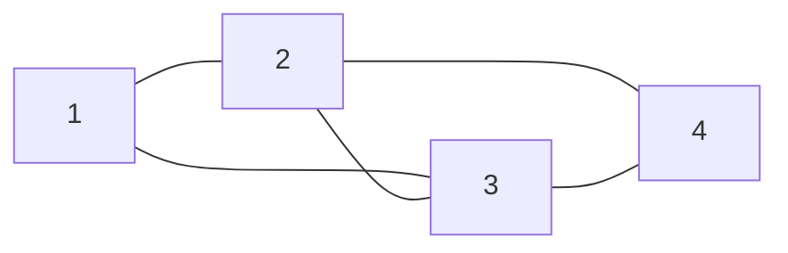

# Graphs: Terminology and Representations

> **Paper:** CS+DA · **Priority:** P0 · **Plan topics:** Graphs; Data-structure operations and complexity
> **Prerequisites:** [Linked lists](linked-lists.md), [Arrays](arrays-stacks-queues.md), [Trees](trees-and-bst.md) · **Leads to:** [Graph traversals](../08-algorithms/graph-traversals.md), [Shortest paths](../08-algorithms/shortest-paths.md), [Minimum spanning trees](../08-algorithms/minimum-spanning-trees.md), [Graph theory](../01-discrete-mathematics/graph-theory.md)

## Quick glance

- A **graph** `G = (V, E)`: vertices and edges. **Undirected**: edge `{u, v}`; **directed**: arc `(u, v)` from `u` to `v`. `n = |V|`, `e = |E|`.
- **Handshake lemma:** `Σ deg(v) = 2e` (undirected), so the number of odd-degree vertices is even. Directed: `Σ indeg = Σ outdeg = e`.
- **Maximum edges** (simple graph): undirected `n(n-1)/2`; directed `n(n-1)`. A **tree** has `n - 1` edges and is connected and acyclic.
- **Adjacency matrix:** `n × n`, `A[i][j] = 1` iff edge `i → j`; **space Θ(n²)**, edge test O(1), listing neighbours Θ(n). **Adjacency list:** array of lists; **space Θ(n + e)** (each undirected edge stored twice), edge test O(deg), neighbours O(deg).
- **Sparse** (`e ≈ n`): use lists. **Dense** (`e ≈ n²`): matrix is fine.
- **BFS/DFS:** O(n + e) with lists, **O(n²)** with a matrix. **Dijkstra / Prim:** O(n²) with matrix + array, O((n + e) log n) with lists + binary heap.
- Entry `(A^k)[i][j]` = number of **walks of length k** from `i` to `j`; for an undirected simple graph, `trace(A³)/6` = number of triangles.
- **Incidence matrix:** `n × e`; an undirected graph's column has two 1's. **Edge list:** `e` pairs (+ weights); good for sorting edges (Kruskal).

## 1. Terminology

A graph models pairwise relationships: cities and roads, web pages and links, tasks and dependencies.

| Term | Meaning |
|---|---|
| Undirected / directed (digraph) | edges unordered pairs / ordered pairs |
| Weighted | each edge has a number (cost, distance) |
| Adjacent | `u`, `v` joined by an edge; the edge is **incident** to both |
| Degree `deg(v)` | number of incident edges (a self-loop counts 2); directed: in-degree, out-degree |
| Simple graph | no self-loops, no parallel edges; **multigraph** allows parallel edges |
| Path / walk | sequence of vertices joined by edges; a **path** repeats no vertex, a **walk** may |
| Cycle | closed path with distinct vertices (≥ 3 for undirected simple graphs) |
| Connected | every pair joined by a path (undirected); **strongly connected**: directed paths both ways |
| Component | maximal connected subgraph |
| Subgraph / spanning subgraph | subset of vertices and edges / all vertices |
| Complete graph `K_n` | every pair adjacent: `n(n-1)/2` edges |
| Bipartite | vertices split into two sets, edges only across (no odd cycle) |
| DAG | directed acyclic graph |
| Tree / forest | connected acyclic / acyclic |
| Sparse / dense | `e = O(n)` / `e = Θ(n²)` |

**Counting.** A simple undirected graph on `n` vertices has at most `C(n,2)` edges, so there are `2^C(n,2)` labelled graphs. A connected graph has at least `n - 1` edges; a graph with `e < n - 1` is certainly disconnected. A simple graph with `k` components and `n` vertices has at least `n - k` edges.

**Handshake lemma.** Every edge adds 1 to each of two degrees, so `Σ deg(v) = 2e`. Worked check: a graph on 5 vertices with degrees `3, 3, 2, 2, 2` has `e = 12/2 = 6`; degrees `3, 3, 3, 2, 2` sum to 13: **impossible** (odd).

## 2. Representations

Running example, undirected, vertices `1..4`, edges `{1,2}, {1,3}, {2,3}, {2,4}, {3,4}` (K₄ without the edge `{1,4}`):

```text
   1 ----- 2          edges: 1-2, 1-3, 2-3, 2-4, 3-4
   |     / |          (a square 1-2-4-3 with the diagonal 2-3)
   |   /   |
   | /     |
   3 ----- 4
```


### 2.1 Adjacency matrix

```text
      1 2 3 4
  1 [ 0 1 1 0 ]
  2 [ 1 0 1 1 ]
  3 [ 1 1 0 1 ]
  4 [ 0 1 1 0 ]
```
- Undirected: **symmetric**, diagonal 0 (simple). Row sum = degree (2, 3, 3, 2). Directed: row sum = out-degree, column sum = in-degree. Weighted: store the weight (and `∞`/0 for no edge).
- **Space Θ(n²)** regardless of `e` (n²/2 suffices for symmetric storage: see triangular storage in [arrays](arrays-stacks-queues.md)).
- Edge query / insert / delete: **O(1)**. Neighbours of `v` / degree of `v`: **Θ(n)** (scan a row). Add a vertex: O(n²) (rebuild) unless over-allocated.

### 2.2 Adjacency list

```text
1: -> 2 -> 3
2: -> 1 -> 3 -> 4
3: -> 1 -> 2 -> 4
4: -> 2 -> 3
```
```c
struct enode { int to; int w; struct enode *next; };
struct enode *adj[N];                 /* array of linked-list heads */
void addEdge(int u, int v, int w) {   /* directed u->v; call twice for undirected */
    struct enode *p = malloc(sizeof *p); p->to = v; p->w = w; p->next = adj[u]; adj[u] = p;
}
```
- **Space Θ(n + e)**: `n` list heads plus `2e` nodes (undirected) or `e` nodes (directed).
- Edge query `(u, v)`: **O(deg(u))**. Neighbours of `v`: **O(deg(v))** (optimal). Insert edge: O(1) at the head. Delete edge: O(deg).
- Replacing the lists by hash sets gives O(1) expected edge query.

### 2.3 Incidence matrix and edge list

**Incidence matrix** `B` (`n × e`): undirected `B[v][j] = 1` if vertex `v` is an end of edge `j`; directed: `+1` at the tail, `-1` at the head. Each undirected column has exactly two 1's, each row sum = degree. Space `Θ(n·e)`: wasteful, but algebraically useful (e.g. the oriented incidence matrix of a connected graph has rank `n - 1`; see [graph theory](../01-discrete-mathematics/graph-theory.md)).

For the example, with edges in the order `e1 = 12, e2 = 13, e3 = 23, e4 = 24, e5 = 34`:
```text
      e1 e2 e3 e4 e5
  1 [  1  1  0  0  0 ]
  2 [  1  0  1  1  0 ]
  3 [  0  1  1  0  1 ]
  4 [  0  0  0  1  1 ]
```
**Edge list:** `(1,2), (1,3), (2,3), (2,4), (3,4)`, space Θ(e); finding neighbours is O(e), but it is ideal for sorting edges by weight (Kruskal, Bellman-Ford).

### 2.4 Comparison

| Operation | Adjacency matrix | Adjacency list | Edge list |
|---|---|---|---|
| Space | Θ(n²) | Θ(n + e) | Θ(e) |
| Is `(u,v)` an edge? | **O(1)** | O(deg u) | O(e) |
| List neighbours of `v` | Θ(n) | **O(deg v)** | O(e) |
| Degree of `v` | Θ(n) (O(1) if stored) | O(deg v) (O(1) if stored) | O(e) |
| Add edge | O(1) | O(1) | O(1) |
| Delete edge | O(1) | O(deg) | O(e) |
| Add vertex | O(n²) rebuild | O(1) | O(1) |
| Iterate over all edges | Θ(n²) | Θ(n + e) | Θ(e) |

**Worked example 1 (memory).** `n = 1000` vertices, `e = 5000` undirected edges, a pointer = 8 bytes, an `int` = 4. Matrix of `int`: `10^6 × 4 = 4 MB` (or 125 KB if bits). List: 1000 heads × 8 + 10000 nodes × 16 = 8 KB + 160 KB = 168 KB. The list wins for this sparse graph; for a complete graph (`e ≈ 500 000`) the matrix wins.

**Rule of thumb:** matrix when `e = Θ(n²)` or constant-time edge tests are crucial; list when `e = O(n)`.

## 3. Algorithm cost depends on the representation

| Algorithm | Adjacency matrix | Adjacency list |
|---|---|---|
| BFS / DFS | **O(n²)** (scan a row per vertex) | **O(n + e)** |
| Connected components, cycle detection | O(n²) | O(n + e) |
| Topological sort | O(n²) | O(n + e) |
| Dijkstra | O(n²) with an array | O((n + e) log n) binary heap; O(e + n log n) Fibonacci heap |
| Prim | O(n²) | O((n + e) log n) |
| Kruskal | needs an edge list: O(e log e) | O(e log e) |
| Bellman-Ford | O(n·e) (O(n³) from a matrix) | O(n·e) |
| Floyd-Warshall | O(n³) (matrix natural) | O(n³) |

**Why BFS is O(n + e) with lists.** Each vertex is dequeued once (n steps) and its list is scanned once, so the total number of list nodes examined is `Σ deg(v) = 2e` (undirected) or `e` (directed). With a matrix, scanning a row costs `n` per vertex: `n²` total, regardless of `e`.

**Dijkstra choice.** For dense graphs (`e ≈ n²`) the O(n²) array version beats the heap version (O(n² log n)); for sparse graphs the heap version (O(n log n)) wins. Details: [shortest paths](../08-algorithms/shortest-paths.md), [graph traversals](../08-algorithms/graph-traversals.md).

## 4. Walks and the adjacency matrix

**Theorem.** `(A^k)[i][j]` equals the number of walks of length `k` from `i` to `j`. Reason: `(A^2)[i][j] = Σ_m A[i][m]·A[m][j]` counts intermediate vertices `m` with `i → m → j`; induct on `k`.

**Worked example 2.** Directed graph on 1..4 with arcs `1→2, 1→3, 2→3, 3→4, 4→1`:

```text
 A  =  [0 1 1 0]      A² = [0 0 1 1]      A³ = [1 0 0 1]
       [0 0 1 0]           [0 0 0 1]           [1 0 0 0]
       [0 0 0 1]           [1 0 0 0]           [0 1 1 0]
       [1 0 0 0]           [0 1 1 0]           [0 0 1 1]
```
- `A²[1][3] = 1`: the only 2-walk from 1 to 3 is `1→2→3`; `A²[1][4] = 1` (`1→3→4`).
- `A³[1][1] = 1`: the closed 3-walk `1→3→4→1`. `trace(A³) = 3`: the directed triangle `1→3→4→1` is counted from each of its three starting vertices.
- **Reachability** (transitive closure): `(I + A)^(n-1)` (Boolean) or Warshall's algorithm; the shortest path length from `i` to `j` is the smallest `k` with `A^k[i][j] > 0`.

**Worked example 3 (triangles).** Undirected example graph (5 edges, above): `A³` has diagonal `2, 4, 4, 2`, trace 12, triangles = `12/6 = 2` (triangles `{1,2,3}` and `{2,3,4}`). Each triangle gives 6 closed 3-walks (3 starting points × 2 directions).

**Degree facts from the matrix.** Undirected: `A·1 = degree vector`; `trace(A²) = Σ deg(v) = 2e`.

## 5. Special graphs and quick facts

- **Complete bipartite `K_{m,n}`:** `mn` edges. **Bipartite ⇔ no odd cycle ⇔ 2-colourable** ([graph theory](../01-discrete-mathematics/graph-theory.md)).
- **Tree facts:** `n - 1` edges; unique path between any two vertices; adding any edge creates exactly one cycle; removing any edge disconnects it; at least 2 leaves for `n ≥ 2`.
- **Number of spanning trees of `K_n`:** `n^(n-2)` (Cayley); for `K_4`: 16.
- **DAG:** has a topological order; adjacency matrix can be made strictly upper triangular by relabelling.
- **Directed graph max edges** `n(n-1)` (no self-loops); with self-loops `n²`.
- **Regular graph:** all degrees equal `k`, `e = nk/2` (so `nk` must be even). 3-regular needs even `n`.
- **Planar graphs:** `e ≤ 3n - 6` (n ≥ 3), Euler `n - e + f = 2` for connected planar graphs.

## Formulas and facts to memorise

| Item | Formula/fact | When to use |
|---|---|---|
| Handshake | Σ deg = 2e | edge counting |
| Max edges | n(n-1)/2 undirected, n(n-1) directed | density bounds |
| Min edges, connected | n - 1 | tree test |
| Matrix space / list space | Θ(n²) / Θ(n + e) | representation choice |
| Edge test | O(1) matrix / O(deg) list | operation costs |
| BFS/DFS | O(n²) matrix / O(n + e) list | traversal cost |
| Dijkstra | O(n²) array / O((n+e) log n) heap | choice by density |
| Walks | (A^k)[i][j] | path counting |
| Triangles | trace(A³)/6 | undirected simple graph |
| Spanning trees of K_n | n^(n-2) | counting |
| k-regular | e = nk/2 | degree questions |

## GATE traps

- **Undirected edges are stored twice** in adjacency lists (and symmetric in the matrix): list space is `n + 2e`, not `n + e`.
- **Counting edges:** `Σ deg = 2e`, so do not divide by 2 again for directed in/out sums (`Σ outdeg = e`).
- **BFS on a matrix is O(n²)**, not O(n + e); Dijkstra's O(n²) vs O((n + e) log n) depends on density.
- **Edge test on a list** is O(deg), not O(1).
- **Walk vs path:** `(A^k)` counts walks (repeated vertices allowed).
- **Self-loops** add 2 to a degree in undirected graphs.
- **Max edges** differ for directed (`n(n-1)`) and undirected (`n(n-1)/2`).
- **A graph with degree sequence summing to an odd number** does not exist.
- **Multigraph vs simple graph:** the matrix then stores counts (A[i][j] can exceed 1).

## Connections

- [Graph theory](../01-discrete-mathematics/graph-theory.md) — connectivity, matching, colouring, Euler/Hamilton, planarity.
- [Linked lists](linked-lists.md) — adjacency lists are arrays of lists.
- [Arrays, stacks, queues](arrays-stacks-queues.md) — matrix storage (symmetric = triangular); BFS queue and DFS stack.
- [Trees and BST](trees-and-bst.md) — trees as acyclic connected graphs.
- [Graph traversals](../08-algorithms/graph-traversals.md) — BFS, DFS, topological sort, SCC.
- [Shortest paths](../08-algorithms/shortest-paths.md) — Dijkstra, Bellman-Ford, Floyd-Warshall.
- [Minimum spanning trees](../08-algorithms/minimum-spanning-trees.md) — Prim and Kruskal.
- [Heaps](heaps.md) — the priority queue behind Dijkstra and Prim.
- [Hashing](../08-algorithms/hashing.md) — hash-set adjacency for O(1) edge queries.
- [Linear algebra: eigenvalues](../03-linear-algebra/eigenvalues-and-eigenvectors.md) — spectra of adjacency matrices, powers counting walks.
- [Deadlocks](../13-operating-systems/deadlocks.md) — resource-allocation graphs, cycle detection.
- [Databases: transactions](../14-databases/transactions-and-concurrency.md) — precedence graphs for conflict serialisability.
- [Compiler optimisation](../12-compiler-design/optimization-and-dataflow.md) — control-flow graphs.
- [Probabilistic reasoning](../17-artificial-intelligence/probabilistic-reasoning.md) — Bayesian networks are DAGs.
- [Computer networks: routing](../15-computer-networks/routing.md) — networks as weighted graphs.

## Practice

**Q1 (NAT, easy).** A simple undirected graph has 6 vertices with degrees `4, 3, 3, 2, 2, x`. Find `x` if the graph has 9 edges.

<details><summary>Answer</summary>

**Answer:** 4  
**Solution:** `Σ deg = 2·9 = 18`; `4 + 3 + 3 + 2 + 2 = 14`, so `x = 4`.

</details>

**Q2 (NAT).** Maximum number of edges in a simple directed graph with 10 vertices (no self-loops, at most one arc per ordered pair)?

<details><summary>Answer</summary>

**Answer:** 90  
**Solution:** `n(n-1) = 10·9 = 90`.

</details>

**Q3 (MCQ).** For a graph with `n` vertices and `e` edges stored as an adjacency list, the time for BFS is  (A) O(n²)  (B) O(n + e)  (C) O(e log n)  (D) O(n·e)

<details><summary>Answer</summary>

**Answer:** (B)  
**Solution:** Each vertex is enqueued once and each adjacency list scanned once: total `n + Σ deg = n + 2e`.

</details>

**Q4 (NAT).** An undirected simple graph has adjacency matrix `A` with `trace(A³) = 24`. How many triangles does it contain?

<details><summary>Answer</summary>

**Answer:** 4  
**Solution:** Each triangle yields 6 closed walks of length 3: `24 / 6 = 4`.

</details>

**Q5 (MCQ).** Which operation is asymptotically *faster* with an adjacency matrix than with an adjacency list?  (A) list all neighbours of a vertex  (B) test whether edge (u, v) exists  (C) BFS on a sparse graph  (D) count all edges

<details><summary>Answer</summary>

**Answer:** (B)  
**Solution:** The matrix answers in O(1); the list needs O(deg(u)). The others are equal or better with lists.

</details>

**Q6 (NAT).** A directed graph has `A² = [[0,0,1,1],[0,0,0,1],[1,0,0,0],[0,1,1,0]]` as in Worked example 2. How many walks of length 2 exist in total?

<details><summary>Answer</summary>

**Answer:** 6  
**Solution:** Sum all entries of `A²`: 2 + 1 + 1 + 2 = 6.

</details>

**Q7 (MSQ).** Which are true for a connected simple undirected graph with `n ≥ 3` vertices? (A) It has at least `n - 1` edges. (B) It has at most `n(n-1)/2` edges. (C) If it has exactly `n - 1` edges it is a tree. (D) The number of odd-degree vertices is even. (E) An adjacency list always uses less memory than an adjacency matrix.

<details><summary>Answer</summary>

**Answer:** A, B, C, D  
**Solution:** (E) false for dense graphs: list space `n + 2e` can exceed `n²` bits/cells when `e ≈ n²/2`, and each list node also carries a pointer.

</details>

**Q8 (NAT, harder).** A graph has `n = 2000` vertices and `e = 3000` edges. Compare Dijkstra's running time (as number of basic steps, ignoring constants) with the array version `n²` and the heap version `(n + e) log₂ n` (take `log₂ 2000 ≈ 11`). How many times larger is the array version than the heap version, to the nearest integer?

<details><summary>Answer</summary>

**Answer:** 73  
**Solution:** Array: `2000² = 4 000 000`. Heap: `(2000 + 3000)·11 = 55 000`. Ratio `4 000 000 / 55 000 ≈ 72.7 ≈ 73`: the sparse graph strongly favours the heap version.

</details>
