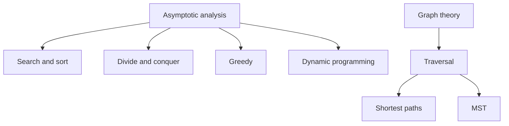

# Algorithms

> **Paper:** CS+DA · **Priority:** P0/P1

Learn to state an algorithm precisely, prove why it works, and derive its cost. Asymptotic analysis and data structures are prerequisites; graph algorithms build on graph terminology.

| Order | Chapter | Core idea |
|---|---|---|
| 1 | [Asymptotic analysis](asymptotic-analysis.md) | Growth, recurrences, bounds |
| 2 | [Searching and sorting](searching-and-sorting.md) | Search and comparison sorts |
| 3 | [Divide and conquer](divide-and-conquer.md) | Recursive decomposition |
| 4 | [Greedy algorithms](greedy-algorithms.md) | Safe local choices |
| 5 | [Dynamic programming](dynamic-programming.md) | Cache overlapping subproblems |
| 6 | [Hashing](hashing.md) | Expected-time dictionary operations |
| 7 | [Graph traversals](graph-traversals.md) | Reachability and order |
| 8 | [Minimum spanning trees](minimum-spanning-trees.md) | Cheapest connectivity |
| 9 | [Shortest paths](shortest-paths.md) | Minimise path weight |

Connections: [data structures](../07-data-structures/README.md) implement queues, heaps, and union-find; [discrete math](../01-discrete-mathematics/README.md) supplies recurrences and graph theory.

[Cheatsheet](CHEATSHEET.md) · [Checkpoint](CHECKPOINT.md) · [Roadmap](../ROADMAP.md) · [Connections](../CONNECTIONS.md) · [Progress](../PROGRESS.md)
