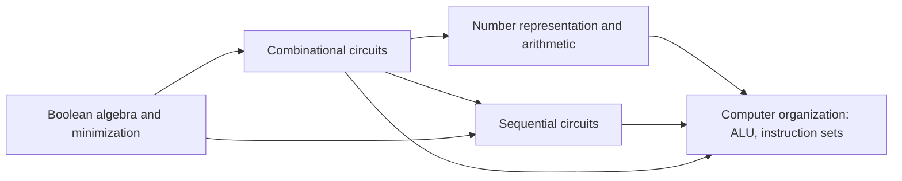

# 09 · Digital Logic

> **Paper:** CS · **Approximate GATE weightage:** 4–6 marks (usually 2–3 questions, mix of 1- and 2-mark, MCQ and NAT)
> **Prerequisites:** [Propositional logic](../01-discrete-mathematics/propositional-logic.md), [Posets and lattices](../01-discrete-mathematics/posets-and-lattices.md) (Boolean algebra as a lattice)

## Why this subject matters / mental model

Digital logic is the bottom layer of every computer: wires carry 0 or 1, gates compute Boolean functions, flip-flops remember bits. Two kinds of circuits cover everything. **Combinational** circuits are pure functions of their inputs (adders, multiplexers, decoders). **Sequential** circuits add memory, so the output depends on history (counters, registers, state machines). Number representation tells you what the bits *mean*: integers, fractions and IEEE 754 floats. In GATE the questions are formulaic and fast once the patterns are internalised: count prime implicants, implement a function with a MUX, trace a counter, find an IEEE 754 value, detect overflow.

## Reading order

| # | Chapter | Priority | Plan topics covered |
|---|---|---|---|
| 1 | [Boolean algebra and minimization](boolean-algebra-and-minimization.md) | P0 | Boolean algebra; Boolean minimization: algebraic technique; Karnaugh maps; Tabular minimization method |
| 2 | [Combinational circuits](combinational-circuits.md) | P0 | Combinational circuit design |
| 3 | [Sequential circuits](sequential-circuits.md) | P0 | Sequential circuit design |
| 4 | [Number representation and arithmetic](number-representation-and-arithmetic.md) | P0 | Number representation; Fixed-point arithmetic; Floating-point arithmetic |

Final revision: [CHEATSHEET.md](CHEATSHEET.md). Self-test: [CHECKPOINT.md](CHECKPOINT.md).

## Chapter dependencies

Chapter 4 can be read right after chapter 1 if you wish (only the adder-subtractor part needs chapter 2).

## Connections to other subjects

- [Propositional logic](../01-discrete-mathematics/propositional-logic.md) — same laws, DNF/CNF equal SOP/POS.
- [Posets and lattices](../01-discrete-mathematics/posets-and-lattices.md) — Boolean algebras are complemented distributive lattices.
- [Regular languages and finite automata](../11-theory-of-computation/regular-languages-and-finite-automata.md) — FSMs, Mealy/Moore, state minimisation.
- [ALU and control unit](../10-computer-organization/alu-and-control-unit.md) — adders, MUXes, decoders, counters build the datapath and hardwired control.
- [Memory hierarchy and cache](../10-computer-organization/memory-hierarchy-and-cache.md) — decoders for memory addressing.
- [Pipelining](../10-computer-organization/pipelining.md) — registers and clock-period reasoning from setup/hold timing.
- [C basics and expressions](../05-c-programming/c-basics-and-expressions.md) — 2's complement overflow, bitwise operators, float behaviour.

Back to the roadmap: [Roadmap](../ROADMAP.md) · [Connections](../CONNECTIONS.md) · [Progress](../PROGRESS.md)

Next in this section: start with [Boolean algebra and minimization](boolean-algebra-and-minimization.md).
