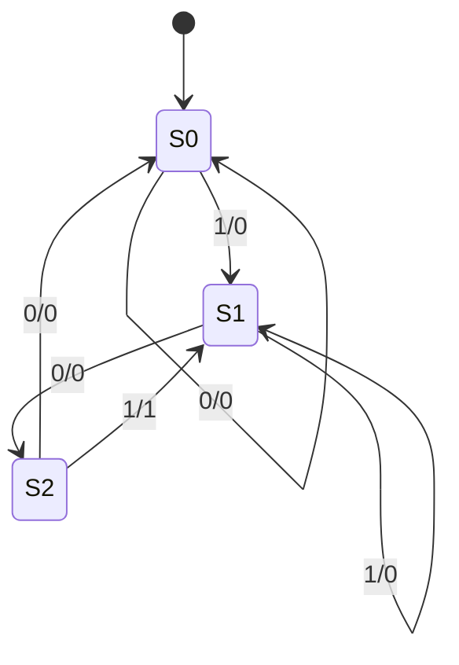

# Sequential Circuits

> **Paper:** CS · **Priority:** P0 · **Plan topics:** Sequential circuit design
> **Prerequisites:** [Combinational circuits](combinational-circuits.md) · **Leads to:** [ALU and control unit](../10-computer-organization/alu-and-control-unit.md), [Pipelining](../10-computer-organization/pipelining.md)

## Quick glance

- **Sequential circuit** = combinational logic + memory (flip-flops). Output depends on inputs **and stored state**. Synchronous circuits change state only on a clock edge.
- **Latch** is level-sensitive (transparent while enable is high); **flip-flop** is edge-triggered (samples on the edge).
- Characteristic equations: **SR** $Q^+ = S + R'Q$ ($SR=0$), **D** $Q^+ = D$, **JK** $Q^+ = JQ' + K'Q$, **T** $Q^+ = T\oplus Q$.
- **Race-around** occurs in a level-triggered JK with $J=K=1$ when the clock pulse is longer than the propagation delay; cured by master-slave or edge triggering.
- Timing: $T_{clk} \ge t_{cq} + t_{comb,max} + t_{su}$ (+ skew). **Hold:** $t_{cq} + t_{comb,min} \ge t_{hold}$ (+ skew), independent of clock period.
- **$n$ flip-flops** give at most $2^n$ states. Mod-$N$ counter needs $\lceil\log_2 N\rceil$ flip-flops.
- **Ring counter:** $n$ FFs, $n$ states. **Johnson (twisted ring):** $n$ FFs, **$2n$** states.
- Ripple (asynchronous) counter: simple but delay accumulates; synchronous counter: all FFs clocked together.
- **Mealy** output depends on state and input (fewer states, output can change between clocks); **Moore** output depends on state only (one more state typical, glitch-free).
- #1 trap: unused states of ring/Johnson/mod-$N$ counters: self-starting? Also confusing excitation tables with characteristic tables.

## 1. Latches

A latch stores one bit using cross-coupled gates (feedback). It is **level-sensitive**.

**SR latch (NOR):** inputs $S$ (set), $R$ (reset).

| S | R | Q+ | Meaning |
|---|---|---|---|
| 0 | 0 | Q | hold |
| 0 | 1 | 0 | reset |
| 1 | 0 | 1 | set |
| 1 | 1 | – | forbidden (both outputs 0, then indeterminate on release) |

An SR latch built from **NAND** gates has active-low inputs: $\bar S=\bar R=0$ is forbidden; $\bar S=\bar R=1$ holds.

**Gated SR / D latch:** add an enable $E$ so that changes happen only while $E=1$. **D latch:** $S = D$, $R = D'$ removes the forbidden state: $Q^+ = D$ while $E=1$, holds when $E=0$. A D latch is **transparent**: $Q$ follows $D$ throughout the enable-high interval.

## 2. Flip-flops

A flip-flop samples its inputs **only at a clock edge**. Master-slave: two latches back to back with opposite enables; master follows input while clock is high, slave copies on the falling edge, so the output changes once per cycle. Edge-triggered flip-flops (positive/negative edge) are the modern form.

### Characteristic tables, equations and excitation tables

| FF | Characteristic table | Characteristic equation | Excitation table (Q → Q+ : inputs) |
|---|---|---|---|
| **SR** | $00\to Q$; $01\to0$; $10\to1$; $11\to$ ✗ | $Q^+ = S + R'Q$, with $SR=0$ | $0\to0$: $S=0,R=X$; $0\to1$: $S=1,R=0$; $1\to0$: $S=0,R=1$; $1\to1$: $S=X,R=0$ |
| **D** | $Q^+ = D$ | $Q^+ = D$ | $0\to0$: $D=0$; $0\to1$: $1$; $1\to0$: $0$; $1\to1$: $1$ |
| **JK** | $00\to Q$; $01\to0$; $10\to1$; $11\to Q'$ | $Q^+ = JQ' + K'Q$ | $0\to0$: $J=0,K=X$; $0\to1$: $J=1,K=X$; $1\to0$: $J=X,K=1$; $1\to1$: $J=X,K=0$ |
| **T** | $T=0\to Q$; $T=1\to Q'$ | $Q^+ = T\oplus Q$ | $0\to0$: $T=0$; $0\to1$: $1$; $1\to0$: $1$; $1\to1$: $0$ |

**The excitation table answers: "which inputs do I need to make this transition?" Use it to design circuits. The characteristic table answers: "what happens for these inputs?" Use it to analyse circuits.**

Derivation of the JK excitation entries: $0\to0$ needs $J=0$ ($K$ arbitrary: $K=0$ holds, $K=1$ resets), $0\to1$ needs $J=1$ ($K=0$ sets, $K=1$ toggles), and so on. The don't-cares are what make JK-based designs smaller.

### Race-around condition
With a **level-triggered** JK and $J=K=1$, $Q$ toggles; if the clock stays high longer than the propagation delay $t_{pd}$, $Q$ toggles again and again during one pulse, so the final value is unpredictable. Condition: $t_{pw} > t_{pd}$.

**Cures:** (1) edge-triggered, (2) master-slave (the master is frozen while the slave is transparent, so only one toggle), (3) pulse width $<t_{pd}$ (impractical). The D, T (as a toggle of an edge-triggered FF) and SR latches do not have a race-around in the JK sense. The master-slave JK suffers from "ones-catching" (a glitch on $J/K$ while clock is high gets captured) in the classic pulse-triggered version.

### Flip-flop conversions
Method: write the excitation inputs of the **given** FF in terms of the new FF's inputs and $Q$ (using the excitation table of the given FF).

| Want ← Have | Inputs of the available FF |
|---|---|
| JK ← SR | $S = JQ'$, $R = KQ$ |
| SR ← JK | $J = S$, $K = R$ (with $SR=0$) |
| D ← JK | $J = D$, $K = D'$ |
| T ← JK | $J = K = T$ |
| JK ← T | $T = JQ' + KQ$ |
| D ← T | $T = D\oplus Q$ |
| T ← D | $D = T\oplus Q$ |
| JK ← D | $D = JQ' + K'Q$ |
| D ← SR | $S = D$, $R = D'$ |
| T ← SR | $S = TQ'$, $R = TQ$ |

(Every row verified exhaustively over all $(inputs, Q)$ combinations.)

**Worked example: T from JK, then divide-by-2.** Tie $J=K=1$: $Q^+ = Q'$, toggles every clock. $Q$ has half the clock frequency: a divide-by-2 circuit. Chaining $n$ of these gives divide by $2^n$.

**Worked example: derive $T = JQ' + KQ$ for JK from T.** Need $Q^+ = JQ'+K'Q$. Toggle is needed exactly when $Q^+\ne Q$: when $Q=0$ and $Q^+=1$ ($J=1$), or $Q=1$ and $Q^+=0$ ($K=1$). So $T = Q'J + QK$. Consistent with the table.

## 3. Timing: setup, hold and maximum clock frequency

- **Setup time $t_{su}$:** data must be stable this long **before** the active edge.
- **Hold time $t_{h}$:** data must stay stable this long **after** the edge.
- **Clock-to-Q $t_{cq}$:** delay from edge to new output.

Between two FFs through combinational logic with delay $t_{comb}$:

$$T_{clk} \ge t_{cq} + t_{comb,max} + t_{su} + t_{skew}, \qquad t_{cq} + t_{comb,min} \ge t_{h} + t_{skew}.$$

$f_{max} = 1/T_{clk,min}$. **Hold violations cannot be fixed by slowing the clock** (the inequality doesn't contain $T_{clk}$); add delay to the short path.

**Worked example.** $t_{cq}=2$ ns, $t_{su}=1$ ns, logic between FFs = 6 ns max: $T_{min} = 2+6+1 = 9$ ns, $f_{max} = 111.1$ MHz. With 0.5 ns skew (capturing clock arrives late the other way): $T_{min}=9.5$ ns, $105.3$ MHz. Hold check with $t_h=1$ ns, $t_{comb,min}=0.2$ ns, $t_{cq,min}=2$: $2.2\ge1$, OK.

**Worked example (pipeline-flavoured).** Three stages with delays 4, 6, 5 ns, register overhead ($t_{cq}+t_{su}$) = 1 ns each. Clock period set by slowest stage: $6+1 = 7$ ns, $f = 142.9$ MHz.

## 4. Registers and shift registers

A **register** is a group of FFs sharing a clock (and often load enable).

**Shift register (D FFs in a chain):** each clock shifts every bit one position.
- **SISO** (serial in, serial out): an $n$-bit delay line; bit entering appears at output after $n$ clocks.
- **SIPO:** serial to parallel converter (after $n$ clocks the parallel output has the word).
- **PISO:** parallel load then shift out (parallel to serial).
- **PIPO:** a plain register.
- Universal shift register: modes hold, shift right, shift left, parallel load (4:1 MUX at each FF input).

**Worked example.** A 4-bit right-shift register initially $Q_3Q_2Q_1Q_0 = 1011$, serial-in $=0$ at $Q_3$. After 1 clock: $0101$; 2: $0010$; 3: $0001$; 4: $0000$. Shifting right with 0 fill divides an unsigned value by 2 (11, 5, 2, 1, 0). Time to shift out an $n$-bit word serially: $n$ clock cycles.

## 5. Counters

A counter steps through a sequence of states on each clock pulse. $n$ flip-flops give at most $2^n$ states; a **mod-$N$ counter** has $N$ states and needs $\lceil\log_2 N\rceil$ FFs.

### Asynchronous (ripple) counters
Each FF toggles ($T=1$ or $J=K=1$) and is clocked by the **previous stage's output**, not the common clock. Up counter: clock each FF from the previous $Q'$ for negative-edge FFs (or $Q$ for positive-edge). Down counter: the other.

- **Mod-$2^n$**, frequency at stage $k$ output = $f_{clk}/2^k$ (the last stage is divide-by-$2^n$).
- **Delay accumulates:** worst-case settling time $= n\cdot t_{pd}$ (all bits ripple, e.g. $0111\to1000$). Max clock frequency $\approx 1/(n\,t_{pd})$ (plus decoding margin). A 4-bit ripple counter with $t_{pd}=10$ ns: settling $40$ ns, so $f_{max}\approx 25$ MHz.
- **Glitches** during ripple make decoding of intermediate states unreliable.
- **Mod-$N$ by reset:** detect state $N$ with a gate and clear asynchronously. For mod-10: NAND of $Q_3$ and $Q_1$ (first time $1010$ is reached) drives the clear. State $1010$ exists for a brief instant, so it glitches.

### Synchronous counters
All FFs share the clock; next-state logic decides which toggle. A synchronous binary up-counter with T FFs: $T_0=1$, $T_1 = Q_0$, $T_2 = Q_1Q_0$, $T_3 = Q_2Q_1Q_0$, i.e. $T_i = \prod_{j<i} Q_j$. Delay $= t_{cq} + t_{AND} + t_{su}$ independent of $n$ (up to fan-in).

| Property | Ripple | Synchronous |
|---|---|---|
| Clock | each FF clocked by previous output | common clock |
| Speed | slow, delay grows with $n$ | fast |
| Hardware | minimum | extra gates |
| Glitches in decode | yes | no |

### Ring and Johnson counters
- **Ring counter:** $n$-FF shift register with $Q_{n-1}$ fed back to input; a single 1 circulates ($1000\to0100\to0010\to0001$). **$n$ states** used, out of $2^n$. Needs initialisation (preset one FF), not self-starting without correction. Output is one-hot, so no decoding needed.
- **Johnson counter:** feedback from $\overline{Q_{n-1}}$. **$2n$ states**: $0000\to1000\to1100\to1110\to1111\to0111\to0011\to0001\to0000$ (for $n=4$). Verified: 8 states, cycle returns to $0000$. Decoding any state needs only 2-input gates. Unused: $2^n - 2n$ states (8 of 16 for $n=4$) in separate cycles unless self-correcting logic is added.

| Counter | FFs for modulus | Used states | Max with $n$ FFs |
|---|---|---|---|
| Binary | $\lceil\log_2N\rceil$ | $N$ | $2^n$ |
| Ring | $N$ | $N$ | $n$ |
| Johnson | $\lceil N/2\rceil$ | $N$ (even) | $2n$ |

## 6. Synchronous counter design from a state diagram

Procedure: (1) state diagram / table; (2) choose FF type; (3) from the excitation table write each FF's input for every present state, treat unused states as don't-cares; (4) minimise by K-map; (5) draw.

**Worked example: mod-6 up counter with T flip-flops.** States $Q_2Q_1Q_0$: $000\to001\to010\to011\to100\to101\to000$; states $110,111$ unused (don't-care).

| Present | Next | Toggles needed $T_2T_1T_0$ |
|---|---|---|
| 000 | 001 | 001 |
| 001 | 010 | 011 |
| 010 | 011 | 001 |
| 011 | 100 | 111 |
| 100 | 101 | 001 |
| 101 | 000 | 101 |

- $T_0$: 1 in every used state, so **$T_0=1$**.
- $T_1$: 1 in states $001$ and $011$ (i.e. $m_1, m_3$), don't-care $m_6,m_7$: $T_1 = Q_2'Q_0$ (group $m_1,m_3$; $m_7$ not needed).
- $T_2$: 1 in $011$ ($m_3$) and $101$ ($m_5$), don't-care $m_6, m_7$: group $m_3,m_7$ $\Rightarrow Q_1Q_0$; group $m_5,m_7\Rightarrow Q_2Q_0$. $T_2 = Q_0(Q_1+Q_2)$.

Check (python-verified): $T_1=Q_2'Q_0$ toggles only in $001,011$; $T_2$ toggles only in $011, 101$ among used states. Self-starting check: from $110$: $T_0=1$, $T_1 = 0$, $T_2 = 0$, so $110\to111$; from $111$: $T_0=1,T_1=0,T_2=1\Rightarrow Q_2\to0, Q_1 \to 1, Q_0\to 0$: $010$. So the counter **is self-starting** (110, 111 flow into the main cycle).

**Worked example: JK design hint.** Use the JK excitation table; entries with $X$ give extra don't-cares, so JK logic is usually simpler than D logic. For a transition $1\to0$ in a stage: $J=X,K=1$.

**Worked example: mod-$N$ counter size.** A mod-12 counter needs $\lceil\log_2 12\rceil = 4$ FFs; a mod-12 Johnson counter needs 6 FFs; a mod-12 ring counter needs 12 FFs.

## 7. Finite state machines: Mealy and Moore

- **Moore:** output = $f(\text{state})$. Output changes only at clock edges (after the state changes).
- **Mealy:** output = $f(\text{state}, \text{input})$. Output can change as soon as the input changes (within the cycle). Typically needs fewer states; outputs can glitch with input glitches.

**Worked example: detect $101$ (overlapping) on a serial input.**

Mealy (3 states): $S_0$ (no progress), $S_1$ (saw 1), $S_2$ (saw 10).

| State | Input 0 | Input 1 |
|---|---|---|
| $S_0$ | $S_0/0$ | $S_1/0$ |
| $S_1$ | $S_2/0$ | $S_1/0$ |
| $S_2$ | $S_0/0$ | $S_1/1$ |

Input $1101101$: outputs $0,0,0,1,0,0,1$ (simulated). Overlap: after detecting $101$ the final $1$ is reused as the start of the next pattern, so $S_2\xrightarrow{1}S_1$.

Moore (4 states): $A$ (start), $B$ (1), $C$ (10), $D$ (101, output 1). $D\xrightarrow{0}C$, $D\xrightarrow{1}B$, $A\xrightarrow{1}B$, $B\xrightarrow{0}C$, $C\xrightarrow{1}D$, $C\xrightarrow{0}A$, $A\xrightarrow{0}A$, $B\xrightarrow{1}B$. The Moore output is the Mealy output **delayed by one clock** (asserted when in state $D$ after the clock edge).

**Rule of thumb:** converting Mealy to Moore may increase the number of states (up to $\#\text{states}\times\#\text{distinct outputs}$); Moore to Mealy never needs more states.

## 8. Analysis: finding the state sequence of a circuit

Procedure: write FF input equations, substitute into characteristic equations to get next-state equations, build a trace (state) table, and read the cycle.

**Worked example 1 (D flip-flops).** $D_A = B$, $D_B = A'$. Start at $AB=00$.

| Clock | A | B | next A = B | next B = A' |
|---|---|---|---|---|
| 0 | 0 | 0 | 0 | 1 |
| 1 | 0 | 1 | 1 | 1 |
| 2 | 1 | 1 | 1 | 0 |
| 3 | 1 | 0 | 0 | 0 |
| 4 | 0 | 0 | | |

Sequence $00\to01\to11\to10\to00$: a mod-4 Gray-code counter (period 4).

**Worked example 2 (JK).** $J_A = B$, $K_A = B'$; $J_B=A'$, $K_B = A$. Next: $A^+ = J_AA' + K_A'A = BA' + BA = B$; $B^+ = A'B' + A'B = A'$ ($J_BB'+K_B'B = A'B' + A'B = A'$). Same as example 1.

**Worked example 3 (state count).** A shift register with $n$ FFs and XOR feedback of two bits (LFSR) cycles through up to $2^n-1$ states. For $n=3$ with feedback $D_0 = Q_2\oplus Q_1$ starting $001$: $001\to010\to101\to011\to111\to110\to100\to001$; shifting left, $D_0=Q_2\oplus Q_1$: $(Q_2Q_1Q_0)=001\to(Q_1Q_0 D_0)=(0,1,0\oplus0=0)$: $010$; next: $Q_2=0,Q_1=1$: $D_0=1$: $(1,0,1)=101$; next: $D_0 = 1\oplus0=1$: $(0,1,1)=011$; next $D_0=0\oplus1=1$: $111$; next $D_0 = 1\oplus1=0$: $110$; next $D_0 = 1\oplus1 = 0$: $100$; next $D_0 = 1\oplus0=1$: $001$. Period 7 $=2^3-1$ (maximal length).

## Formulas and facts to memorise

| Item | Formula/fact | When to use |
|---|---|---|
| SR | $Q^+=S+R'Q$, $SR=0$ | analysis |
| JK | $Q^+=JQ'+K'Q$ | analysis |
| D | $Q^+=D$ | |
| T | $Q^+=T\oplus Q$ | |
| JK excitation | $0\to0$: $0X$; $0\to1$: $1X$; $1\to0$: $X1$; $1\to1$: $X0$ | design |
| Race-around | level JK, $J=K=1$, $t_{pw}>t_{pd}$ | MCQ |
| Setup | $T\ge t_{cq}+t_{comb}+t_{su}$ | max frequency |
| Hold | $t_{cq}+t_{comb,min}\ge t_h$ | independent of $T$ |
| Counter FFs | mod-$N$: $\lceil\log_2N\rceil$ | |
| Ring / Johnson states | $n$ / $2n$ | counters |
| Ripple delay | $n\,t_{pd}$ | speed of async counter |
| Frequency division | stage $k$: $f/2^k$ | counters |
| Mealy vs Moore | output depends on input too / state only | FSM |

## GATE traps

- **JK $J=K=1$** toggles; but with a **level-triggered** FF it races. In an edge-triggered or master-slave FF the same inputs are fine.
- Characteristic table is not the excitation table: **for $Q\to Q^+$ requirements use excitation**.
- Hold time violation is **not fixed by lowering frequency**.
- **Johnson** counter has $2n$ states; **ring** has $n$. A mod-$N$ ring counter needs $N$ FFs, **not** $\log_2N$.
- Unused states: check if the counter is **self-starting**; a ring counter without correction is not.
- Ripple counter: **count the clock to the last FF** — total delay is the sum of all FF delays, so max frequency is limited by $n\,t_{pd}$.
- Mealy output changes **asynchronously** with input; Moore with state. Mealy $\to$ Moore may add states.
- SR latch: $S=R=1$ is forbidden for NOR; for NAND latches the forbidden input is $\bar S=\bar R=0$.
- A D latch is **transparent**; a D flip-flop is not. A "latch" in the question = level, "flip-flop" = edge.

## Connections

- [Combinational circuits](combinational-circuits.md) — next-state and output logic of every FSM is a combinational circuit; adders etc.
- [Boolean algebra and minimization](boolean-algebra-and-minimization.md) — K-maps with don't-cares minimise excitation equations.
- [Number representation and arithmetic](number-representation-and-arithmetic.md) — shift registers perform multiply/divide by 2; Gray codes drive counters.
- [ALU and control unit](../10-computer-organization/alu-and-control-unit.md) — hardwired control units are a sequence counter (ring/binary) plus decoder; registers hold datapath state.
- [Pipelining](../10-computer-organization/pipelining.md) — pipeline registers and clock period $=$ slowest stage $+$ register overhead.
- [Regular languages and finite automata](../11-theory-of-computation/regular-languages-and-finite-automata.md) — Mealy/Moore machines are finite automata with output.

## Practice

**Q1 (MCQ).** Which flip-flop input condition produces toggling in a JK flip-flop?
(a) $J=0,K=0$ (b) $J=1,K=0$ (c) $J=K=1$ (d) $J=0,K=1$

Answer

**Answer:** (c).
**Solution:** $Q^+ = JQ'+K'Q$ with $J=K=1$ gives $Q'$.

**Q2 (NAT).** How many flip-flops are needed for (i) a mod-60 binary counter, (ii) a mod-8 Johnson counter? Give the sum.

Answer

**Answer:** 10.
**Solution:** (i) $\lceil\log_2 60\rceil = 6$. (ii) Johnson has $2n$ states, so $n=4$. Sum $=10$.

**Q3 (MCQ).** A 4-bit ripple counter uses FFs with propagation delay 12 ns each. The maximum clock frequency (reading the count only after all FFs have settled) is approximately:
(a) 83 MHz (b) 41.7 MHz (c) 20.8 MHz (d) 8.3 MHz

Answer

**Answer:** (c).
**Solution:** Worst-case settling $=4\times12 = 48$ ns. $f = 1/48\text{ ns} = 20.8$ MHz.

**Q4 (NAT).** Two edge-triggered FFs are connected through logic with max delay 7 ns. $t_{cq} = 3$ ns, $t_{su} = 2$ ns, no skew. The maximum clock frequency in MHz?

Answer

**Answer:** 83.3 MHz.
**Solution:** $T = 3+7+2 = 12$ ns, $f = 1/12\text{ ns} = 83.3$ MHz.

**Q5 (MSQ).** Which statements are correct?
(a) A D latch is transparent while its enable is high.
(b) The forbidden input of an NOR-based SR latch is $S=R=1$.
(c) A ring counter of 5 FFs has 10 states.
(d) Hold time violations can be removed by reducing the clock frequency.

Answer

**Answer:** (a), (b).
**Solution:** (c) ring has $n=5$ states, Johnson has 10. (d) hold inequality contains no clock period.

**Q6 (NAT).** $D_A = A\oplus B$, $D_B = A'$. Starting from $AB = 11$, how many clock pulses until the state first repeats? (Give the length of the cycle entered.)

Answer

**Answer:** 3.
**Solution:** Next: $A^+ = A\oplus B$, $B^+ = A'$. $11\to(0,0)=00\to(0,1)=01\to(1,1)=11$. Sequence $11,00,01,11$: cycle length 3. (State $10$: $\to(1,0)=10$, a self-loop; not reached from 11.)

**Q7 (MCQ).** To convert a T flip-flop into a D flip-flop we use $T=$
(a) $D$ (b) $D'$ (c) $D\oplus Q$ (d) $D+Q$

Answer

**Answer:** (c).
**Solution:** Need $Q^+=D$; $T\oplus Q = D \Rightarrow T = D\oplus Q$.

**Q8 (NAT).** A synchronous mod-6 counter is built with T flip-flops from the equations $T_0=1$, $T_1 = Q_2'Q_0$, $T_2=Q_0(Q_1+Q_2)$. Starting at $000$, what is the state (as a decimal $Q_2Q_1Q_0$) after 20 clock pulses?

Answer

**Answer:** 2.
**Solution:** Cycle length 6 and $20 \bmod 6 = 2$; after 2 pulses the state is $010 = 2$.

