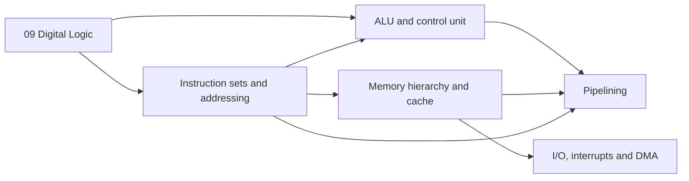

# 10 · Computer Organization and Architecture

> **Paper:** CS · **Approximate GATE weightage:** 8–10 marks (typically 5–7 questions; heavy on cache, pipelining, addressing/instruction formats, and DMA/interrupt numerics; mostly NAT and 2-mark numerics)
> **Prerequisites:** [Digital Logic](../09-digital-logic/README.md) (adders, MUX/decoders, flip-flops, counters, 2's complement, IEEE 754)

## Why this subject matters / mental model

A computer is a loop: **fetch an instruction, decode it, execute it, store the result**. Everything in this section is a different view of that loop. The **ISA** (instruction sets, addressing modes) is the interface to software. The **datapath and control unit** realise it in hardware (ALU, registers, hardwired or microprogrammed control). **Memory hierarchy and cache** hide the slowness of main memory. **I/O, interrupts and DMA** connect the machine to the world without wasting CPU time. **Pipelining** overlaps instructions to raise throughput, at the cost of hazards. GATE questions here are almost all numerical: count bits, count misses, count stalls, compute AMAT/CPI/speedup. Practise each formula until the arithmetic is automatic, and always state the convention you assume.

## Reading order

| # | Chapter | Priority | Plan topics covered |
|---|---|---|---|
| 1 | [Instruction sets and addressing](instruction-sets-and-addressing.md) | P0 | Instruction sets; Addressing modes |
| 2 | [ALU and control unit](alu-and-control-unit.md) | P1 | ALU design; Hardwired control unit; Microprogrammed control unit |
| 3 | [Memory hierarchy and cache](memory-hierarchy-and-cache.md) | P0 | Memory interfacing; Memory hierarchy and performance; Cache memory mapping |
| 4 | [I/O, interrupts and DMA](io-interrupts-dma.md) | P1 | I/O interface; Interrupts; DMA |
| 5 | [Pipelining](pipelining.md) | P0 | Instruction pipelining; Pipeline hazards |

Final revision: [CHEATSHEET.md](CHEATSHEET.md). Self-test: [CHECKPOINT.md](CHECKPOINT.md).

## Chapter dependencies

## Connections to other subjects

- [Digital Logic](../09-digital-logic/README.md) — adders, MUXes, decoders, flip-flops, counters, IEEE 754 are the hardware under every chapter here.
- [C Programming](../05-c-programming/README.md) — pointers, arrays and stack frames map to addressing modes; array traversal order decides cache misses.
- [Operating Systems](../13-operating-systems/README.md) — interrupts, traps, DMA drivers, paging/TLB (same hit-ratio mathematics), context switching.
- [Compiler Design](../12-compiler-design/README.md) — code generation, register allocation, instruction scheduling (hazards), calling conventions.
- [Data Structures](../07-data-structures/README.md) and [Algorithms](../08-algorithms/README.md) — cache-friendly layouts and loop orders; hashing as direct-mapped indexing.
- [Computer Networks](../15-computer-networks/README.md) — NIC DMA, bandwidth/latency calculations similar to bus and pipeline formulas.

Back to the roadmap: [Roadmap](../ROADMAP.md) · [Connections](../CONNECTIONS.md) · [Progress](../PROGRESS.md)

Start with [Instruction sets and addressing](instruction-sets-and-addressing.md).
