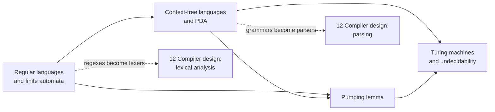

# 11 · Theory of Computation

> **Paper:** CS · **Approximate weightage:** about 7–9 marks (usually 3–5 questions: one or two 2-markers on automata/regex counting, one on CFL/PDA properties, one on decidability/closure)

**Prerequisites:** [Sets, relations, functions](../01-discrete-mathematics/sets-relations-functions.md) (languages are sets, Myhill–Nerode is an equivalence relation) · [Propositional logic](../01-discrete-mathematics/propositional-logic.md) (proof style) · [Graph theory](../01-discrete-mathematics/graph-theory.md) (automata are labelled digraphs; emptiness is reachability).

## Why this subject matters / mental model

Theory of Computation asks: *what can a machine with a given kind of memory do?* The whole subject is one ladder, climbed one memory type at a time.

| Memory | Machine | Languages | Boundary example |
| --- | --- | --- | --- |
| None (finite state) | DFA / NFA | Regular | cannot count a^n b^n |
| One stack | PDA | Context-free | cannot compare three things (a^n b^n c^n) |
| Bounded tape | LBA | Context-sensitive | decidable but harder |
| Unbounded tape | Turing machine | Recursive / RE | cannot decide halting |

Every GATE question is one of: (1) **count or design** (states of a minimal DFA, a regex, a grammar), (2) **classify** (is this language regular / CFL / decidable?), (3) **closure/decision property** (is this operation closed? is this problem decidable?), (4) **prove** (pumping lemma, reduction, Rice). The chapters follow that ladder and the cheat sheet gathers the tables you need.

## Reading order

| # | Chapter | Priority | Plan topics covered |
| --- | --- | --- | --- |
| 1 | [Regular languages and finite automata](regular-languages-and-finite-automata.md) | P0 | Regular expressions; Finite automata; Regular languages |
| 2 | [Context-free languages and PDA](context-free-languages-and-pda.md) | P0 | Context-free grammars; Push-down automata; Context-free languages |
| 3 | [Pumping lemma](pumping-lemma.md) | P0 | Pumping lemma (regular and context-free) |
| 4 | [Turing machines and undecidability](turing-machines-and-undecidability.md) | P0 | Turing machines; Undecidability |

Finish with [CHEATSHEET.md](CHEATSHEET.md) for revision and [CHECKPOINT.md](CHECKPOINT.md) to test yourself.

## Connections to other subjects

- [Lexical analysis](../12-compiler-design/lexical-analysis.md) — regular expressions and DFAs are the specification and implementation of a scanner.
- [Parsing](../12-compiler-design/parsing.md) — LL and LR parsers are deterministic pushdown automata for DCFLs; ambiguity of grammars shows up as parser conflicts.
- [Sequential circuits](../09-digital-logic/sequential-circuits.md) — Mealy and Moore machines are finite automata with output.
- [Graph theory](../01-discrete-mathematics/graph-theory.md) — emptiness, finiteness and state elimination are graph reachability and path questions.
- [Asymptotic analysis](../08-algorithms/asymptotic-analysis.md) — the Turing machine is the reference model for time complexity; undecidability bounds what any algorithm can do.
- [Combinatorics](../01-discrete-mathematics/combinatorics.md) — pigeonhole principle (pumping lemma), Catalan numbers (parse trees).
- [Optimization and data-flow analysis](../12-compiler-design/optimization-and-dataflow.md) — Rice's theorem is why exact program analysis is impossible and compilers use approximations.

**Files:** [CHEATSHEET.md](CHEATSHEET.md) · [CHECKPOINT.md](CHECKPOINT.md)

[Roadmap](../ROADMAP.md) · [Connections](../CONNECTIONS.md) · [Progress](../PROGRESS.md)
