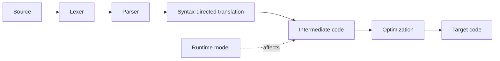

# Compiler Design

> **Paper:** CS · **Priority:** P0/P1

A compiler translates source text through representations that expose different questions: tokens, syntax trees, typed/annotated trees, intermediate code, and target instructions. Each pass preserves program meaning while enabling analysis or transformation.

| Order | Chapter | Focus |
|---|---|---|
| 1 | [Lexical analysis](lexical-analysis.md) | Tokens and finite automata |
| 2 | [Parsing](parsing.md) | Grammars and parser tables |
| 3 | [Syntax-directed translation](syntax-directed-translation.md) | Attributes and translation rules |
| 4 | [Runtime environments](runtime-environments.md) | Storage, calls, activation records |
| 5 | [Intermediate code generation](intermediate-code-generation.md) | TAC and control-flow graphs |
| 6 | [Optimization and dataflow](optimization-and-dataflow.md) | Local/global transformations |

Connections: [theory of computation](../11-theory-of-computation/README.md) provides automata and grammars; [data structures](../07-data-structures/README.md) power symbol tables; [architecture](../10-computer-organization/README.md) motivates target code.

[Cheatsheet](CHEATSHEET.md) · [Checkpoint](CHECKPOINT.md) · [Roadmap](../ROADMAP.md) · [Connections](../CONNECTIONS.md) · [Progress](../PROGRESS.md)
