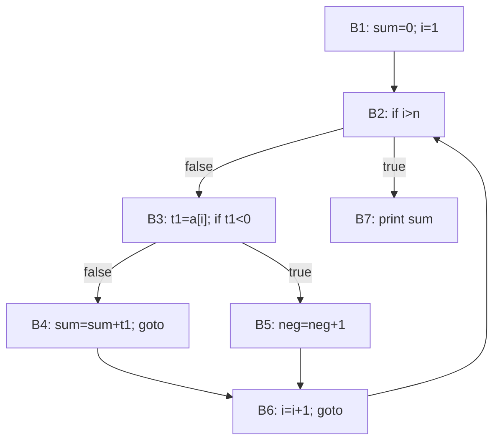

# Intermediate Code Generation

> **Paper:** CS · **Priority:** P0 · **Plan topics:** Intermediate code generation
> **Prerequisites:** [Syntax-directed translation](syntax-directed-translation.md) · [Runtime environments](runtime-environments.md) · **Leads to:** [Optimization and data-flow analysis](optimization-and-dataflow.md)

## Quick glance

- **Intermediate representation (IR):** a machine-independent form between the front end and the back end. With one IR, m front ends × n back ends need only m + n components.
- Common IRs: **syntax trees/DAGs**, **postfix**, **three-address code (3AC)**, **SSA**. 3AC instructions have at most one operator and three addresses: `x = y op z`, `x = op y`, `x = y`, `goto L`, `if x relop y goto L`, `param x / call p, n / return`, `x = a[i]`, `a[i] = x`, `x = &y / *y`.
- Three storage forms: **quadruples** (op, arg1, arg2, result) — 4 fields, temporaries named explicitly; **triples** (op, arg1, arg2) — result is the instruction number, 3 fields, hard to reorder; **indirect triples** — a list of pointers to triples, so reordering only moves pointers.
- **DAG** shares common subexpressions: node count for an expression = distinct leaves + distinct operator nodes. **SSA:** every variable is assigned exactly once; joins use **φ-functions**; number of SSA names = number of definitions (plus φ's).
- **Boolean expressions:** short-circuit evaluation with jumping code: `B1 || B2` jumps to true as soon as B1 is true. `backpatching` fills in jump targets later using truelist/falselist.
- **Arrays (row-major):** address of A[i][j] with lower bounds 0 = base + (i × n₂ + j) × w. Column-major: (j × n₁ + i) × w.
- **Basic block:** maximal straight-line sequence with one entry (first instruction) and one exit (last). **Leaders:** (1) the first instruction; (2) any target of a jump; (3) any instruction right after a jump. Each block runs from a leader to the next leader − 1. The **control-flow graph (CFG)** has blocks as nodes and edges for jumps and fall-through.
- #1 trap: miscounting leaders: the instruction after an **unconditional** goto is also a leader, and so is the instruction after a conditional jump (fall-through path).

## 1. Intermediate representations

| IR | Form | Strength |
| --- | --- | --- |
| Syntax tree | operators as nodes | keeps structure; used by front end |
| DAG | syntax tree with shared subexpressions | exposes common subexpressions |
| Postfix | `ab+c*` | simple stack machine evaluation |
| Three-address code | `t1 = a + b` | close to machine, easy to optimise |
| SSA | 3AC with unique definitions | easy data-flow analysis |
| Bytecode / LLVM IR | typed low-level IR | portable back end |

**Why 3AC?** Each instruction does at most one operation, so complex expressions are broken into temporaries (names `t1, t2, …`), and the order of evaluation is explicit. The names of temporaries become the DAG's interior nodes' names.

### 1.1 Worked example: translating `a = b * -c + b * -c`

Syntax-tree 3AC (no sharing):

```text
t1 = minus c
t2 = b * t1
t3 = minus c
t4 = b * t3
t5 = t2 + t4
a  = t5
```

6 instructions, 5 temporaries. The DAG shares `minus c` and `b * (minus c)`, giving 4 instructions:

```text
t1 = minus c
t2 = b * t1
t5 = t2 + t2
a  = t5
```

**Quadruples** (index, op, arg1, arg2, result) for the 6-instruction version:

| # | op | arg1 | arg2 | result |
| --- | --- | --- | --- | --- |
| 0 | minus | c | | t1 |
| 1 | * | b | t1 | t2 |
| 2 | minus | c | | t3 |
| 3 | * | b | t3 | t4 |
| 4 | + | t2 | t4 | t5 |
| 5 | = | t5 | | a |

**Triples** (the result is referred to by instruction number):

| # | op | arg1 | arg2 |
| --- | --- | --- | --- |
| 0 | minus | c | |
| 1 | * | b | (0) |
| 2 | minus | c | |
| 3 | * | b | (2) |
| 4 | + | (1) | (3) |
| 5 | = | a | (4) |

**Indirect triples:** a separate list `[35→(0), 36→(1), …]` of pointers into the triple table; the optimiser reorders the pointer list instead of renumbering the triples.

| | Quadruples | Triples | Indirect triples |
| --- | --- | --- | --- |
| Fields per instruction | 4 | 3 | 3 (+ 1 pointer entry) |
| Temporaries in symbol table | yes | no | no |
| Moving/optimising code | easy (names fixed) | hard (references are positions) | easy |
| Memory | most | least | in between |

## 2. Translating expressions and statements

**Assignment/expression (SDT):** each expression E gets `E.addr` (the name holding the value) and `E.code`. `E → E₁ + E₂`: `E.addr = newtemp()`, `E.code = E₁.code ∥ E₂.code ∥ gen(E.addr '=' E₁.addr '+' E₂.addr)`. For `id = E`: `gen(id.addr '=' E.addr)`.

**Number of temporaries** = number of operator nodes (without reuse). `x = a + b * c - d / e` has operators *, +, /, − → 4 temporaries:

```text
t1 = b * c
t2 = a + t1
t3 = d / e
t4 = t2 - t3
x  = t4
```

**Control flow.**

```text
while (C) S           L1: if C false goto L2     (jumping code for C)
                           S
                           goto L1
                      L2:

if (C) S1 else S2         if C false goto Lelse
                          S1
                          goto Lend
                      Lelse: S2
                      Lend:

for (i=0; i<n; i++) S     i = 0
                      L1: if i >= n goto L2
                          S
                          i = i + 1
                          goto L1
                      L2:
```

**Procedure calls.** `f(a, b+1)` becomes `param a; t1 = b + 1; param t1; t2 = call f, 2`. The `param` instructions implement the calling sequence ([Runtime environments](runtime-environments.md)).

## 3. Boolean expressions and short-circuit code

**Numerical method:** compute 0/1 into a temporary. **Jumping code (control-flow method):** a boolean is translated into jumps to a *true* label or *false* label, with no value materialised. `&&` and `||` are **short-circuit**: in `B₁ || B₂`, if B₁ is true the code jumps straight to the true label without evaluating B₂; `B₁ && B₂`: if B₁ is false, jump to the false label.

### 3.1 Worked example (with backpatching)

Translate `if (a < b || c < d && e < f) x = 1; else x = 2;`. `&&` binds tighter than `||`, so the condition is `a<b || (c<d && e<f)`. Each relational gives two instructions: `if x relop y goto _` and `goto _` (targets left blank, collected in lists).

1. `a < b`: instr 1 `if a<b goto _`, instr 2 `goto _`. truelist {1}, falselist {2}.
2. Marker M₁ = 3 for the second operand of `||`. `c < d`: instr 3 `if c<d goto _`, instr 4 `goto _`. truelist {3}, falselist {4}. Marker M₂ = 5 for the second operand of `&&`. `e < f`: instr 5 `if e<f goto _`, instr 6 `goto _`. truelist {5}, falselist {6}.
3. `&&`: backpatch({3}, 5). truelist = {5}, falselist = merge({4},{6}) = {4, 6}.
4. `||`: backpatch(falselist of `a<b` = {2}, M₁ = 3). truelist = merge({1},{5}) = {1, 5}, falselist = {4, 6}.
5. `if (B) S1 else S2`: backpatch({1,5}, 7) (S1 starts at 7); S1 = instr 7 `x = 1`, then instr 8 `goto _` (to end); backpatch({4,6}, 9) (S2 starts at 9); S2 = instr 9 `x = 2`; end label is 10.

```text
1: if a < b goto 7
2: goto 3
3: if c < d goto 5
4: goto 9
5: if e < f goto 7
6: goto 9
7: x = 1
8: goto 10
9: x = 2
10: ...
```

Count: 9 instructions plus the next one at 10. The rules used: **B → B₁ || M B₂**: backpatch(B₁.falselist, M.instr); B.truelist = merge(B₁.truelist, B₂.truelist); B.falselist = B₂.falselist. **B → B₁ && M B₂**: backpatch(B₁.truelist, M.instr); B.truelist = B₂.truelist; B.falselist = merge(B₁.falselist, B₂.falselist). **B → !B₁**: swap lists.

**Backpatching** gives one-pass generation of jumps whose targets are not yet known: each unresolved jump is put on a list and later patched when the target label is reached. Functions: `makelist(i)`, `merge(p1, p2)`, `backpatch(p, i)`.

## 4. Arrays

Element size w. **One dimension**, lower bound low: `addr(A[i]) = base + (i − low) × w`.

**Two dimensions, row-major** (C): A[l₁..h₁][l₂..h₂], n₂ = h₂ − l₂ + 1:
`addr(A[i][j]) = base + ((i − l₁) × n₂ + (j − l₂)) × w`.
**Column-major** (FORTRAN): `base + ((j − l₂) × n₁ + (i − l₁)) × w`, n₁ = h₁ − l₁ + 1.

**Worked examples** (all arithmetic checked):
- `int A[10][20]`, base 1000, w = 4, C indexing (0-based): address of A[3][5] = 1000 + (3×20 + 5)×4 = 1000 + 260 = **1260** (row-major); column-major = 1000 + (5×10 + 3)×4 = 1000 + 212 = **1212**.
- Pascal-style `A[1..10][1..20]`: A[3][5] = 1000 + ((3−1)×20 + (5−1))×4 = 1000 + 176 = **1176**.
- 3AC for `x = A[i][j]` (0-based, n₂ = 20, w = 4):

```text
t1 = i * 20
t2 = t1 + j
t3 = t2 * 4
x  = A[t3]            (A[t3] means the word at base(A) + t3)
```

4 instructions; one multiplication by 20, one by 4 (in practice strength-reduced to a shift for w = 4).

For d dimensions row-major: offset = ((i₁ n₂ + i₂) n₃ + i₃) … computed by Horner's rule, d − 1 multiplications by the sizes plus one by w.

## 5. Static single assignment (SSA)

**Definition.** Each variable is assigned at most once in the program text; each use refers to exactly one definition. Where control-flow paths join, a **φ-function** selects the value according to the path taken: `x3 = φ(x1, x2)` (x1 if control came from the first predecessor, x2 if from the second). Easier optimisation: constant propagation, dead-code elimination, global value numbering.

**Worked example 1 (if-else).**

```text
Original               SSA
x = 1                  x1 = 1
y = 2                  y1 = 2
if (c)                 if (c)
  x = x + y              x2 = x1 + y1
else                   else
  y = x * 2              y2 = x1 * 2
z = x + y              x3 = φ(x2, x1)      # join: x changed on the then-branch only
                       y3 = φ(y1, y2)
                       z1 = x3 + y3
```

Distinct SSA names: x1, x2, x3, y1, y2, y3, z1 = **7**; φ-functions = **2** (a variable needs a φ at the join only if it has different reaching definitions from the two paths).

**Worked example 2 (loop).**

```text
i = 0; s = 0;                      i1 = 0; s1 = 0
while (i < n) {                    header:  i2 = φ(i1, i3); s2 = φ(s1, s3)
    s = s + i;                              if (i2 < n)
    i = i + 1;                     body:    s3 = s2 + i2; i3 = i2 + 1; goto header
}                                  exit:    print(s2)
print(s)
```

SSA names: i1, i2, i3, s1, s2, s3 = **6**; φ-functions = **2**, both at the loop header (a loop header has two predecessors: entry and back edge). The use after the loop refers to s2 (the value at the header).

**Where to put φ (minimal SSA).** At the **dominance frontier** of each definition, iterated. For GATE counting questions, add a φ for a variable at a join node only when that variable is defined on at least one path and reaches the join with different definitions.

## 6. Basic blocks and control-flow graphs

**Leader algorithm.**
1. The first instruction is a leader.
2. The target of any conditional or unconditional jump is a leader.
3. The instruction immediately following a jump (conditional **or** unconditional) is a leader.

A basic block runs from a leader up to (but not including) the next leader.

**Worked example.**

```text
 1: sum = 0
 2: i = 1
 3: if i > n goto 11
 4: t1 = a[i]
 5: if t1 < 0 goto 8
 6: sum = sum + t1
 7: goto 9
 8: neg = neg + 1
 9: i = i + 1
10: goto 3
11: print sum
```

Leaders: 1 (first); targets 11, 8, 9, 3; instructions after jumps: 4 (after 3), 6 (after 5), 8 (after 7), 11 (after 10). Leader set = **{1, 3, 4, 6, 8, 9, 11}** → **7 basic blocks**:

| Block | Instructions |
| --- | --- |
| B1 | 1–2 |
| B2 | 3 |
| B3 | 4–5 |
| B4 | 6–7 |
| B5 | 8 |
| B6 | 9–10 |
| B7 | 11 |

Edges: B1→B2; B2→B3 (fall-through) and B2→B7 (jump); B3→B4 (fall-through) and B3→B5 (jump); B4→B6 (goto 9); B5→B6 (fall-through); B6→B2 (goto 3). **8 edges** (plus ENTRY→B1 and B7→EXIT if drawn). The loop is B2 → B3 → (B4|B5) → B6 → B2.



A **loop** in the CFG is a strongly connected set of blocks with a single entry (the header), which dominates all of them. Block count and edge count are standard GATE questions.

## Formulas and facts to memorise

| Item | Formula/fact | When to use |
| --- | --- | --- |
| 3AC instruction | at most one operator | IR questions |
| Quadruple fields | 4 (op, arg1, arg2, result) | storage questions |
| Triple fields | 3; result is the instruction index | storage questions |
| Temporaries for an expression tree | number of operator nodes | temporary counting |
| DAG nodes | distinct leaves + distinct operator nodes | CSE questions |
| Leaders | first; targets; after jumps | basic block counting |
| 1-D array | base + (i − low) × w | address |
| 2-D row-major | base + ((i−l₁) n₂ + (j−l₂)) w | address |
| SSA | one definition per name; φ at joins | SSA counting |
| `||` / `&&` | short-circuit; truelist/falselist/backpatch | boolean code |
| m front ends, n back ends | m + n with shared IR | motivation |

## GATE traps

- **Leader after every jump**, conditional or not. The instruction following `goto` starts a block even if no jump targets it.
- A jump target that is the middle of what you thought was a block splits that block.
- Triples cannot be reordered without renumbering; indirect triples can.
- Short-circuit evaluation can skip a side-effecting operand: in `if (a < b || f())`, f() is not called when a < b.
- Row-major vs column-major changes the address; check which the question assumes (C is row-major; FORTRAN, MATLAB column-major) and the array's lower bound (C: 0; Pascal: given).
- SSA name counts: every assignment creates a new name and every φ also creates one; the φ goes at the join, not at the use.
- In 3AC an expression with k binary operators needs k temporaries before optimisation, but a DAG may need fewer.
- Edges in a CFG count both branch targets of a conditional jump (and the fall-through), not just the jump.

## Connections

- [Syntax-directed translation](syntax-directed-translation.md) — 3AC is produced by SDDs/translation schemes; DAGs by value numbering.
- [Runtime environments](runtime-environments.md) — `param`/`call`/`return` and array addressing follow the frame and storage layout.
- [Optimization and data-flow analysis](optimization-and-dataflow.md) — basic blocks and the CFG are the objects on which data-flow analyses run; SSA simplifies them.
- [Parsing](parsing.md) — backpatching and marker nonterminals make jumping code work in a one-pass LR parser.
- [Pointers, arrays, strings](../05-c-programming/pointers-arrays-strings.md) — C array indexing is the row-major address computation.
- [Graph traversals](../08-algorithms/graph-traversals.md) — the CFG is a directed graph; loops are found with DFS/dominators.
- [Boolean algebra and minimization](../09-digital-logic/boolean-algebra-and-minimization.md) — short-circuit evaluation uses boolean identities (De Morgan for `!`).
- [Instruction sets and addressing](../10-computer-organization/instruction-sets-and-addressing.md) — 3AC maps to register-machine instructions.

## Practice

**Q1 (NAT).** How many temporaries does the straight 3AC (no optimisation) for `x = a + b * c - d / e` need?

<details><summary>Answer</summary>

**Answer:** 4  
**Solution:** One temporary per operator: `b*c`, `a + t1`, `d/e`, `t2 - t3` = 4.

</details>

**Q2 (NAT).** For `a = b * -c + b * -c`, how many instructions in the 3AC generated from the DAG?

<details><summary>Answer</summary>

**Answer:** 4  
**Solution:** `t1 = minus c; t2 = b * t1; t5 = t2 + t2; a = t5`.

</details>

**Q3 (NAT).** A C array `int A[10][20]` with base address 1000 is stored in row-major order, int = 4 bytes. The address of `A[3][5]` is

<details><summary>Answer</summary>

**Answer:** 1260  
**Solution:** 1000 + (3 × 20 + 5) × 4 = 1000 + 260 = 1260.

</details>

**Q4 (NAT).** The basic blocks of the following 3AC are identified by the leader algorithm. How many blocks?
```text
1: i = 0
2: if i >= 10 goto 8
3: t = i * i
4: if t > 50 goto 8
5: print t
6: i = i + 1
7: goto 2
8: halt
```

<details><summary>Answer</summary>

**Answer:** 5  
**Solution:** Leaders: 1; targets 8, 2; after jumps: 3 (after 2), 5 (after 4), 8 (after 7). Leaders {1, 2, 3, 5, 8}; blocks 1, 2, 3–4, 5–7, 8 = 5 blocks.

</details>

**Q5 (MCQ).** Which representation allows the optimiser to reorder instructions most easily?
(A) triples (B) indirect triples (C) postfix (D) syntax tree

<details><summary>Answer</summary>

**Answer:** (B)  
**Solution:** Indirect triples keep a pointer list that can be permuted without renumbering references; plain triples refer to each other by position.

</details>

**Q6 (NAT).** How many φ-functions are needed in the SSA form of
```text
x = 0
if (p) x = 1
else x = 2
y = x
```
(minimal SSA)?

<details><summary>Answer</summary>

**Answer:** 1  
**Solution:** At the join after if/else, x has two reaching definitions (x2 = 1 and x3 = 2): `x4 = φ(x2, x3)`. y has a single definition. The initial `x1 = 0` is dead but still a separate SSA name. Only one φ.

</details>

**Q7 (NAT).** Backpatching for `a < b || c < d` as a condition of an if-statement: how many `goto _` and `if … goto _` instructions are generated for the condition alone (each relational generates one conditional and one unconditional jump)?

<details><summary>Answer</summary>

**Answer:** 4  
**Solution:** Two relational expressions × 2 jumps = 4 instructions: `if a<b goto _`, `goto _`, `if c<d goto _`, `goto _`.

</details>

**Q8 (MCQ).** In the CFG of the 11-line example in §6 (blocks B1–B7), how many edges are there?
(A) 6 (B) 7 (C) 8 (D) 9

<details><summary>Answer</summary>

**Answer:** (C)  
**Solution:** B1→B2, B2→B3, B2→B7, B3→B4, B3→B5, B4→B6, B5→B6, B6→B2 = 8.

</details>
