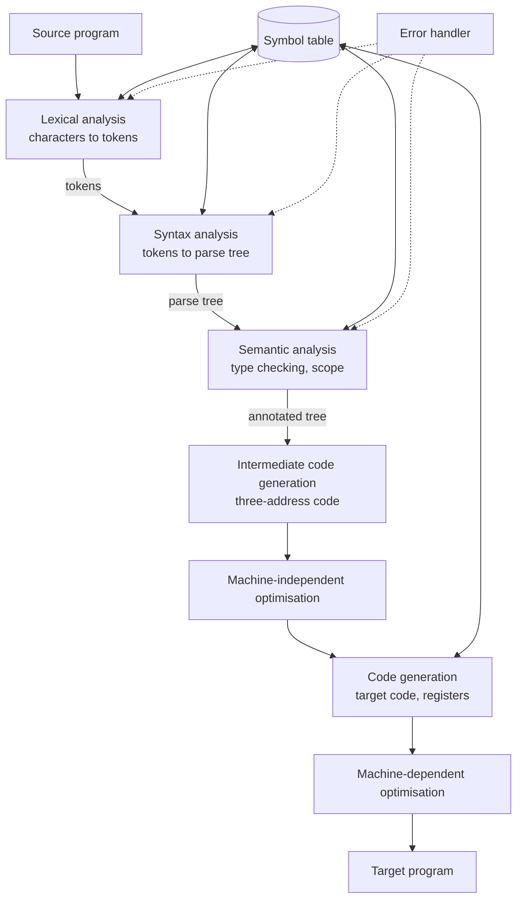

# Lexical Analysis

> **Paper:** CS · **Priority:** P0 · **Plan topics:** Lexical analysis
> **Prerequisites:** [Regular languages and finite automata](../11-theory-of-computation/regular-languages-and-finite-automata.md) · **Leads to:** [Parsing](parsing.md) · [Syntax-directed translation](syntax-directed-translation.md)

## Quick glance

- A compiler is a pipeline: **lexical analysis → syntax analysis → semantic analysis → intermediate code → optimisation → code generation**, all sharing a **symbol table** and an **error handler**. The first three are the *front end* (analysis), the last two the *back end* (synthesis).
- The **lexer (scanner)** reads characters and produces **tokens**. **Token** = a category (id, number, keyword, operator…). **Lexeme** = the actual character sequence matched ("count", "3.14"). **Pattern** = the rule (a regular expression) describing the lexemes of a token.
- Patterns are **regular expressions**; the lexer is a DFA built from them (regex → NFA → DFA). A lexer cannot check nesting or matching brackets (needs a CFG).
- **Maximal munch (longest match):** at each position take the longest prefix that matches some pattern. **Tie ⇒ the rule listed first wins** (so keywords go before the identifier rule).
- The lexer removes whitespace and comments (they produce no tokens), returns **one token per lexeme**, a **string literal is one token**, and records identifiers in the symbol table.
- Counting tokens in a C snippet: split with longest match, count strings/char/number literals as 1, comments as 0. `a+++b` has 4 tokens (`a ++ + b`), `x>>=2` has 3.
- Lexical errors: illegal characters, malformed numbers, unterminated string/comment. Recovery: **panic mode** (skip characters until a valid token start). Undeclared variables, type mismatches and unbalanced brackets are **not** lexical errors.
- #1 trap: counting tokens by whitespace. Tokens are decided by the longest-match rule, not by spaces (`i+++j`, `x=y/*c*/z`).

## 1. Phases of a compiler



| Phase | Input → output | Typical errors found | Formal tool |
| --- | --- | --- | --- |
| Lexical | characters → tokens | illegal character, bad number, unterminated string | regular expressions, DFA |
| Syntax | tokens → parse tree | missing `;`, unbalanced parentheses, bad statement | context-free grammar, PDA |
| Semantic | parse tree → annotated tree | undeclared variable, type mismatch, wrong argument count | attribute grammars, symbol table |
| Intermediate code | tree → three-address code | – | syntax-directed translation |
| Optimisation | IR → better IR | – | data-flow analysis |
| Code generation | IR → target code | – | register allocation, instruction selection |

**Example flow.** For `position = initial + rate * 60`: the lexer gives `id1 = id2 + id3 * 60`; the parser builds the tree; semantic analysis inserts the int-to-float conversion of 60; intermediate code is `t1 = inttofloat(60); t2 = id3 * t1; t3 = id2 + t2; id1 = t3`; the optimiser folds the constant conversion and removes temporaries: `t1 = id3 * 60.0; id1 = id2 + t1`; code generation emits `LDF R2, id3; MULF R2, R2, #60.0; LDF R1, id2; ADDF R1, R1, R2; STF id1, R1`.

**Symbol table.** A dictionary (usually a hash table) mapping each identifier to its attributes (type, scope, storage address, number of parameters). The lexer creates the entry; later phases fill in attributes. Operations: insert, lookup; scoping handled by a stack of tables or by chaining.

**Passes.** A *pass* reads the whole program (or its IR) once. Phases may be grouped into fewer passes; *single-pass* compilers interleave phases (needs declare-before-use). Front end depends on the source language; back end on the target machine; mix-and-match gives m × n compilers from m front ends and n back ends via a common IR (m + n components instead of m × n).

## 2. Tokens, lexemes, patterns

| Token | Pattern (informal) | Sample lexemes |
| --- | --- | --- |
| `id` | letter (letter \| digit)* | count, x1, _tmp |
| `num` | digit+ (. digit+)? (E [+-]? digit+)? | 0, 31, 3.14, 6.02E23 |
| `if` | the letters i f | if |
| `relop` | < \| <= \| == \| != \| > \| >= | <=, == |
| `string` | " (any char except ") * " | "hello" |
| `assign` | = | = |

**Regular definitions** name sub-patterns: `digit → [0-9]`, `letter → [A-Za-z_]`, `id → letter (letter | digit)*`, `digits → digit+`, `number → digits (. digits)? (E [+-]? digits)?`.

**Attributes.** A token is a pair (name, attribute value): for `id` the attribute points to the symbol-table entry; for `num` it is the value; for `relop` it distinguishes LT, LE, … The parser needs only the token name; later phases use the attribute.

**Why a separate lexer?** Simpler design (the grammar need not mention whitespace and comments), efficiency (a specialised DFA with buffering is fast), portability (device-specific peculiarities isolated).

## 3. From regular expressions to a lexer

**Pipeline:** regex for each token pattern → NFA for each (Thompson) → combine with a new start state with ε-edges to each NFA → subset construction to a DFA (each DFA final state remembers the *earliest* pattern among the NFA finals it contains) → minimise optionally → table-driven scanner. See [Regular languages and finite automata](../11-theory-of-computation/regular-languages-and-finite-automata.md) for the constructions.

**A small transition-diagram lexer.** For identifiers `letter(letter|digit)*`: state 0 on letter → state 1; state 1 loops on letter/digit; on any other char → accept state 2 marked `retract` (the lookahead character is pushed back to the input). Numbers: digits, optional fraction, optional exponent; each branch needs one extra character of lookahead, which is why scanners retract.

**Worked example: relational operators.** Patterns `<`, `<=`, `<>`, `=`, `>`, `>=`. Start; on `<` go to s1; on `=` from s1 → accept LE; on `>` → accept NE; on other → retract and accept LT. Similarly `>`. Input `a<=b`: reads `<`, sees `=`, accepts LE (2 chars). Input `a<b`: reads `<`, sees `b`, retracts, accepts LT.

### 3.1 Longest match and priority

Lex-style rules: (1) among the patterns, choose the one matching the **longest** prefix of the remaining input; (2) if several match that same longest length, choose the pattern listed **first**.

**Worked example (three patterns).** Rules in order: `a` → T1; `abb` → T2; `a*b+` → T3. Input `aaba`:

1. At position 0: `a` matches T1 (length 1); `abb` does not match; `a*b+` matches `aab` (length 3). Longest is 3, so token T3 = "aab".
2. At position 3: `a` matches T1 (length 1); `a*b+` needs a b and fails. Token T1 = "a".

Result: T3("aab") T1("a"). Input `abb`: T2 matches "abb" (3) and T3 also matches "abb" (3); tie, so the earlier rule T2 wins. Input `abba`: T2("abb") then T1("a"). Input `bab`: T3("b") then T3("ab"). All computed by a program implementing the two rules.

**Keywords vs identifiers.** List keyword rules (`if`, `while`, …) before the identifier rule. Then `if` (2 chars, tie with `id`) is the keyword (listed first), but `iff` (3 chars) is an identifier since `id` matches longer. `ifx=if2;` is `ifx`, `=`, `if2`, `;`: three non-keyword lexemes. Alternatively the lexer treats keywords as identifiers and looks them up in a pre-loaded reserved-word table.

**Why longest match can mislead.** `a---b` is `a -- - b` (4 tokens), not `a - -- b`; `x+++++y` is `x ++ ++ + y` (an error later in the parser, not the lexer). Lookahead limits: some languages need unbounded lookahead (Fortran's `DO 5 I = 1.25` is an assignment to the variable `DO5I`, while `DO 5 I = 1,25` is a loop).

### 3.2 Input buffering

Reading character-by-character from disk is slow, so lexers read in blocks. **Buffer pairs** (two halves of N characters each, e.g. a disk block) with two pointers: `lexemeBegin` and `forward`. **Sentinels:** put a special `eof` marker at the end of each half so that the forward pointer needs only one test per character instead of two (end of half or actual character). When `forward` hits the sentinel in the middle, reload the other half; a real `eof` at the end of the input ends the scan. A lexeme must fit within the lookahead capacity of the two buffers.

## 4. Counting tokens (a GATE favourite)

**Rules.** (1) Apply maximal munch left to right. (2) Whitespace separates tokens but is not itself a token; tokens may also be adjacent without whitespace. (3) Comments count 0, even though they contain spaces and symbols. (4) A string literal `"..."` is **one** token, whatever it contains (including `//`, `%d`, `,`). A char literal `'a'` is one token. (5) A number like `3.14e-2` is one token. (6) Multi-character operators (`++ -- -> << >> <= >= == != && || += -= *= /= %= <<= >>= &= |= ^=`) are one token each. (7) Each of `( ) { } [ ] ; , . ? :` is one token. (8) `#include <stdio.h>` is usually excluded (handled by the preprocessor); if counted as plain text it is `# include < stdio . h >` = 7 tokens.

All counts below were verified with a program implementing these rules.

| # | Source | Tokens | Count |
| --- | --- | --- | --- |
| 1 | `printf("i = %d, &i = %x", i, &i);` | printf ( "…" , i , & i ) ; | **10** |
| 2 | `/* hello */ int main() { return 0; } // end` | int main ( ) { return 0 ; } | **9** |
| 3 | `for(i=0;i<10;i++)` | for ( i = 0 ; i < 10 ; i ++ ) | **13** |
| 4 | `a+++b` | a ++ + b | **4** |
| 5 | `a-->b` | a -- > b | **4** |
| 6 | `x=y>>=2;` | x = y >>= 2 ; | **6** |
| 7 | `a->b.c[10]` | a -> b . c [ 10 ] | **8** |
| 8 | `3.14e-2+1.5` | 3.14e-2 + 1.5 | **3** |
| 9 | `"a//b" + x` | "a//b" + x | **3** |
| 10 | `if(a>=b&&c!=d)` | if ( a >= b && c != d ) | **10** |
| 11 | `x = a---b;` | x = a -- - b ; | **7** |
| 12 | `i=i+++1;` | i = i ++ + 1 ; | **7** |
| 13 | `a=b/*c*/d;` | a = b d ; (comment removed, no token between b and d) | **5** |
| 14 | `int x=10,y=20;` | int x = 10 , y = 20 ; | **9** |

Row 13 shows a subtle point: the comment produces no token, so `b` and `d` remain separate tokens (in real C a comment acts as whitespace).

**Worked trace for row 1** (the classic): `printf` identifier (1); `(` (2); the string `"i = %d, &i = %x"` is a single token (3) even though it contains `=`, `&`, `,` and spaces; `,` (4); `i` (5); `,` (6); `&` (7); `i` (8); `)` (9); `;` (10). Answer 10.

**Worked trace for row 6:** `x` `=` then `y>>=2`: at `>`, candidates `>`, `>>`, `>>=`; the longest is `>>=` (3 chars), so tokens x, =, y, >>=, 2, ; = 6.

## 5. Lexical errors and recovery

| Situation | Lexical error? |
| --- | --- |
| illegal character (e.g. `@` in C) | yes |
| unterminated string or comment | yes |
| identifier too long, number out of range | yes (implementation-defined) |
| undeclared variable `x`, assigning string to int | no (semantic) |
| missing `;`, unbalanced `(` | no (syntax) |
| misspelt keyword `whiel (x)` | **not lexical**: `whiel` is a valid identifier; the parser reports a syntax error |

**Recovery strategies.** *Panic mode:* delete characters until a token can be formed. *Delete* one extra character, *insert* a missing character, *replace* a character, *transpose* two adjacent characters: choose the one needing the fewest edits (minimum-distance repair). Lexers rarely need more than panic mode.

## 6. Lex/Flex (brief)

A Lex specification has three sections separated by `%%`: definitions, rules (`pattern  { action }`), and user code. Example:

```text
digit   [0-9]
%%
"if"                   { return IF; }
[A-Za-z_][A-Za-z0-9_]* { yylval = install_id(); return ID; }
{digit}+(\.{digit}+)?  { yylval = atof(yytext); return NUM; }
[ \t\n]+               { /* skip whitespace */ }
.                      { lex_error(); }
%%
```

Lex generates `yylex()`, uses `yytext` (current lexeme) and `yyleng` (its length), resolves ties by rule order, and returns the token to the parser (Yacc, see [Parsing](parsing.md)). The generated scanner is a DFA simulated from a transition table.

## Formulas and facts to memorise

| Item | Formula/fact | When to use |
| --- | --- | --- |
| Token / lexeme / pattern | category / matched text / regex rule | definition questions |
| Maximal munch | longest prefix, ties to the earliest rule | token counting, Lex |
| Comments, whitespace | 0 tokens | token counting |
| String literal | 1 token | token counting |
| Lexer formalism | regular expressions → NFA → DFA | which machine |
| Lexer cannot | check matching brackets, types, declarations | error classification |
| Buffer pairs with sentinels | one test per character | buffering questions |
| m front ends × n back ends | m + n components with a shared IR | IR motivation |

## GATE traps

- **Strings are single tokens**: `printf("a, b, c")` contains one string token, not five.
- **Longest match, not whitespace**: `a+++b` is `a ++ + b`; `a+ ++b` is `a + ++ b`. Both 4 tokens but different.
- Comments contribute nothing, and `/* ... */` is not nested in C.
- A misspelt keyword (`whiel`) or a missing semicolon is a **syntax** error, not a lexical one; an undeclared identifier is **semantic**.
- Keywords before identifiers in the rule list; otherwise `if` becomes an identifier.
- The lexer works on regular languages: it cannot match `{ }` pairs. Don't say "lexical analysis checks balanced parentheses".
- The symbol-table entry is created by the lexer (or parser) but its type attribute is filled in by semantic analysis.
- The number of tokens in `#include <stdio.h>`: ask what the question counts; default GATE answers exclude preprocessor lines unless told otherwise.

## Connections

- [Regular languages and finite automata](../11-theory-of-computation/regular-languages-and-finite-automata.md) — token patterns are regular expressions; the lexer is the DFA (Thompson, subset construction, minimisation).
- [Pumping lemma](../11-theory-of-computation/pumping-lemma.md) — why a lexer cannot recognise nested structure.
- [Parsing](parsing.md) — consumes the token stream; lexer and parser are linked by `yylex()`/`yyparse()`.
- [Runtime environments](runtime-environments.md) — the symbol table feeds storage allocation.
- [C basics and expressions](../05-c-programming/c-basics-and-expressions.md) — operator precedence and the longest-match tokens (`++`, `->`, `>>=`) seen in C code.
- [Hashing](../08-algorithms/hashing.md) — the symbol table is a hash table.

## Practice

**Q1 (NAT).** The number of tokens in the C statement `printf("i = %d, &i = %x", i, &i);` is

<details><summary>Answer</summary>

**Answer:** 10  
**Solution:** printf, (, one string literal, `,`, i, `,`, &, i, ), ; = 10. The string is one token.

</details>

**Q2 (NAT).** How many tokens are in `for (i = 0; i < 10; i++)`?

<details><summary>Answer</summary>

**Answer:** 13  
**Solution:** for ( i = 0 ; i < 10 ; i ++ ) : 13 tokens (`++` is one token).

</details>

**Q3 (MCQ).** Which of the following errors can be detected by the lexical analyser?
(A) undeclared variable (B) unbalanced parentheses (C) an illegal character such as `@` in a C program (D) type mismatch in an assignment

<details><summary>Answer</summary>

**Answer:** (C)  
**Solution:** Only an illegal character (or malformed lexeme) matches no pattern. (A), (D) are semantic; (B) is syntactic.

</details>

**Q4 (MCQ).** With rules (in order) `a` → T1, `abb` → T2, `a*b+` → T3 and the maximal-munch rule, the input `aabbab` is tokenised as
(A) T3 T3 (B) T3 T1 T3 (C) T1 T1 T2 T3 (D) T3 T2 T1

<details><summary>Answer</summary>

**Answer:** (A)  
**Solution:** At position 0 the longest match is `aabb` (T3, length 4); at position 4 the remaining `ab`: `a` is length 1, `a*b+` matches `ab` (length 2), so T3. Result T3("aabb") T3("ab").

</details>

**Q5 (NAT).** Number of tokens in `x = a---b;` (assume C maximal munch).

<details><summary>Answer</summary>

**Answer:** 7  
**Solution:** x, =, a, --, -, b, ; = 7. After `a`, the scanner takes `--` (longest), then `-`.

</details>

**Q6 (MSQ).** Which statements about lexical analysis are correct?
(A) A lexeme is an instance of a token. (B) The lexer is typically implemented as a DFA. (C) The lexer checks that every `(` has a matching `)`. (D) A comment produces no token.

<details><summary>Answer</summary>

**Answer:** A, B, D  
**Solution:** (C) needs a pushdown automaton, i.e. the parser.

</details>

**Q7 (NAT).** How many tokens are in `a = b /* x + y */ + c // d`?

<details><summary>Answer</summary>

**Answer:** 5  
**Solution:** a, =, b, +, c; both comments are discarded.

</details>

**Q8 (MCQ).** Why are keyword patterns listed before the identifier pattern in a Lex specification?
(A) keywords are longer than identifiers (B) when `id` and a keyword match the same length, the earlier rule wins (C) the lexer cannot match identifiers otherwise (D) it saves memory

<details><summary>Answer</summary>

**Answer:** (B)  
**Solution:** For the input `if`, both patterns match 2 characters; the tie is broken by rule order. For `iff` the identifier pattern matches longer and wins.

</details>
