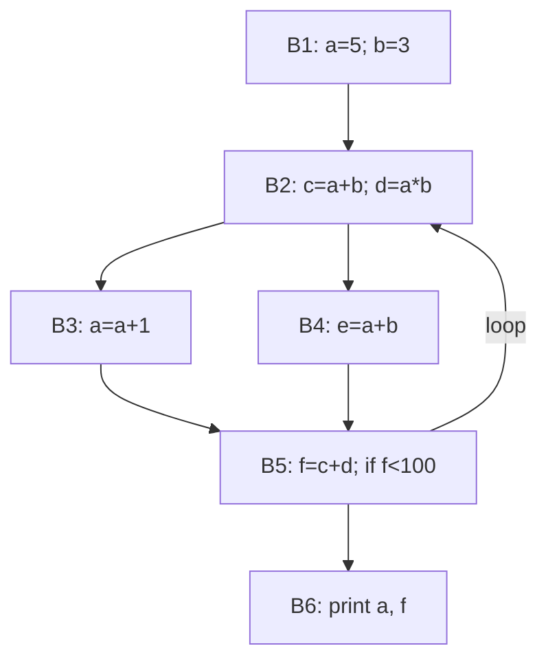

# Code Optimization and Data-Flow Analysis

> **Paper:** CS · **Priority:** P0 · **Plan topics:** Local optimization; Data-flow analysis; Constant propagation; Liveness analysis; Common subexpression elimination
> **Prerequisites:** [Intermediate code generation](intermediate-code-generation.md) · [Graph theory](../01-discrete-mathematics/graph-theory.md) · **Leads to:** [Compiler design cheat sheet](CHEATSHEET.md)

## Quick glance

- **Optimisation** transforms code to run faster or smaller **without changing its meaning**. It is *conservative*: if the compiler cannot prove a change is safe, it does not make it. Exact analysis of programs is undecidable (Rice), so analyses over-approximate.
- **Local optimisation** works inside a basic block: constant folding, constant/copy propagation, common-subexpression elimination (CSE), dead-code elimination, algebraic simplification, strength reduction, peephole patterns. **Global** optimisation works across blocks using **data-flow analysis**.
- A **data-flow problem** assigns each basic block B sets IN[B] and OUT[B], with **gen**/**kill** sets: OUT[B] = gen[B] ∪ (IN[B] − kill[B]) (forward), IN[B] = use[B] ∪ (OUT[B] − def[B]) (backward). The **meet** operator joins information at merge points: ∪ (may-analysis) or ∩ (must-analysis).
- The four standard analyses: **Reaching definitions** (forward, ∪), **Live variables** (backward, ∪), **Available expressions** (forward, ∩), **Very busy expressions** (backward, ∩). Constant propagation is forward over a lattice (⊤, constants, NAC).
- **Liveness** drives dead-code elimination and **register allocation**: two variables **interfere** if live at the same time; the minimum registers needed = **chromatic number** of the interference graph (≥ the maximum number simultaneously live).
- **CSE:** an expression e = x op y is a candidate for reuse if it is **available** (computed on every path and neither operand redefined since).
- Initialisation matters: forward ∪ problems start with OUT = ∅; forward ∩ problems (available expressions) start with OUT = the universal set (except the entry node, where IN = ∅).
- #1 trap: mixing up direction and meet. Live variables are **backward with union**; available expressions are **forward with intersection**.

## 1. Local optimisations

All examples are inside one basic block. Each transformation must preserve the value of every variable used later.

| Technique | Before | After |
| --- | --- | --- |
| Constant folding | `x = 3 * 4` | `x = 12` |
| Constant propagation | `x = 5; y = x + 2` | `x = 5; y = 7` |
| Copy propagation | `x = y; z = x + 1` | `x = y; z = y + 1` |
| Common-subexpression elimination | `t1 = a + b; t2 = a + b` | `t1 = a + b; t2 = t1` |
| Dead-code elimination | `x = a + b` (x never used again) | removed |
| Algebraic simplification | `x = y * 1`, `x = y + 0`, `x = y - y` | `x = y`, `x = y`, `x = 0` |
| Strength reduction | `x = y * 2`, `x = y * 8`, `x = y / 4` (unsigned) | `x = y + y` or `y << 1`, `y << 3`, `y >> 2` |
| Unreachable-code elimination | code after an unconditional `goto` with no label | removed |

**Peephole optimisation:** look at a small window (a few instructions) of target or IR code and replace patterns. Examples: delete `store x; load x` when the load directly follows (redundant load); replace `goto L1 … L1: goto L2` by `goto L2` (flow-of-control); remove a jump to the next instruction; use a machine increment instruction for `x = x + 1`; `if debug == 0 goto` code elimination when `debug` is a known constant.

### 1.1 Worked example: DAG-based CSE and dead code

Block:

```text
1: a = b + c
2: b = a - d
3: c = b + c
4: d = a - d
```

Build the DAG, naming each node with the variables assigned to it:

- Leaves: b₀, c₀, d₀ (values on entry).
- Node n₁ = b₀ + c₀, label **a**.
- Node n₂ = n₁ − d₀, labels **b** (instruction 2) and later **d** (instruction 4: `a − d`: a is n₁ and d is still d₀, the same operation on the same operands, so the same node n₂).
- Node n₃ = n₂ + c₀ (instruction 3: `b + c` where b is now n₂, c is c₀), label **c**. It is different from n₁ because b changed.

Regenerated code (one instruction per interior node, plus copies for extra labels):

```text
a = b + c
b = a - d
d = b          # instead of d = a - d  (CSE: same value as b)
c = b + c
```

Saved one subtraction (4 operations → 3 operations plus a copy). Note that `c = b + c` is **not** replaced by `a`, even though the text looks like `a = b + c`: b's value changed in between.

**Dead-code via DAG:** if `a` is not live on exit, the node n₁ is still needed (it feeds n₂), but the label `a` can be dropped as an assignment target: only labels live on exit are written.

## 2. Loop optimisation

A **natural loop** of a back edge n → d (d dominates n) is d plus all nodes that can reach n without passing through d. d is the **header**.

| Optimisation | Idea | Example |
| --- | --- | --- |
| Code motion (loop-invariant hoisting) | move computations whose operands do not change in the loop to the preheader | `for(i..) a[i] = x*y + i` → `t = x*y;` before the loop |
| Induction-variable elimination / strength reduction | replace multiplication by repeated addition | `t = i * 4` each iteration → `t = t + 4` |
| Loop unrolling | replicate the body k times to cut branch overhead | 2× unrolling halves the loop tests |
| Loop fusion / jamming | merge two loops with the same bounds | one pass over data |
| Loop interchange, tiling | change loop order for cache locality | |
| Dead-induction-variable elimination | remove variables made redundant by another induction variable | |

**Worked example.** `for (i = 0; i < 100; i++) A[i] = x*y + i*4;`

```text
Before                       After
L: t1 = x * y                t1 = x * y        # hoisted: invariant
   t2 = i * 4                t2 = 0            # i*4 = 0 initially
   t3 = t1 + t2              L: t3 = t1 + t2
   A[i] = t3                    A[i] = t3
   i  = i + 1                   t2 = t2 + 4    # strength reduction
   if i < 100 goto L            i  = i + 1
                                if i < 100 goto L
```

Per iteration: two multiplications become zero (x*y computed once, i*4 replaced by an addition). A statement is loop-invariant if each operand is a constant, or defined outside the loop, or defined by an already-invariant statement. Hoisting is safe only if the statement's block dominates all loop exits (or the statement has no side effect/trap) and the variable is not otherwise defined in the loop.

## 3. The data-flow framework

For each basic block B:

| Analysis | Direction | Meet | Equations | Initialisation |
| --- | --- | --- | --- | --- |
| **Reaching definitions** | forward | ∪ | IN[B] = ∪ OUT[P] over predecessors P; OUT[B] = gen[B] ∪ (IN[B] − kill[B]) | OUT = ∅ |
| **Live variables** | backward | ∪ | OUT[B] = ∪ IN[S] over successors S; IN[B] = use[B] ∪ (OUT[B] − def[B]) | IN = ∅ |
| **Available expressions** | forward | ∩ | IN[B] = ∩ OUT[P]; OUT[B] = gen[B] ∪ (IN[B] − kill[B]) | OUT = U (all expressions); IN[entry] = ∅ |
| **Very busy (anticipated) expressions** | backward | ∩ | OUT[B] = ∩ IN[S]; IN[B] = use[B] ∪ (OUT[B] − kill[B]) | IN = U |

- gen/kill for reaching definitions: gen = definitions in B that reach the end of B (last definition of each variable); kill = all other definitions of the variables defined in B.
- use[B] = variables read in B **before** any definition in B ("upward-exposed uses"); def[B] = variables defined in B.
- For available expressions: gen[B] = expressions evaluated in B whose operands are not redefined later in B; kill[B] = expressions with an operand defined in B.
- **Iterative algorithm:** repeat the equations over all blocks until no set changes. Order: forward problems converge fastest in reverse postorder, backward in postorder. The sets only grow (∪, ∅ start) or only shrink (∩, U start), so the algorithm terminates.
- **May vs must:** union analyses compute facts that hold on *some* path (reaching defs, liveness); intersection analyses compute facts that hold on *all* paths (available expressions, very busy).
- Maximum number of iterations for a reducible CFG with loop-connectedness d: d + 2 passes (including the confirming pass).

### 3.1 Worked example: one CFG, four analyses

CFG (blocks and statements; D1…D7 are labels for definitions):

```text
B1: D1: a = 5        D2: b = 3
B2: D3: c = a + b    D4: d = a * b          (loop header)
B3: D5: a = a + 1
B4: D6: e = a + b
B5: D7: f = c + d    then: if (f < 100) goto B2
B6: print(a, f)
Edges: B1→B2, B2→B3, B2→B4, B3→B5, B4→B5, B5→B2, B5→B6
```



**(a) Reaching definitions (forward, ∪).** gen/kill:

| Block | gen | kill |
| --- | --- | --- |
| B1 | D1, D2 | D5 (another def of a) |
| B2 | D3, D4 | – |
| B3 | D5 | D1 |
| B4 | D6 | – |
| B5 | D7 | – |
| B6 | – | – |

Iteration 1 (blocks in order B1…B6, OUT starts ∅): OUT[B1] = {D1, D2}; IN[B2] = OUT[B1] ∪ OUT[B5] = {D1, D2} (OUT[B5] still ∅), OUT[B2] = {D1, D2, D3, D4}; IN[B3] = OUT[B2], OUT[B3] = {D5} ∪ ({D1,D2,D3,D4} − {D1}) = {D2, D3, D4, D5}; IN[B4] = OUT[B2], OUT[B4] = {D1,D2,D3,D4,D6}; IN[B5] = OUT[B3] ∪ OUT[B4] = {D1…D6}, OUT[B5] = {D1…D7}; IN[B6] = OUT[B5] = {D1…D7}.
Iteration 2: IN[B2] = {D1,D2} ∪ {D1…D7} = {D1…D7}, OUT[B2] = {D1…D7}; OUT[B3] = {D2…D7}, OUT[B4] = {D1…D7}; OUT[B5] = {D1…D7}. Iteration 3 changes nothing.

Final: IN[B2] = IN[B3] = IN[B4] = IN[B5] = IN[B6] = {D1,…,D7}; OUT[B3] = {D2,…,D7}; OUT[B1] = {D1, D2}. **Two definitions of a reach B2: D1 (a = 5, from the entry) and D5 (a = a+1, around the loop)**, so a is not constant there.

**(b) Live variables (backward, ∪).** use/def (f in the branch of B5 is defined in B5 before its use there, so not upward-exposed):

| Block | use | def |
| --- | --- | --- |
| B1 | – | a, b |
| B2 | a, b | c, d |
| B3 | a | a |
| B4 | a, b | e |
| B5 | c, d | f |
| B6 | a, f | – |

Backward from B6: IN[B6] = {a, f}, OUT[B6] = ∅. OUT[B5] = IN[B2] ∪ IN[B6]. Start IN[B2] = ∅: OUT[B5] = {a, f}, IN[B5] = {c, d} ∪ ({a, f} − {f}) = {a, c, d}. IN[B4] = {a, b} ∪ ({a, c, d} − {e}) = {a, b, c, d}. IN[B3] = {a} ∪ ({a, c, d} − {a}) = {a, c, d}. OUT[B2] = IN[B3] ∪ IN[B4] = {a, b, c, d}; IN[B2] = {a, b} ∪ ({a, b, c, d} − {c, d}) = {a, b}. Second pass: OUT[B5] = IN[B2] ∪ IN[B6] = {a, b} ∪ {a, f} = {a, b, f}; IN[B5] = {c, d} ∪ ({a, b, f} − {f}) = {a, b, c, d}; IN[B3] = {a} ∪ ({a, b, c, d} − {a}) = {a, b, c, d}; IN[B4] = {a, b, c, d}; OUT[B2] unchanged {a,b,c,d}. Third pass: no change.

| Block | LiveIn | LiveOut |
| --- | --- | --- |
| B1 | ∅ | {a, b} |
| B2 | {a, b} | {a, b, c, d} |
| B3 | {a, b, c, d} | {a, b, c, d} |
| B4 | {a, b, c, d} | {a, b, c, d} |
| B5 | {a, b, c, d} | {a, b, f} |
| B6 | {a, f} | ∅ |

**Use of the result.** `e` is not live out of B4 (it is never read), so `D6: e = a + b` is **dead code** and can be removed. Variables live at the end of B1 are a and b only.

**(c) Available expressions (forward, ∩).** Expressions: a+b, a*b, c+d. gen/kill:

| Block | gen | kill |
| --- | --- | --- |
| B1 | – | a+b, a*b (a and b defined) |
| B2 | a+b, a*b | c+d (c and d defined) |
| B3 | – | a+b, a*b (a redefined) |
| B4 | a+b | – |
| B5 | c+d | – |
| B6 | – | – |

IN[B1] = ∅. Initialise OUT of all other blocks to U = {a+b, a*b, c+d}. Iterate: OUT[B1] = ∅. IN[B2] = OUT[B1] ∩ OUT[B5] = ∅, OUT[B2] = {a+b, a*b} ∪ (∅ − …) = {a+b, a*b}. IN[B3] = IN[B4] = {a+b, a*b}. OUT[B3] = ∅ ∪ ({a+b,a*b} − {a+b,a*b}) = ∅; OUT[B4] = {a+b} ∪ {a+b, a*b} = {a+b, a*b}. IN[B5] = OUT[B3] ∩ OUT[B4] = ∅; OUT[B5] = {c+d}. IN[B6] = {c+d}. A second pass changes nothing.

| Block | IN | OUT |
| --- | --- | --- |
| B1 | ∅ | ∅ |
| B2 | ∅ | {a+b, a*b} |
| B3 | {a+b, a*b} | ∅ |
| B4 | {a+b, a*b} | {a+b, a*b} |
| B5 | ∅ | {c+d} |
| B6 | {c+d} | {c+d} |

**CSE:** in B4, `e = a + b` recomputes `a + b`, which is available at the entry of B4 (computed in B2, not killed on the path B2→B4): replace by `e = c`, valid as long as c still holds a+b (c is not redefined between B2's statement and B4: true). (Here e is dead anyway.) On the other path B3 kills a+b, so a+b is **not** available at B5, which is why the intersection at the join gives ∅.

## 4. Constant propagation

A forward analysis over a **lattice**: each variable maps to one of
- **⊤** (undefined / no information yet),
- a **constant** c,
- **⊥ = NAC** ("not a constant").

**Meet (join of paths):** ⊤ ⊓ v = v; c ⊓ c = c; c₁ ⊓ c₂ = NAC (c₁ ≠ c₂); NAC ⊓ anything = NAC. Transfer for x = y op z: if both operands are constants, x gets that constant; if either is NAC, x is NAC; otherwise ⊤.

**Worked example.**

```text
B1: x = 2; y = 3; if (p) goto B3
B2: z = x + y; y = 10          (z = 5, y = 10)
    goto B4
B3: z = y + 2                  (z = 5)
B4: w = z + x; v = y + 1
```

At the entry of B4: x = 2 on both paths → 2. y: B2 gives 10, B3 gives 3 → NAC. z: B2 gives 5, B3 gives 3 + 2 = 5 → **5** (the paths agree). So in B4: `w = z + x` = 5 + 2 = **7** (constant, fold it); `v = y + 1` = NAC + 1 = NAC (not foldable).

**Not distributive.** Constant propagation is *monotone* but not *distributive*, so the iterative solution (MFP) can be less precise than the ideal meet-over-all-paths (MOP). Example: path 1 sets x = 1, y = 2; path 2 sets x = 2, y = 1; at the join `z = x + y`: MFP merges first, so x = NAC and y = NAC, hence z = NAC. MOP evaluates each path separately: z = 3 on both, so z = 3. Reaching definitions, live variables and available expressions *are* distributive, so MFP = MOP for them.

## 5. Liveness and register allocation

**Definition.** A variable is **live** at a point if its current value may be read later before being overwritten. Two variables **interfere** if they are live at the same time (more precisely: at a definition of v, v interferes with everything live immediately after that point, other than the source of a plain copy `v = u`).

**Interference graph:** nodes = variables, edge = interference. **A valid register assignment is a proper colouring** of this graph with k colours (k registers). If no k-colouring exists, some variable is **spilled** to memory. Minimum registers = chromatic number χ. Always χ ≥ the largest set of variables live simultaneously (a clique). For straight-line code (an interval graph) χ equals the maximum number of simultaneously live variables. For general graphs deciding k-colourability is NP-complete, so compilers use heuristics (Chaitin's simplify/select: repeatedly remove a node with degree < k, push it on a stack, colour in reverse). See [Graph theory](../01-discrete-mathematics/graph-theory.md).

### 5.1 Worked example (straight-line)

```text
1: a = 1
2: b = 2
3: c = a + b
4: d = c * a
5: e = d + b
6: f = e - c
7: print(f)
```

Backward liveness (live after each instruction): after 7: ∅; after 6: {f}; after 5: {c, e}; after 4: {b, c, d}; after 3: {a, b, c}; after 2: {a, b}; after 1: {a}.

Interference edges (a defined variable interferes with everything live after its definition): at 2: b–a; at 3: c–a, c–b; at 4: d–b, d–c; at 5: e–c; at 6: f has nothing else live. Edges: **a–b, a–c, b–c, b–d, c–d, c–e**.

Largest simultaneously live set: {a, b, c} (after instruction 3) or {b, c, d} (after 4), size **3**. Colouring with 3 colours: R0 = {a, d, e, f}, R1 = {b}, R2 = {c}. a and d may share R0 because `d = c * a` is the last use of a. Two registers are impossible since a, b, c form a triangle. **Minimum registers = 3** (verified by exhaustive search).

**Beyond cliques.** χ can exceed the largest clique: a 5-cycle interference graph (odd cycle) has largest clique 2 but needs 3 colours.

## 6. Putting the analyses to work

| Goal | Analysis | Transformation |
| --- | --- | --- |
| Remove dead assignments | live variables | delete `x = …` when x not live after |
| Global CSE | available expressions | replace a recomputation by the saved value |
| Constant folding across blocks | constant propagation / reaching definitions (a use with a single reaching constant definition) | substitute the constant |
| Copy propagation | reaching definitions of copies | substitute y for x after `x = y` |
| Detect uninitialised use | reaching definitions (a use with no reaching definition) | warning |
| Loop-invariant code motion | reaching definitions + dominators | hoist |
| Register allocation | liveness | graph colouring |
| Partial redundancy elimination | available + anticipated expressions | insert and delete computations |

## Formulas and facts to memorise

| Item | Formula/fact | When to use |
| --- | --- | --- |
| Reaching definitions | forward, ∪, OUT = gen ∪ (IN − kill) | which assignment reaches a use |
| Live variables | backward, ∪, IN = use ∪ (OUT − def) | dead code, registers |
| Available expressions | forward, ∩, initial OUT = U | global CSE |
| Very busy expressions | backward, ∩ | code hoisting |
| Constant lattice | ⊤, constants, NAC; meet of two different constants = NAC | constant propagation |
| Distributive | RD, LV, AE: yes; constant propagation: no (MFP ≤ MOP) | precision |
| Registers needed | chromatic number ≥ max live | register allocation |
| Natural loop | back edge n→d (d dominates n): d plus nodes reaching n without d | loop questions |
| Strength reduction | x*2 → x+x or x<<1; i*c → running sum | local/loop |
| DAG CSE | same op on same operand nodes → one node | local CSE |

## GATE traps

- **Direction and meet:** live variables are backward and ∪; available expressions are forward and ∩. Writing OUT = gen ∪ (IN − kill) for liveness is wrong; its form is IN = use ∪ (OUT − def).
- For available expressions, **initialise OUT to the universal set**, not ∅ (otherwise nothing is ever available); IN of the entry is ∅.
- `use[B]` counts only reads before a write in the block: in `x = x + 1`, x is used; in `x = 5; y = x`, x is not upward-exposed.
- An assignment `d = a - d`-style CSE must check that operands were not redefined between the two evaluations (node identity in the DAG, not the variable name).
- A definition inside a loop reaching the loop header from the back edge means the variable is not constant at the header, even if it is constant on entry.
- Minimum registers equals the chromatic number, which is at least the maximum number of variables live at once, but may be larger.
- A statement can be dead even if its variable is used later in the program text: what matters is whether the *assigned value* can be read (liveness along paths).
- Constant propagation merges per variable; it can miss constants that exist on every path separately (MFP vs MOP).
- Compilers only optimise when provably safe; a pointer or procedure call may kill expressions or definitions, so analyses must be conservative.

## Connections

- [Intermediate code generation](intermediate-code-generation.md) — basic blocks, CFG and SSA are the objects optimised here.
- [Parsing](parsing.md) and [Lexical analysis](lexical-analysis.md) — front-end phases whose output ends up as this IR.
- [Graph theory](../01-discrete-mathematics/graph-theory.md) — graph colouring (register allocation), dominators, reachability on the CFG.
- [Turing machines and undecidability](../11-theory-of-computation/turing-machines-and-undecidability.md) — Rice's theorem is why exact analyses (dead code, constants) are impossible and compilers approximate.
- [Posets and lattices](../01-discrete-mathematics/posets-and-lattices.md) — the constant-propagation domain is a lattice; meet = greatest lower bound; monotone frameworks terminate because lattices have finite height.
- [Pipelining](../10-computer-organization/pipelining.md) — instruction scheduling avoids hazards; loop unrolling exposes more independent instructions.
- [Memory hierarchy and cache](../10-computer-organization/memory-hierarchy-and-cache.md) — loop interchange and tiling target cache locality.
- [Greedy algorithms](../08-algorithms/greedy-algorithms.md) — heuristic graph colouring is a greedy process.

## Practice

**Q1 (MCQ).** Which combination is correct?
(A) Live variables: forward, ∩ (B) Available expressions: forward, ∩ (C) Reaching definitions: backward, ∪ (D) Live variables: backward, ∩

<details><summary>Answer</summary>

**Answer:** (B)  
**Solution:** Live variables: backward, ∪. Reaching definitions: forward, ∪. Available expressions: forward, ∩.

</details>

**Q2 (NAT).** In the CFG of §3.1, how many definitions of the variable `a` reach the entry of block B2?

<details><summary>Answer</summary>

**Answer:** 2  
**Solution:** IN[B2] = {D1…D7}; the definitions of `a` are D1 (a = 5) and D5 (a = a + 1): 2.

</details>

**Q3 (MCQ).** In the CFG of §3.1, which variables are live at the exit of block B1?
(A) ∅ (B) {a} (C) {a, b} (D) {a, b, c}

<details><summary>Answer</summary>

**Answer:** (C)  
**Solution:** LiveOut[B1] = LiveIn[B2] = {a, b}: B2 reads a and b before defining c and d.

</details>

**Q4 (NAT).** In the CFG of §3.1, how many expressions are available at the entry of B5?

<details><summary>Answer</summary>

**Answer:** 0  
**Solution:** IN[B5] = OUT[B3] ∩ OUT[B4] = ∅ ∩ {a+b, a*b} = ∅. B3 redefines a and kills a+b and a*b.

</details>

**Q5 (NAT).** For the straight-line code of §5.1 (live at the end: nothing), what is the minimum number of registers needed so that no variable is spilled?

<details><summary>Answer</summary>

**Answer:** 3  
**Solution:** a, b, c are simultaneously live after instruction 3 (triangle in the interference graph); 3 colours suffice.

</details>

**Q6 (MCQ).** Block: `a = b + c; b = a - d; c = b + c; d = a - d`. After DAG-based local CSE, `d = a - d` becomes
(A) `d = a - d` (B) `d = b` (C) `d = c` (D) removed

<details><summary>Answer</summary>

**Answer:** (B)  
**Solution:** Instruction 2 computes a − d into b, and neither a nor d has changed when instruction 4 recomputes a − d, so d receives b. `c = b + c` is a different node because b changed.

</details>

**Q7 (MSQ).** Which statements about data-flow analysis are true?
(A) Available expressions is a "must" analysis. (B) Live-variable analysis propagates information from successors to predecessors. (C) In reaching definitions the meet is intersection. (D) Constant propagation is distributive.

<details><summary>Answer</summary>

**Answer:** A, B  
**Solution:** (C) is false: the meet for reaching definitions is union. (D) is false: constant propagation is monotone but not distributive (x = 1,y = 2 vs x = 2,y = 1 then z = x + y).

</details>

**Q8 (NAT).** In the constant-propagation example of §4, what is the constant value of `w = z + x` at the end of the program?

<details><summary>Answer</summary>

**Answer:** 7  
**Solution:** z = 5 on both paths, x = 2: w = 7. (y is NAC at the join, so v is not a constant.)

</details>
