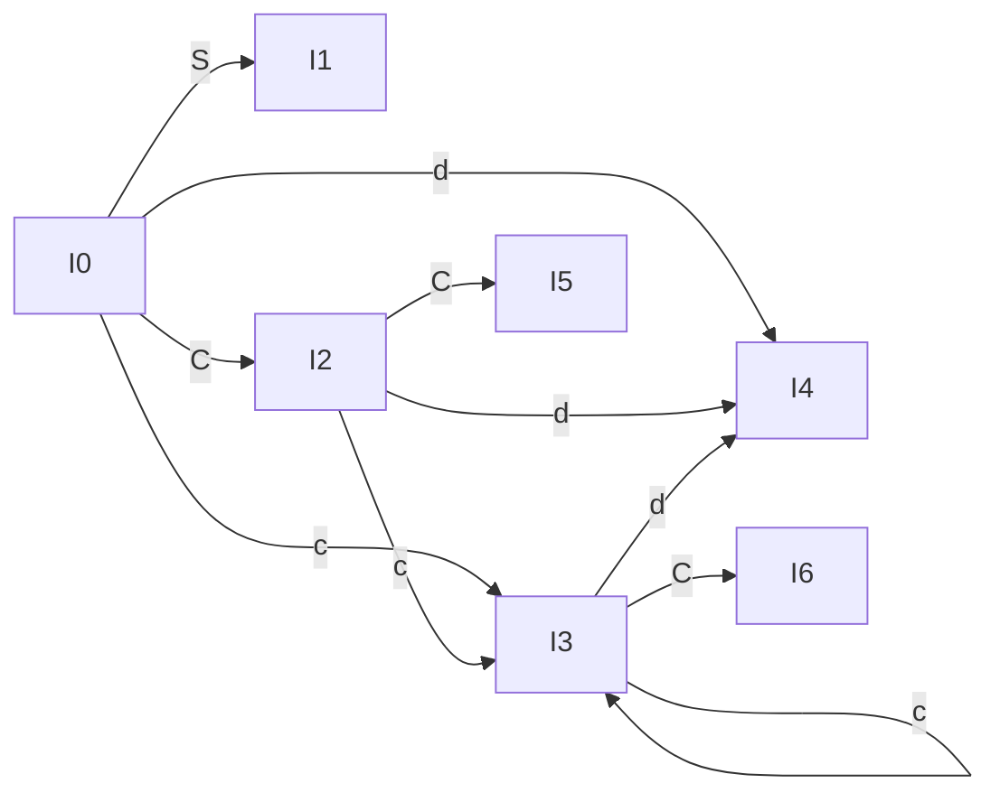

# Parsing

> **Paper:** CS · **Priority:** P0 · **Plan topics:** Parsing
> **Prerequisites:** [Context-free languages and PDA](../11-theory-of-computation/context-free-languages-and-pda.md) · [Lexical analysis](lexical-analysis.md) · **Leads to:** [Syntax-directed translation](syntax-directed-translation.md)

## Quick glance

- A **parser** checks that the token stream is derivable from the grammar's start symbol and builds the parse tree. **Top-down** builds it from the root (leftmost derivation); **bottom-up** from the leaves (a rightmost derivation in reverse).
- **FIRST(α)** = terminals that can begin a string derived from α (plus ε if α ⇒* ε). **FOLLOW(A)** = terminals that can appear immediately after A in some sentential form (always contains `$` for the start symbol; never contains ε).
- **LL(1):** left-to-right scan, leftmost derivation, 1 lookahead. A grammar is LL(1) iff for every A → α | β: FIRST(α) ∩ FIRST(β) = ∅, at most one alternative derives ε, and if β ⇒* ε then FIRST(α) ∩ FOLLOW(A) = ∅. Not LL(1) if **left-recursive, ambiguous, or not left-factored**.
- **LR(k):** left-to-right scan, rightmost derivation in reverse. LR parsers use a stack of states plus ACTION/GOTO tables. Power: **LR(0) ⊂ SLR(1) ⊂ LALR(1) ⊂ LR(1) (= CLR)**; LL(1) ⊂ LR(1).
- State counts: **LR(0) = SLR(1) = LALR(1) ≤ CLR(1)** (they share the same canonical LR(0) states; CLR splits them by lookahead). Table entries: SLR reduces on FOLLOW(A), LALR/CLR on the exact lookahead set.
- Conflicts: **shift-reduce** (state has a complete item and a shift on the same terminal) and **reduce-reduce** (two complete items with overlapping lookaheads). LALR can introduce reduce-reduce conflicts that CLR does not have, but never shift-reduce ones beyond those of CLR.
- A **handle** is the right side of a production that, replaced by its left side, gives the previous step of a rightmost derivation. A **viable prefix** is a prefix of a right sentential form that does not extend past its handle; the LR(0) automaton recognises viable prefixes.
- Operator-precedence parsing handles operator grammars (no ε, no two adjacent nonterminals) with precedence relations ⋖, ≐, ⋗ between terminals.
- #1 trap: computing FOLLOW from the wrong place or forgetting that FIRST of a nullable nonterminal makes the next symbol's FIRST count too (`S → ABC` with A, B nullable has FIRST(S) ⊇ FIRST(C)).

## 1. Parsing basics

**Intuition.** The grammar is the specification; the parser is the matching algorithm. Parsing = finding the derivation. The parse tree is the same whether you build it top-down or bottom-up (for an unambiguous grammar).

| | Top-down | Bottom-up |
| --- | --- | --- |
| Derivation traced | leftmost | rightmost, in reverse |
| Starts from | start symbol | the input tokens |
| Actions | expand / match | shift / reduce |
| Families | recursive descent, LL(1) | operator-precedence, LR(0), SLR, LALR, CLR |
| Power | weaker | stronger (handles left recursion, more grammars) |
| Hand-written? | yes (recursive descent) | tool-generated (Yacc/Bison) |

Sentential form: any string derivable from S. Right sentential form: arises in a rightmost derivation. A **sentence** has only terminals.

## 2. Preparing a grammar for top-down parsing

### 2.1 Left recursion

A grammar is left-recursive if A ⇒+ Aα. Top-down parsers loop forever on it (A calls A without consuming input).

**Immediate elimination.** A → Aα₁ | … | Aα_m | β₁ | … | β_n becomes
A → β₁A' | … | β_nA' ; A' → α₁A' | … | α_mA' | ε.

**Worked example.** E → E + T | T becomes E → T E'; E' → + T E' | ε. T → T * F | F becomes T → F T'; T' → * F T' | ε. The result with F → ( E ) | id is the classic LL(1) expression grammar G1 used below. (Associativity: the new grammar's *tree* is right-leaning but the language is unchanged; translation schemes must restore left associativity.)

**Indirect left recursion.** S → A a | b; A → A c | S d | ε. Order nonterminals S, A. For A substitute S's productions in A → S d: A → A c | A a d | b d | ε. Remove immediate recursion in A: A → b d A' | A'; A' → c A' | a d A' | ε.

### 2.2 Left factoring

When two alternatives share a prefix, the parser cannot choose with one lookahead. A → α β₁ | α β₂ becomes A → α A'; A' → β₁ | β₂.

**Worked example (dangling else).** S → i E t S | i E t S e S | a becomes S → i E t S S' | a; S' → e S | ε; E → b. This is still **not LL(1)** because the grammar is ambiguous (see §3.3): the standard resolution is to match `e` with the nearest `i`.

## 3. FIRST and FOLLOW

**Rules for FIRST.**
1. FIRST(a) = {a} for a terminal a; FIRST(ε) = {ε}.
2. For A → X₁X₂…X_k: add FIRST(X₁) − {ε}; if ε ∈ FIRST(X₁) add FIRST(X₂) − {ε}; … ; add ε if every X_i is nullable.
3. FIRST of a nonterminal = union over its productions. Iterate to a fixed point.

**Rules for FOLLOW.**
1. `$` ∈ FOLLOW(S) for the start symbol S.
2. For A → α B β: add FIRST(β) − {ε} to FOLLOW(B).
3. For A → α B, or A → α B β with ε ∈ FIRST(β): add FOLLOW(A) to FOLLOW(B).
Iterate to a fixed point. ε never appears in FOLLOW.

### 3.1 Worked example G1 (expression grammar)

```text
E  -> T E'
E' -> + T E' | ε
T  -> F T'
T' -> * F T' | ε
F  -> ( E ) | id
```

FIRST: F = {(, id}; T' = {*, ε}; T = FIRST(F) = {(, id}; E' = {+, ε}; E = FIRST(T) = {(, id}.

FOLLOW, step by step:
- E: start, so $. F → ( E ): `)` follows E. FOLLOW(E) = {$, )}.
- E': appears at the end of E → T E' and E' → + T E', so FOLLOW(E') = FOLLOW(E) = {$, )}.
- T: in E → T E': FIRST(E') − ε = {+}; E' nullable so add FOLLOW(E). In E' → + T E': same. FOLLOW(T) = {+, $, )}.
- T': at the end of T → F T' and T' → * F T': FOLLOW(T') = FOLLOW(T) = {+, $, )}.
- F: in T → F T': FIRST(T') − ε = {*}; T' nullable, add FOLLOW(T). In T' → * F T': same. FOLLOW(F) = {*, +, $, )}.

| Nonterminal | FIRST | FOLLOW |
| --- | --- | --- |
| E | ( id | $ ) |
| E' | + ε | $ ) |
| T | ( id | + $ ) |
| T' | * ε | + $ ) |
| F | ( id | * + $ ) |

(Table computed independently by a program.)

### 3.2 Worked example G2 (nullable symbols)

S → A B C; A → a | ε; B → b | ε; C → c.

- FIRST(A) = {a, ε}; FIRST(B) = {b, ε}; FIRST(C) = {c}.
- FIRST(S) = (FIRST(A) − ε) ∪ (FIRST(B) − ε) ∪ FIRST(C) = {a, b, c} (A and B are nullable, so c can come first; ε is not added because C is not nullable).
- FOLLOW(S) = {$}. FOLLOW(A) = (FIRST(B) − ε) ∪ FIRST(C) = {b, c} (B nullable, so C's first symbol also follows A). FOLLOW(B) = FIRST(C) = {c}. FOLLOW(C) = FOLLOW(S) = {$}.

### 3.3 LL(1) parsing table and the LL(1) condition

**Table construction.** For each production A → α: for every terminal a ∈ FIRST(α), put A → α in M[A, a]; if ε ∈ FIRST(α), put A → α in M[A, b] for every b ∈ FOLLOW(A) (including `$`). A grammar is LL(1) iff no cell has more than one production.

**G1's table** (blank = error):

| | id | + | * | ( | ) | $ |
| --- | --- | --- | --- | --- | --- | --- |
| E | E → T E' | | | E → T E' | | |
| E' | | E' → + T E' | | | E' → ε | E' → ε |
| T | T → F T' | | | T → F T' | | |
| T' | | T' → ε | T' → * F T' | | T' → ε | T' → ε |
| F | F → id | | | F → ( E ) | | |

No cell has two entries, so G1 is LL(1).

**Predictive parse of `id + id * id`** (stack top on the left):

```text
Stack            Input            Action
E $              id + id * id $   E  -> T E'
T E' $           id + id * id $   T  -> F T'
F T' E' $        id + id * id $   F  -> id
id T' E' $       id + id * id $   match id
T' E' $          + id * id $      T' -> ε
E' $             + id * id $      E' -> + T E'
+ T E' $         + id * id $      match +
T E' $           id * id $        T  -> F T'
F T' E' $        id * id $        F  -> id
id T' E' $       id * id $        match id
T' E' $          * id $           T' -> * F T'
* F T' E' $      * id $           match *
F T' E' $        id $             F  -> id
id T' E' $       id $             match id
T' E' $          $                T' -> ε
E' $             $                E' -> ε
$                $                accept
```

16 moves (expand or match), then accept. Time O(n).

**Non-LL(1) grammars (verified by building the tables).**

| Grammar | Conflict | Reason |
| --- | --- | --- |
| S → i E t S S' \| a; S' → e S \| ε; E → b | M[S', e] = {S' → e S, S' → ε} | e ∈ FIRST(eS) and e ∈ FOLLOW(S'): dangling-else ambiguity |
| S → A B; A → a A \| ε; B → b B \| a | M[A, a] = {A → aA, A → ε} | a ∈ FIRST(aA) and a ∈ FOLLOW(A) (B can start with a) |
| S → A a \| b; A → A c \| S d \| ε | many | left recursion |
| E → E + T \| T … | – | left-recursive: not LL(1) |

**Facts.** Every LL(1) grammar is unambiguous; every ambiguous or left-recursive grammar is not LL(1). Two productions A → α | β with a common prefix are never LL(1). LL(1) ⊂ LR(1).

### 3.4 Recursive descent

One procedure per nonterminal; each chooses its production by the lookahead and calls procedures for nonterminals, matches terminals. For G1:

```c
void E()  { T(); Eprime(); }
void Eprime() { if (look == '+') { match('+'); T(); Eprime(); } /* else ε */ }
void T()  { F(); Tprime(); }
void Tprime() { if (look == '*') { match('*'); F(); Tprime(); } }
void F()  { if (look == '(') { match('('); E(); match(')'); } else match(ID); }
```

The call stack plays the role of the parse stack. With backtracking, a recursive-descent parser can handle non-LL(1) grammars but may take exponential time.

## 4. Bottom-up parsing: shift-reduce

**Intuition.** Read tokens left to right pushing them on a stack (**shift**); whenever the top of the stack matches the right side of a production *and that is the right moment*, replace it by the left side (**reduce**). Reductions undo a rightmost derivation. The **handle** is the substring to reduce next.

**Four actions:** shift, reduce, accept, error. Stack holds a viable prefix.

**Example.** Grammar S → C C; C → c C | d, input `c d d`:

```text
Stack        Input     Action
$            c d d $   shift
$ c          d d $     shift
$ c d        d $       reduce C -> d
$ c C        d $       reduce C -> c C
$ C          d $       shift
$ C d        $         reduce C -> d
$ C C        $         reduce S -> C C
$ S          $         accept
```

The reductions in order are C→d, C→cC, C→d, S→CC; read backwards: S ⇒ CC ⇒ Cd ⇒ cCd ⇒ cdd, a rightmost derivation. **Number of reduce steps = number of productions used in the derivation = 4; shifts = number of tokens = 3.**

**Handle pruning.** For the right sentential form `c C d`: the handle is `c C` (production C → c C). If instead you reduced the `d` too early you would reach `c C C`, which is not a right sentential form (in a rightmost derivation the right-hand C is expanded first), a wrong move. The LR automaton ensures reductions happen only at handles.

**Viable prefixes.** Prefixes of right sentential forms that do not extend beyond the right end of the handle. The set of viable prefixes is a regular language, recognised by the DFA of LR(0) item sets: the stack contents always form a viable prefix.

## 5. LR parsers

**LR parsing algorithm.** Stack of (state) entries (symbols implied). Look at the state s on top and the next token a. ACTION[s, a] is one of: shift t (push state t), reduce A → β (pop |β| states, let t be the new top, push GOTO[t, A]), accept, error. Linear time, no backtracking.

### 5.1 LR(0) items and the canonical collection

An **LR(0) item** is a production with a dot marking how much has been seen: A → α · β. The **closure** of a set I: for each item A → α · B β add B → · γ for all B-productions, repeating. **goto(I, X)** = closure of {A → αX · β : A → α · Xβ ∈ I}. Start with the **augmented** grammar S' → S.

**Worked example: S' → S; S → C C; C → c C | d.**

| State | Items | Transitions |
| --- | --- | --- |
| I0 | S' → ·S; S → ·CC; C → ·cC; C → ·d | S→I1, C→I2, c→I3, d→I4 |
| I1 | S' → S· | – (accept on $) |
| I2 | S → C·C; C → ·cC; C → ·d | C→I5, c→I3, d→I4 |
| I3 | C → c·C; C → ·cC; C → ·d | C→I6, c→I3, d→I4 |
| I4 | C → d· | – |
| I5 | S → CC· | – |
| I6 | C → cC· | – |

DFA of item sets (the viable-prefix automaton):



Seven LR(0) states. This is also the number of SLR(1) and LALR(1) states for this grammar (verified by program); CLR(1) has 10 (below).

**LR(0) parsing table.** Reduce in every column of a state with a complete item. A grammar is LR(0) iff no state has a complete item together with another item that is complete or has a terminal after the dot. Here I4, I5, I6 are pure reduce states, I1 is accept, others only shift, so the grammar is LR(0).

### 5.2 SLR(1)

Same states as LR(0), but reduce A → α only on terminals in **FOLLOW(A)**. FOLLOW(S) = {$}, FOLLOW(C) = {c, d, $}. Productions numbered 1: S → CC, 2: C → cC, 3: C → d.

| State | ACTION c | ACTION d | ACTION $ | GOTO S | GOTO C |
| --- | --- | --- | --- | --- | --- |
| 0 | s3 | s4 | | 1 | 2 |
| 1 | | | acc | | |
| 2 | s3 | s4 | | | 5 |
| 3 | s3 | s4 | | | 6 |
| 4 | r3 | r3 | r3 | | |
| 5 | | | r1 | | |
| 6 | r2 | r2 | r2 | | |

Parsing `c d d`: states stack [0] —c→ [0,3] —d→ [0,3,4]; lookahead d, r3 (pop 1, GOTO[3,C] = 6) → [0,3,6]; r2 on d (pop 2, GOTO[0,C] = 2) → [0,2]; s4 → [0,2,4]; lookahead $, r3 → GOTO[2,C] = 5 → [0,2,5]; r1 (pop 2, GOTO[0,S] = 1) → [0,1]; accept. Total actions 8 (3 shifts, 4 reductions, accept).

**Where SLR fails.** S → L = R | R; L → * R | id; R → L. State I2 = {S → L · = R, R → L ·}. FOLLOW(R) = {$, =} contains `=`, so on `=` the SLR table has shift (to item S → L = · R) **and** reduce R → L: a **shift-reduce conflict**. Yet this grammar is not ambiguous; the conflict comes from SLR using the coarse FOLLOW set. In reality `=` can never follow R when R → L is reduced at this point. LR(1)/LALR lookaheads (just $ here) resolve it.

### 5.3 Canonical LR(1) (CLR)

An LR(1) item is [A → α · β, a] with a lookahead terminal a (what may follow the item's whole production). Closure: for [A → α · B β, a], for each B → γ add [B → · γ, b] for every b ∈ FIRST(βa). Reduce only on the item's lookahead.

**Worked example (same grammar):**
- J0: [S' → ·S, $]; [S → ·CC, $]; [C → ·cC, c/d]; [C → ·d, c/d] (lookaheads c/d come from FIRST(C $) = {c, d}).
- J2 = goto(J0, C): [S → C·C, $]; [C → ·cC, $]; [C → ·d, $] (lookahead $ now).
- J3 = goto(J0, c): [C → c·C, c/d]; [C → ·cC, c/d]; [C → ·d, c/d]. And J6 = goto(J2, c) has the same core but lookahead $. Likewise J4/J7 = [C → d·, c/d] / [C → d·, $], and J8/J9 = [C → cC·, c/d] / [C → cC·, $].

Ten states: J0, J1 (S'→S·), J2, J3, J4, J5 (S→CC·), J6, J7, J8, J9. **CLR(1) has 10 states, LR(0)/SLR/LALR have 7.**

### 5.4 LALR(1)

Merge CLR states with identical cores (same items ignoring lookaheads), union the lookaheads. Here {J3, J6}, {J4, J7}, {J8, J9} merge, giving 7 states, the same states as LR(0), but with lookaheads that are more precise than FOLLOW in general. LALR is how Yacc/Bison work (small tables, nearly CLR power).

**Merging can create reduce-reduce conflicts (never new shift-reduce ones).** G: S → a A d | b B d | a B e | b A e; A → c; B → c. In CLR: J6 = {A → c·, d; B → c·, e}; J9 = {A → c·, e; B → c·, d}: no conflict. Same core, so LALR merges them into {A → c·, d/e; B → c·, d/e}: on d (and e) both A → c and B → c reduce: **reduce-reduce conflict**. SLR also has it (FOLLOW(A) = FOLLOW(B) = {d, e}). So this grammar is LR(1) but not LALR(1) or SLR(1). (Counts by program: LR(0)/LALR 13 states, CLR 14.)

**Another useful example:** the expression grammar E → E + T | T; T → T * F | F; F → ( E ) | id has 12 LR(0)/SLR/LALR states and 22 CLR states.

### 5.5 The hierarchy

```text
LR(0) ⊂ SLR(1) ⊂ LALR(1) ⊂ LR(1) = CLR(1)        (grammar classes)
LL(1) ⊂ LR(1)                                       (LL(1) is incomparable with SLR(1) as classes of grammars)
```

| Parser | Items | Reduce on | #States | Power |
| --- | --- | --- | --- | --- |
| LR(0) | LR(0) | all terminals (no lookahead) | n | weakest |
| SLR(1) | LR(0) | FOLLOW(A) | same n | |
| LALR(1) | LR(1) merged by core | merged lookaheads | same n | |
| CLR(1) | LR(1) | exact lookahead | ≥ n (more) | strongest |

All of SLR(1), LALR(1), CLR(1) accept the same *languages* as DPDAs (all DCFLs), but accept different sets of *grammars*. Examples of separation: S → C C; C → cC | d is LR(0); S → L = R | R; … is LALR(1) and CLR(1) but not SLR(1); the a A d … grammar above is CLR(1) but not LALR(1). A grammar that is LL(1) with ε-productions can fail SLR(1): S → A a A b | B b B a; A → ε; B → ε (SLR reduce-reduce on A → ε, B → ε, yet LALR(1)).

Every ambiguous grammar is not LR(k) for any k. Every LL(1) grammar is LR(1).

### 5.6 Conflict resolution (Yacc/Bison)

- **Shift-reduce:** shift by default (good for dangling else: binds `else` to the nearest `if`), or use precedence/associativity declarations (`%left '+' '-'`, `%left '*' '/'`, `%right '^'`, `%nonassoc`) — a rule takes the precedence of its last terminal (or `%prec`). Compare the rule's precedence with the lookahead's: higher rule ⇒ reduce, higher token ⇒ shift, equal ⇒ associativity decides (left ⇒ reduce, right ⇒ shift).
- **Reduce-reduce:** choose the production listed first in the grammar file.
- With these rules an ambiguous grammar such as E → E + E | E * E | id works as a parser: `%left '+'` then `%left '*'` gives `*` higher precedence.

## 6. Operator-precedence parsing

For **operator grammars** (no ε-productions, no two adjacent nonterminals on any right side), parsing can use only the relations between *terminals*: a ⋖ b (a yields precedence to b), a ≐ b, a ⋗ b (a takes precedence over b).

| | id | + | * | $ |
| --- | --- | --- | --- | --- |
| **id** | | ⋗ | ⋗ | ⋗ |
| **+** | ⋖ | ⋗ | ⋖ | ⋗ |
| **\*** | ⋖ | ⋗ | ⋗ | ⋗ |
| **$** | ⋖ | ⋖ | ⋖ | accept |

(Row = terminal on top of the stack, column = next input.) Algorithm: compare the top terminal of the stack with the input; ⋖ or ≐ ⇒ shift; ⋗ ⇒ pop the handle (the string between the last ⋖ and the top ⋗) and reduce. Parse of `id + id * id`:

```text
Stack          Input            Relation          Action
$              id+id*id$        $ ⋖ id            shift
$ id           +id*id$          id ⋗ +            reduce id -> E
$ E            +id*id$          $ ⋖ +             shift
$ E +          id*id$           + ⋖ id            shift
$ E + id       *id$             id ⋗ *            reduce id -> E
$ E + E        *id$             + ⋖ *             shift
$ E + E *      id$              * ⋖ id            shift
$ E + E * id   $                id ⋗ $            reduce id -> E
$ E + E * E    $                * ⋗ $             reduce E*E -> E
$ E + E        $                + ⋗ $             reduce E+E -> E
$ E            $                $ with $          accept
```

`*` binds tighter than `+` because + ⋖ * and * ⋗ +. Operator-precedence parsers are small and fast but accept a restricted class of grammars and may accept some invalid strings (they only check relations between terminals). An operator-precedence parser can also use *precedence functions* f, g (numbers) instead of the table to save space.

## 7. Error recovery in parsers

| Strategy | Idea |
| --- | --- |
| Panic mode | discard tokens until a synchronising token (`;`, `}`) from a set (e.g. FOLLOW of the nonterminal) |
| Phrase-level | local repair (insert missing `;`, delete extra `)`) |
| Error productions | add `E → error` style productions for common mistakes |
| Global correction | minimum edit distance (theoretical) |

LR parsers detect an error at the earliest possible point (a viable-prefix property): the erroneous token is never shifted past; LL(1) also has the viable-prefix property. Both detect errors with the first wrong token.

## Formulas and facts to memorise

| Item | Formula/fact | When to use |
| --- | --- | --- |
| FIRST(A) with nullable prefix | include FIRST of the next symbol | FIRST of strings |
| FOLLOW(B) for A → αBβ | FIRST(β) − ε, plus FOLLOW(A) if β nullable | FOLLOW computation |
| LL(1) cell rule | A → α in M[A, a] for a ∈ FIRST(α); and in M[A, b], b ∈ FOLLOW(A) if α nullable | table building |
| Left recursion removal | A → βA'; A' → αA' \| ε | grammar prep |
| Hierarchy | LR(0) ⊂ SLR ⊂ LALR ⊂ CLR | which parser accepts |
| State counts | LR(0) = SLR = LALR ≤ CLR | counting states |
| SLR reduce set | FOLLOW(A) | SLR tables |
| LALR vs CLR | merging gives only new reduce-reduce conflicts | conflict questions |
| Reduce steps in a parse | number of production uses (for CNF: n − 1 + n) | counting moves |
| Ambiguity | no ambiguous grammar is LL(k) or LR(k) | grammar questions |

## GATE traps

- **FIRST of a string with nullable prefix**: FIRST(ABC) includes FIRST(C) when A, B are nullable. Forgetting this loses terminals.
- **FOLLOW(A)** takes FOLLOW of the left side only when the rest of the right side is nullable (or empty).
- A grammar with a nullable A and A → aA | ε where a ∈ FOLLOW(A) is not LL(1).
- **LL(1) cannot handle left recursion or common prefixes**; to test LL(1) you must check the FIRST/FOLLOW condition, not just the shape.
- SLR(1) and LR(0) use the *same* number of states; CLR(1) usually has more. LALR(1) has the same number of states as SLR(1) and LR(0); CLR(1) can have more.
- LALR merging never adds shift-reduce conflicts; it may add reduce-reduce conflicts.
- A grammar can be LALR(1) but not SLR(1) (the L = R grammar). It can be CLR(1) but not LALR(1) (the aAd/bBd grammar).
- Counting reductions: a shift-reduce parse of n tokens has n shifts; the reductions equal the number of internal nodes of the parse tree (every production use is one reduction, including unit and ε productions).
- Operator-precedence parsing is not defined for grammars with ε-productions or adjacent nonterminals.
- Ambiguous grammars are never LR(1), but Yacc accepts them using precedence declarations that resolve the conflicts.

## Connections

- [Context-free languages and PDA](../11-theory-of-computation/context-free-languages-and-pda.md) — LL/LR parsers are deterministic pushdown automata; ambiguity and left recursion are properties of the CFG; DCFL = languages with LR(1) grammars.
- [Lexical analysis](lexical-analysis.md) — supplies the tokens that the parser consumes.
- [Syntax-directed translation](syntax-directed-translation.md) — semantic actions are executed during the parse (at reductions in LR, at expansion points in LL); L-attributed grammars suit LL parsing.
- [Pumping lemma](../11-theory-of-computation/pumping-lemma.md) — nested structure like balanced parentheses needs a grammar, not a regular expression.
- [Arrays, stacks and queues](../07-data-structures/arrays-stacks-queues.md) — the parse stack.
- [Trees and BST](../07-data-structures/trees-and-bst.md) — the parse tree is the output; reductions build its internal nodes.
- [Graph traversals](../08-algorithms/graph-traversals.md) — the LR(0) automaton is built by a closure/BFS over item sets.

## Practice

**Q1 (MCQ).** For the grammar S → A B C; A → a | ε; B → b | ε; C → c, FOLLOW(A) is
(A) {b} (B) {b, c} (C) {b, c, $} (D) {c}

<details><summary>Answer</summary>

**Answer:** (B)  
**Solution:** FOLLOW(A) = FIRST(B C) = (FIRST(B) − ε) ∪ FIRST(C) (since B is nullable) = {b, c}. $ does not follow A because C is not nullable.

</details>

**Q2 (NAT).** For the grammar G1 (E → TE', E' → +TE' | ε, T → FT', T' → *FT' | ε, F → (E) | id), the number of terminals in FOLLOW(F) is

<details><summary>Answer</summary>

**Answer:** 4  
**Solution:** FOLLOW(F) = {*, +, ), $}.

</details>

**Q3 (MCQ).** Which grammar is not LL(1)?
(A) S → aSb | ε (B) S → A B; A → a A | ε; B → b B | a (C) E → T E'; E' → + T E' | ε; T → id (D) S → a S | b

<details><summary>Answer</summary>

**Answer:** (B)  
**Solution:** In (B), FOLLOW(A) ⊇ FIRST(B) = {a, b}, and a ∈ FIRST(aA), so M[A, a] has two productions. (A): FIRST(aSb) = {a}, FOLLOW(S) = {b, $}: no conflict. (C) and (D) are fine.

</details>

**Q4 (NAT).** The grammar S → C C; C → c C | d is parsed with an SLR(1) parser. For the input `ccdd`, how many reduce actions are performed?

<details><summary>Answer</summary>

**Answer:** 5  
**Solution:** The input ccdd = (ccd)(d). The first C = ccd takes C → d, C → cC, C → cC (3 reductions), the second C = d takes C → d (1), then S → CC (1): total 5.

</details>

**Q5 (MCQ).** Which relation between the numbers of states is correct for the same grammar?
(A) LR(0) > CLR(1) (B) SLR(1) = LALR(1) < CLR(1) always (C) SLR(1) = LALR(1) ≤ CLR(1) (D) LALR(1) > SLR(1)

<details><summary>Answer</summary>

**Answer:** (C)  
**Solution:** SLR and LALR are built on the LR(0) states (same count); CLR may split states by lookahead and so has at least as many. It can be equal (e.g. when no split occurs), so "<" is not always true.

</details>

**Q6 (MSQ).** For the grammar S → L = R | R; L → * R | id; R → L, which statements are true?
(A) It is ambiguous. (B) It has a shift-reduce conflict in SLR(1). (C) It is LALR(1). (D) It is LR(0).

<details><summary>Answer</summary>

**Answer:** B, C  
**Solution:** The grammar is unambiguous. State {S → L · = R, R → L ·} has a shift-reduce conflict on `=` under SLR because FOLLOW(R) contains `=`. LR(1)/LALR(1) lookahead for R → L there is only $, so it is LALR(1) (the program's LALR table has no conflicts). Not LR(0) (the state mixes a complete and a non-complete item).

</details>

**Q7 (NAT).** The grammar E → E + T | T; T → T * F | F; F → ( E ) | id (augmented with E' → E) has how many states in its canonical LR(0) collection?

<details><summary>Answer</summary>

**Answer:** 12  
**Solution:** Generating the item sets gives 12 states (verified by a program). The CLR(1) automaton has 22 states, LALR(1) has 12.

</details>

**Q8 (MCQ).** Which grammar is LL(1) but not SLR(1)?
(A) S → aSb | ε (B) S → A a A b | B b B a; A → ε; B → ε (C) E → E + T | T … (D) S → C C; C → cC | d

<details><summary>Answer</summary>

**Answer:** (B)  
**Solution:** LL(1): FIRST(AaAb) = {a} and FIRST(BbBa) = {b}, disjoint. SLR(1): in the initial state both A → ε and B → ε are complete; FOLLOW(A) = {a, b} = FOLLOW(B), so reduce-reduce conflict on a and on b. LALR(1)/CLR(1) use exact lookaheads (a for A → ε, b for B → ε) and succeed. (A) is SLR(1); (C) is left-recursive, not LL(1); (D) is LR(0).

</details>
