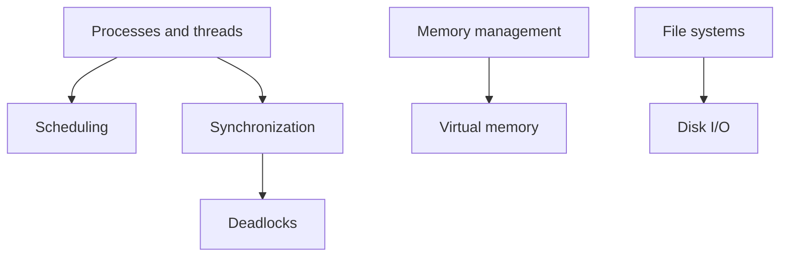

# Operating Systems

> **Paper:** CS · **Priority:** P0/P1

An OS multiplexes processors, memory, files, and devices while enforcing protection. Processes provide execution contexts; scheduling chooses who runs; synchronisation coordinates shared state; memory and file systems manage resources.

| Order | Chapter | Focus |
|---|---|---|
| 1 | [Processes, threads, syscalls](processes-threads-syscalls.md) | Execution and IPC |
| 2 | [CPU scheduling](cpu-scheduling.md) | Ready-queue policy and metrics |
| 3 | [Synchronization](synchronization.md) | Critical sections and semaphores |
| 4 | [Deadlocks](deadlocks.md) | Resource wait cycles and safety |
| 5 | [Memory management](memory-management.md) | Address translation, paging |
| 6 | [Virtual memory](virtual-memory.md) | Demand paging and replacement |
| 7 | [File systems and disk scheduling](file-systems-and-disk-scheduling.md) | Persistent storage |

Connections: [computer organisation](../10-computer-organization/README.md) explains the hardware boundary; [algorithms](../08-algorithms/README.md) supplies scheduling and graph methods; [networks](../15-computer-networks/README.md) supplies communication.

[Cheatsheet](CHEATSHEET.md) · [Checkpoint](CHECKPOINT.md) · [Roadmap](../ROADMAP.md) · [Connections](../CONNECTIONS.md) · [Progress](../PROGRESS.md)
