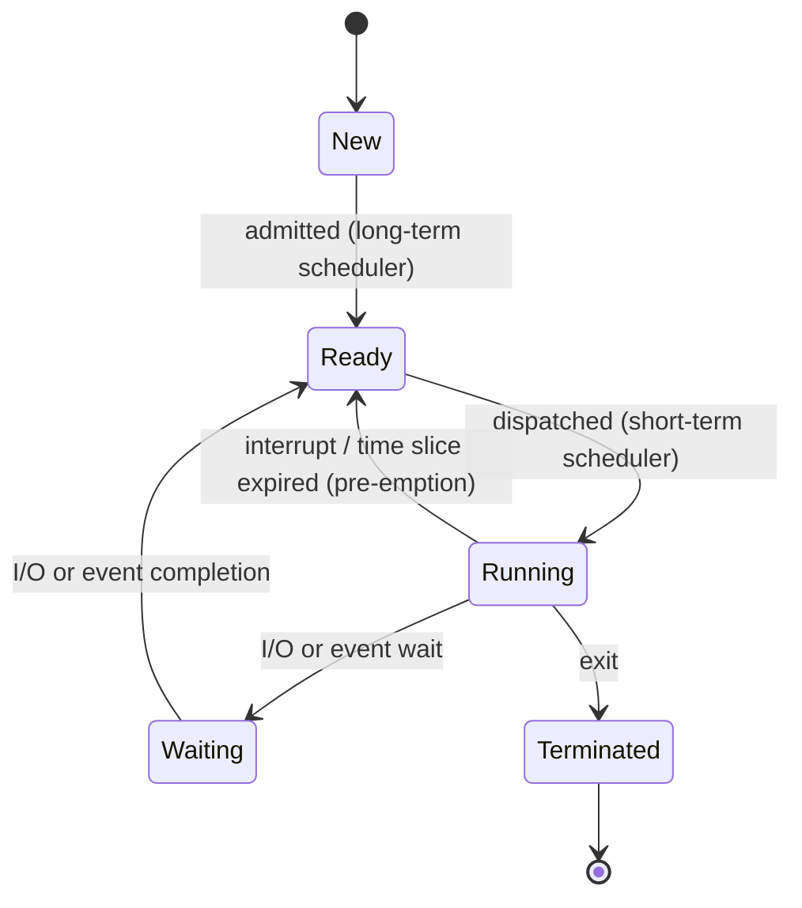

# Processes, Threads, System Calls and IPC

> **Paper:** CS · **Priority:** P0 · **Plan topics:** System calls; Processes; Threads; Inter-process communication
> **Prerequisites:** [Pointers, arrays, strings](../05-c-programming/pointers-arrays-strings.md) · [I/O, interrupts, DMA](../10-computer-organization/io-interrupts-dma.md) · **Leads to:** [CPU scheduling](cpu-scheduling.md) · [Synchronization](synchronization.md)

## Quick glance

- **Kernel mode** can execute privileged instructions and touch all memory; **user mode** cannot. A **system call** is the only controlled door from user to kernel mode (via a **trap** instruction).
- Interrupt = asynchronous, from hardware, unrelated to the current instruction. Trap = deliberate synchronous (system call). Exception/fault = synchronous error caused by the current instruction (divide by zero, page fault).
- **Mode switch** (user to kernel and back) is cheap. **Context switch** (save PCB of one process, load PCB of another) is expensive and is pure overhead.
- A **process** = program in execution = code + data + heap + stack + PCB. States: new, ready, running, waiting (blocked), terminated.
- `fork()` returns **0 in the child, the child's PID in the parent, -1 on failure**. After `n` unconditional `fork()` calls on a single path, there are **2^n processes** (2^n - 1 new ones).
- `exec` replaces the process image (same PID); `wait` reaps a child; a child that finished but is not reaped is a **zombie**; a child whose parent died is an **orphan** (adopted by init).
- Threads of one process **share** code, data, heap, open files; each has a **private** stack, registers, PC. Thread switch is cheaper than process switch.
- IPC: **shared memory** (fast, needs synchronization) vs **message passing** (simple, kernel-mediated, slower). Pipe = unidirectional byte stream, `fd[0]` read end, `fd[1]` write end.
- #1 trap: counting processes/prints with `fork()` inside `&&`, `||` and loops. Draw the process tree.

## 1. The kernel and the two modes

**Intuition.** The OS must protect itself and other programs from a buggy or malicious program. The CPU therefore runs in (at least) two modes, indicated by a **mode bit**: 0 = kernel (supervisor), 1 = user.

| | User mode | Kernel mode |
|---|---|---|
| Instructions | unprivileged only | all (I/O, halt, set timer, change page-table base, disable interrupts) |
| Memory | own address space | everything |
| Entered by | return from kernel | system call, interrupt, exception, reset |

A privileged instruction in user mode raises an exception, and the kernel typically kills the process.

**Why timer interrupts matter.** The OS programs a timer before handing the CPU to a user program. When it fires, control returns to the kernel, so no program can hog the CPU forever. This is what makes pre-emptive scheduling possible.

### Interrupt vs trap vs exception

| Kind | Source | Synchronous? | Example | Resume at |
|---|---|---|---|---|
| Interrupt | external hardware (I/O device, timer) | No | disk finished, timer tick | next instruction |
| Trap (software interrupt) | deliberate instruction | Yes | `int 0x80`, `syscall` | next instruction |
| Exception / fault | the current instruction fails | Yes | divide by zero, page fault, illegal opcode | faulting instruction (page fault) or abort |

**Every one of these transfers control to a kernel handler through the interrupt vector table.** Hardware saves PC and flags, switches to kernel mode, jumps to the handler.

## 2. System calls

A **system call** is a request from a user program to a kernel service. Library wrappers (e.g. `printf` calls `write`) hide the details.

**Mechanism (step by step):**

1. The user program puts the system-call number and arguments in registers (or a block in memory / the stack).
2. It executes a trap instruction (`syscall`, `int 0x80`, `svc`).
3. Hardware switches to kernel mode and jumps through the vector to the system-call dispatcher.
4. The dispatcher indexes the **system-call table** with the call number and runs the kernel routine (after validating arguments and pointers).
5. The result is placed in a register, mode is set back to user, execution resumes after the trap.

Parameter passing: registers (fast, limited count), a memory block whose address is in a register (Linux for many args), or the stack.

| Category | Examples |
|---|---|
| Process control | `fork`, `exec`, `exit`, `wait`, `kill` |
| File management | `open`, `read`, `write`, `close`, `lseek`, `unlink` |
| Device management | `ioctl`, `read`, `write` on device files |
| Information maintenance | `getpid`, `time`, `alarm` |
| Communication | `pipe`, `shmget`, `msgsnd`, `socket` |
| Protection | `chmod`, `chown`, `umask` |

### Mode switch vs context switch

| | Mode switch | Context switch |
|---|---|---|
| What happens | CPU mode bit changes (trap / return) | CPU is given to a different process or thread |
| State saved | minimal (PC, flags) | full PCB: registers, PC, stack pointer, memory-management info |
| Cost | small | large (plus TLB flush / cache cold-start) |
| Needed for a system call? | Yes | **No**, unless the call blocks and the scheduler picks another process |

**Key fact: a system call causes a mode switch but not necessarily a context switch.** A context switch always involves the kernel (so at least two mode switches).

## 3. Processes

### 3.1 What a process is

A **program** is a passive file on disk. A **process** is an active instance: its memory image plus execution state.

```text
High addr  +---------------+
           |     stack     |  grows down: locals, return addresses
           |       |       |
           |       v       |
           |       ^       |
           |       |       |
           |     heap      |  grows up: malloc
           +---------------+
           |  data (.bss)  |  globals / statics
           +---------------+
Low addr   |  text (code)  |
           +---------------+
```

### 3.2 Process Control Block (PCB)

The kernel's per-process record: **PID**, **state**, **program counter**, **CPU registers**, **scheduling info** (priority, queue pointers), **memory-management info** (page-table base, limits), **accounting** (CPU time used), **I/O status** (open file table, devices), parent/child pointers.

### 3.3 Process states



Only **Ready -> Running** and **Running -> Ready (pre-emption)** are decisions of the short-term scheduler. Waiting -> Running is **not** a legal direct transition (it must pass through Ready). With **medium-term scheduling / swapping**, two more states exist: suspended-ready and suspended-waiting (swapped out to disk).

### 3.4 Schedulers

| Scheduler | Also called | Controls | Frequency |
|---|---|---|---|
| Long-term | job scheduler | which jobs are admitted to memory; the **degree of multiprogramming** | rare (seconds to minutes) |
| Medium-term | swapper | swap processes out/in to reduce load | occasional |
| Short-term | CPU scheduler / dispatcher | which ready process runs next | very often (ms), must be fast |

Good long-term mix: a balance of **I/O-bound** (many short CPU bursts) and **CPU-bound** (few long bursts) processes.
The **dispatcher** is the module that does the context switch, switches to user mode and jumps to the right instruction; **dispatch latency** is the time it takes.

### 3.5 Context switch

Steps: save the state of the running process into its PCB, move the PCB to the right queue, select another PCB, restore its state, resume. It is **pure overhead** (no useful work). Cost depends on the hardware (register sets, TLB flush, cache). Typical: microseconds.

## 4. fork, exec, wait, exit

`fork()` creates a **copy** of the calling process: same code, copies of data/heap/stack (copy-on-write in practice, see [Virtual memory](virtual-memory.md)), same open files. Both continue **from the instruction after the fork**.

| Return value | Who gets it |
|---|---|
| `0` | the **child** |
| `> 0` (child PID) | the **parent** |
| `-1` | the parent, creation failed |

**Variables are not shared** after fork (separate address spaces): if the child changes `x`, the parent's `x` is unchanged.

```c
int x = 5;
if (fork() == 0) x++;          // only the child increments its own copy
printf("%d\n", x);             // prints 5 (parent) and 6 (child), either order
```

`exec*()` **replaces** the calling process's image with a new program. PID is unchanged, open files stay open, and **code after a successful exec never runs**. Usual pattern: `fork()` then the child calls `exec`.

`wait()` blocks the parent until a child terminates and **reaps** it (collects the exit status, frees the PCB). `exit()` terminates the caller.

- **Zombie:** child has exited but the parent has not called `wait`; only its PCB entry (exit status) remains.
- **Orphan:** parent exited first; the child is adopted by `init` (PID 1), which reaps it later.

### 4.1 The counting rule

> **Draw a binary tree. Each `fork()` executed by a process creates one new process (the child), and both continue with the code after the call.**

Counting recipe:

1. Maintain the set of live processes and the code position of each.
2. At a `fork()`, each process executing it splits into parent (value > 0) and child (value 0).
3. For `&&`, `||` and `if`, evaluate the **return value per process** (parent: true, child: false) to decide who reaches the next call (short-circuit).
4. Count processes = number of leaves. Count prints per statement as (number of processes that execute it).

**Worked example 1: sequential forks.**

```c
fork(); fork(); fork();
printf("x\n");
```

Each fork doubles the number of processes: 1 -> 2 -> 4 -> 8. **8 processes, 8 lines, 7 children.**

**Worked example 2: fork in a loop.**

```c
for (i = 0; i < n; i++) fork();
printf("x\n");
```

Children also continue the loop with the **current value of `i`**. After iteration `i`, number of processes = 2^(i+1). Total = **2^n processes**, 2^n - 1 children, 2^n lines of `x`.

**Worked example 3: print inside the loop (n = 3).**

```c
for (i = 0; i < 3; i++) { fork(); printf("hi\n"); }
```

| Iteration | Processes executing `fork` | Processes after | Prints this iteration |
|---|---|---|---|
| i = 0 | 1 | 2 | 2 |
| i = 1 | 2 | 4 | 4 |
| i = 2 | 4 | 8 | 8 |

Total = 2 + 4 + 8 = **14 lines** (general: 2^(n+1) - 2). Because `printf` to a terminal is line-buffered, each `\n` flushes. **Without `\n` and with output redirected to a file/pipe (fully buffered), the unflushed buffer is copied into the child by `fork`, so the output count can be larger.** GATE normally assumes lines are printed immediately.

**Worked example 4: fork inside `&&`.**

```c
if (fork() && fork())
    printf("A\n");
printf("B\n");
```

Let P be the original.
- P executes `fork()` #1: P gets > 0 (true), child C1 gets 0 (false).
- C1: `0 && ...` short-circuits, `fork()` #2 not executed. C1 skips A, prints B.
- P (true) executes `fork()` #2: P gets > 0 -> true, child C2 gets 0 -> false.
- P prints A and B. C2 prints B.

```text
P --fork1--> C1 (false, no 2nd fork)          prints B
 \--fork2--> C2 (false)                       prints B
  P (true && true)                            prints A, B
```

**3 processes, A printed once, B printed 3 times (4 lines).**

**Worked example 5: `||`.**

```c
if (fork() || fork())
    fork();
printf("x\n");
```

- P: fork1 returns > 0 (true), `||` short-circuits, no second fork. P enters the if -> fork3 -> P and child C3. Both print x. (2 processes)
- C1 (fork1 returned 0, false): executes fork2. Its parent C1 gets > 0 -> true -> executes fork3 -> C1 and child C1'. Both print x. (2 processes)
- C2 (child of fork2, returned 0): condition false, no fork3. Prints x. (1 process)

Total **5 processes, 5 lines.**

**Worked example 6: mixed operators.** `fork() && fork() || fork();` then `printf`.

Precedence: `&&` binds tighter, so it is `(fork() && fork()) || fork()`.
- P: fork1 true -> fork2: P true => whole `&&` true => `||` short-circuits: no fork3. P: 1 process.
- C2 (fork2 child): `&&` false -> must evaluate fork3 -> splits into 2 processes.
- C1 (fork1 child): `&&` false -> evaluates fork3 -> 2 processes.

Total 1 + 2 + 2 = **5 processes.**

**Worked example 7: print before and between forks.**

```c
fork(); printf("a"); fork(); printf("b");
```

After fork1 there are 2 processes; each prints `a` (2 `a`s). Each then forks (4 processes); each prints `b` (4 `b`s). Total characters printed = **6** (not 8; earlier prints are not "re-printed" by children created later).

**Worked example 8: parent/child branch + wait.**

```c
if (fork() == 0) printf("C");
else { wait(NULL); printf("P"); }
```

`wait` forces the parent to print after the child finished, so output is always `CP`. Without `wait`, either order is possible.

**Worked example 9: fork + exec.**

```c
if (fork() == 0) { execl("/bin/ls", "ls", NULL); printf("E"); }
printf("H");
```

If `execl` succeeds, the child's image is replaced; `E` is never printed. Only the parent prints `H` (the child, after running `ls`, terminates inside `ls`). Output: `ls` listing and one `H`.

**Worked example 10: loop where the child leaves.**

```c
for (i = 0; i < 4; i++) { if (fork() == 0) break; }
printf("x");
```

Only the original keeps looping; each child breaks immediately. 4 children + 1 original = **5 processes, 5 `x`**. (If instead the **parent** breaks and children continue, the tree is also 5 processes for n = 4: sizes n+1 in both cases, because each process forks at most once per iteration but only one line of descendants survives.)

**Worked example 11: loop with `fork() == 0` printing in the child only.**

```c
for (i = 0; i < 2; i++) if (fork() == 0) printf("c%d ", i);
printf("e ");
```

Processes: i=0 fork: P, C0 (prints c0). i=1: P forks C1 (prints c1); C0 forks C0' (prints c1). Prints: c0 once, c1 twice, e by 4 processes. Total tokens printed = 1 + 2 + 4 = **7**.

### 4.2 Traps in fork questions

- Parent and child run **independently**: ordering of outputs is non-deterministic unless `wait`/synchronization is used. GATE "possible outputs" questions ask which orderings are valid.
- Each process has its own copy of every variable; no sharing.
- `fork()` return value matters: `if (fork())` is true in the **parent**.
- The total number of **new** processes = total - 1.

## 5. Threads

A **thread** is a lightweight unit of execution inside a process. A process may have many threads sharing the same address space.

| Shared by all threads of a process | Private to each thread |
|---|---|
| code (text), global/static data, heap | **stack**, **registers** (incl. PC, SP), thread ID |
| open files, signal handlers, working directory | thread-local storage, scheduling priority/state |
| address space and page table | errno / return values |

**Why threads:** responsiveness, resource sharing, cheap creation (no new address space), scalability on multi-core. Switching threads of the same process needs no page-table switch/TLB flush, so it is cheaper than a process context switch.

### User-level vs kernel-level threads

| | User-level threads (ULT) | Kernel-level threads (KLT) |
|---|---|---|
| Managed by | thread library in user space | the OS kernel |
| Kernel aware? | No: sees one process | Yes |
| Switch cost | very low (no mode switch) | higher (system call/ mode switch) |
| Blocking system call | **blocks the whole process** (all threads) | blocks only that thread |
| Multi-core | **cannot** run in parallel on several CPUs | can |
| Scheduling | application-specific, kernel can't help | kernel schedules each thread |

### Multithreading models

| Model | Mapping | Pros | Cons |
|---|---|---|---|
| Many-to-one | many ULT -> 1 kernel thread | cheap, portable | one blocking call blocks all; no parallelism |
| One-to-one | each ULT -> 1 kernel thread | concurrency, parallelism (Linux, Windows) | thread creation costs a kernel thread; may limit count |
| Many-to-many | m user -> n kernel threads (m >= n) | flexible, parallel, no blocking of all | complex to implement |

**Fork in a multithreaded process (POSIX):** the child contains only a copy of the thread that called `fork`.

## 6. Inter-process communication

Processes are isolated, so cooperating processes need IPC. Two fundamental models:

| | Shared memory | Message passing |
|---|---|---|
| Idea | processes map a common region and read/write it | processes exchange messages via `send`/`receive` |
| Kernel involvement | only to set up the region | for **every** message |
| Speed | fast (memory speed) | slower (system calls + copying) |
| Synchronization | **programmer's responsibility** | implicit (receive blocks until a message arrives) |
| Best for | large data, same machine | small data, distributed systems |

**Message-passing design choices:** direct (name the peer) vs indirect (mailbox/port); synchronous (blocking send/receive, "rendezvous") vs asynchronous; buffering: zero capacity, bounded, unbounded.

### Pipes

An **anonymous pipe** is a unidirectional byte stream between related processes (parent/child). `pipe(fd)` fills `fd[0]` (**read end**) and `fd[1]` (**write end**). A **named pipe (FIFO)** has a name in the file system and works between unrelated processes. Reading from an empty pipe blocks; writing to a full pipe blocks; reading when all write ends are closed returns 0 (end of file).

```c
int fd[2]; pipe(fd);
if (fork() == 0) {            // child: reader
    close(fd[1]);             // close unused write end
    char buf[10]; read(fd[0], buf, 10);
} else {                      // parent: writer
    close(fd[0]);
    write(fd[1], "hello", 6);
}
```

The shell's `ls | wc` creates a pipe and connects `ls`'s stdout to `wc`'s stdin.

### Other IPC

Message queues, semaphores, **signals** (asynchronous notifications such as `SIGKILL`, `SIGCHLD`), sockets (also across machines), memory-mapped files.

### Producer-consumer (bounded buffer) with shared memory

A **producer** puts items into a buffer of size N, a **consumer** removes them. Naive circular buffer with `in`, `out` (and no counter):

```c
// buffer[N], in = out = 0
producer: while ((in + 1) % N == out) ;  buffer[in] = item; in = (in + 1) % N;
consumer: while (in == out) ;            item = buffer[out]; out = (out + 1) % N;
```

**This uses only N - 1 slots** (full = `(in+1)%N == out`, empty = `in == out`). Using a shared `count` variable allows all N slots but creates a **race condition** on `count` (see [Synchronization](synchronization.md)); the correct solution uses semaphores `empty`, `full`, `mutex`.

## Formulas and facts to memorise

| Item | Formula / fact | When to use |
|---|---|---|
| Processes after n sequential forks | 2^n total, 2^n - 1 new | fork counting |
| Prints in `for(i<n){fork(); printf}` | 2^(n+1) - 2 | loop print counting |
| fork return | 0 child, PID parent, -1 error | branching |
| exec | replaces image, same PID, no return on success | fork+exec |
| Zombie / Orphan | exited, not reaped / parent died, adopted by init | process-state questions |
| Context switch trigger | timer interrupt, I/O block, higher-priority arrival | scheduling |
| Thread-private | stack, registers, PC, TLS | thread questions |
| ULT blocking call | blocks the whole process | ULT vs KLT |
| Pipe | `fd[0]` read, `fd[1]` write | IPC code |
| Circular buffer without count | holds N - 1 items | producer-consumer |

## GATE traps

- **Counting `fork()` with `&&`/`||`:** the child gets 0 (false) so in `a && b` the child of `a` skips `b`; in `a || b` the child of `a` evaluates `b`, the parent skips it.
- **Prints before a later fork are not duplicated**; but processes created later each execute the remaining statements.
- **Process vs thread sharing:** the **stack** and **registers** are never shared; the **heap and globals** are.
- **System call != context switch.** A system call is a mode switch only.
- **ULT block:** one blocking system call by one user-level thread blocks all threads of that process.
- **Waiting -> Running is not a valid transition;** a woken process becomes Ready.
- **Zombies cannot be killed by `kill`;** they disappear when the parent calls `wait` (or dies).
- **Interrupts are asynchronous, traps/exceptions synchronous.** A page fault is an exception, not an interrupt.
- A context switch **does not** happen between two threads of the same process in the "address-space switch" sense (no page-table swap), but registers/stack pointer still change.
- Trap handler returns to the **next** instruction; page-fault handler returns to the **faulting** instruction (re-executed).

## Connections

- [CPU scheduling](cpu-scheduling.md) — chooses which Ready process or thread gets the CPU; context-switch overhead enters the utilisation formulas.
- [Synchronization](synchronization.md) — shared memory between threads/processes creates race conditions; semaphores solve producer-consumer.
- [Virtual memory](virtual-memory.md) — `fork` is cheap thanks to copy-on-write; each process has its own page table.
- [Memory management](memory-management.md) — the address-space layout and the PCB's memory-management fields.
- [I/O, interrupts, DMA](../10-computer-organization/io-interrupts-dma.md) — interrupt hardware that triggers kernel entry.
- [Pointers, arrays, strings](../05-c-programming/pointers-arrays-strings.md) — the stack/heap layout and `fork`'s copied variables.
- [Runtime environments](../12-compiler-design/runtime-environments.md) — activation records on the per-thread stack.
- [Transport layer / sockets](../15-computer-networks/transport-layer-tcp.md) — sockets are the IPC mechanism across machines.

## Practice

**Q1 (MCQ).** How many child processes are created by the program fragment `fork(); fork(); fork();`?
(A) 3 (B) 4 (C) 7 (D) 8

<details><summary>Answer</summary>

**Answer:** (C) 7.
**Solution:** Each `fork` doubles the number of processes: 1 -> 2 -> 4 -> 8. Total 8 processes, of which 7 are new (children).

</details>

**Q2 (NAT).** How many lines are printed?
```c
for (i = 0; i < 3; i++) { fork(); printf("hi\n"); }
```

<details><summary>Answer</summary>

**Answer:** 14.
**Solution:** Iteration 0: 1 process forks -> 2 print (2 lines). Iteration 1: 2 forks -> 4 print (4 lines). Iteration 2: 4 forks -> 8 print (8 lines). Total 2 + 4 + 8 = 14.

</details>

**Q3 (NAT).** Total number of processes (including the original) created by
```c
if (fork() || fork()) fork();
```

<details><summary>Answer</summary>

**Answer:** 5.
**Solution:** P: fork1 true, skip fork2; enters if, fork3 -> 2 processes. Child C1 of fork1 (false) executes fork2: its parent copy gets true -> fork3 -> 2 processes; the child of fork2 (false) does not enter the if -> 1. Total 2 + 2 + 1 = 5.

</details>

**Q4 (MCQ).** Which of the following is **not** shared among the threads of one process?
(A) global variables (B) heap (C) open file descriptors (D) stack

<details><summary>Answer</summary>

**Answer:** (D).
**Solution:** Each thread has its own stack (local variables, return addresses) and its own register set; code, global data, heap and open files are shared.

</details>

**Q5 (MSQ).** Which statements are true?
(A) A system call always causes a context switch.
(B) A context switch can be triggered by a timer interrupt.
(C) A process in the Waiting state moves directly to Running when its I/O completes.
(D) A user-level thread's blocking system call can block the entire process.

<details><summary>Answer</summary>

**Answer:** (B) and (D).
**Solution:** (A) false: a system call is a mode switch; a context switch happens only if the scheduler picks another process. (C) false: the process becomes Ready first. (B) true: the timer interrupt can expire the quantum. (D) true: the kernel sees only one schedulable entity.

</details>

**Q6 (NAT).** Number of characters printed by
```c
fork(); printf("a"); fork(); printf("b");
```

<details><summary>Answer</summary>

**Answer:** 6.
**Solution:** After the first fork 2 processes each print `a` (2). Both fork again, giving 4 processes that each print `b` (4). Total 2 + 4 = 6.

</details>

**Q7 (NAT).** Total processes created (including the first) by `fork() && fork() || fork();`

<details><summary>Answer</summary>

**Answer:** 5.
**Solution:** Parse as `(fork1 && fork2) || fork3`. Parent: fork1 true, fork2 true => `&&` true, fork3 skipped -> 1 process. Child of fork2: `&&` false -> runs fork3 -> 2 processes. Child of fork1: `&&` false -> runs fork3 -> 2 processes. Total 5.

</details>

**Q8 (MCQ).** A parent creates a child with `fork()` and exits before the child. The child is then called
(A) zombie (B) orphan (C) daemon (D) a thread

<details><summary>Answer</summary>

**Answer:** (B) orphan.
**Solution:** Orphan = child whose parent has terminated; `init` adopts it. A zombie is a terminated child awaiting `wait`.

</details>
