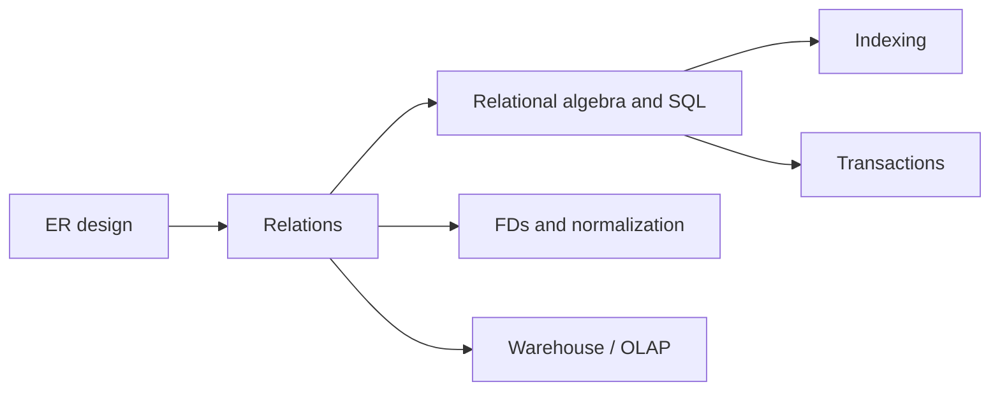

# Databases and Data Warehousing

> **Paper:** CS+DA · **Priority:** P0/P1

Databases model facts as relations, query them declaratively, enforce constraints, and coordinate concurrent updates. Learn the relational model before SQL and functional dependencies; then study indexing and transactions. DA adds warehousing and preprocessing.

| Order | Chapter | Focus |
|---|---|---|
| 1 | [ER model](er-model.md) | Conceptual design |
| 2 | [Relational model, algebra, calculus](relational-model-algebra-calculus.md) | Tables and query semantics |
| 3 | [SQL](sql.md) | Practical declarative queries |
| 4 | [Constraints and normalization](constraints-and-normalization.md) | FDs, keys, normal forms |
| 5 | [File organization and indexing](file-organization-and-indexing.md) | Physical lookup |
| 6 | [Transactions and concurrency](transactions-and-concurrency.md) | ACID and serializability |
| 7 | [Warehousing and preprocessing](data-warehousing-and-preprocessing.md) | DA analytical data |

Connections: [compiler parsing](../12-compiler-design/parsing.md) handles query syntax; [OS file systems](../13-operating-systems/file-systems-and-disk-scheduling.md) provide storage; [ML](../16-machine-learning/README.md) consumes prepared features.

[Cheatsheet](CHEATSHEET.md) · [Checkpoint](CHECKPOINT.md) · [Roadmap](../ROADMAP.md) · [Connections](../CONNECTIONS.md) · [Progress](../PROGRESS.md)
