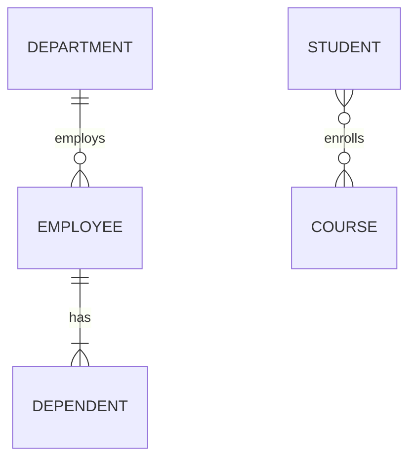

# Entity–Relationship Model

> **Paper:** CS+DA · **Priority:** P1 · **Plan topics:** ER model
> **Prerequisites:** [Sets, relations, functions](../01-discrete-mathematics/sets-relations-functions.md) · **Leads to:** [Relational model, algebra, calculus](relational-model-algebra-calculus.md), [Constraints and normalization](constraints-and-normalization.md)

## Quick glance

- **Entity** = a distinguishable real-world object; **entity set** = collection of similar entities; **attribute** = property; **relationship** = association among entities; **relationship set** = collection of similar relationships.
- Attribute kinds: simple, composite, **multivalued** (double ellipse), **derived** (dashed ellipse), **key** (underlined).
- **Cardinality ratio** (1:1, 1:N, N:1, M:N) says how many entities on one side can be related to one entity on the other; **participation** (total = double line, partial = single line) says whether *every* entity must take part.
- **Weak entity** has no key of its own; identified by owner's key + its **partial key (discriminator)** through an **identifying relationship**; always total participation in it.
- ER to tables: every strong entity gets a table; **M:N relationship gets its own table**; **1:N** puts the FK on the N side (no extra table); **1:1** merges into one side (prefer the total side); **multivalued attribute gets its own table**; weak entity table includes owner's key.
- **Minimum number of tables** is the standard GATE question: count entities, subtract merges (1:1, 1:N, N:1 relationships), add M:N relationships and multivalued attributes.
- **Trap:** total participation matters for merging 1:1 (both total gives a *single* table); for 1:N it only decides whether the FK is NOT NULL, not the table count.

## 1. Why a conceptual model

Before creating tables we draw a picture of the data: what things exist, what facts we store about them, and how they connect. The ER diagram is that picture. It is independent of any DBMS and is later **mapped** to relations (Section 6). Think of it as the floor plan before the construction drawing.

## 2. Entities and attributes

- **Entity**: an object that exists and is distinguishable from others (a student with roll 21CS101).
- **Entity set**: all entities of one type (the set of all students). Drawn as a rectangle.
- **Attribute**: a function from the entity set to a domain. Drawn as an ellipse attached to the entity.

| Attribute kind | Meaning | Notation | Becomes in tables |
| --- | --- | --- | --- |
| Simple (atomic) | Cannot be split (Age) | Ellipse | One column |
| Composite | Made of parts (Name = First + Last; Address = Street + City) | Ellipse with child ellipses | **Leaf components** become columns, the composite itself does not |
| Single-valued | One value per entity | Ellipse | Column |
| **Multivalued** | Several values per entity (Phone numbers) | Double ellipse | **Separate table** (Section 6) |
| Derived | Computed from others (Age from DOB) | Dashed ellipse | **Not stored** (no column) |
| Key | Uniquely identifies an entity | Underlined | Primary key |
| NULL-able | Value unknown/not applicable | none | Column allowing NULL |

**Key attribute**: a minimal set of attributes whose values are unique across the entity set. An entity set may have several candidate keys; one is chosen as the primary key.

**Entity set with no key = weak entity set** (Section 4).

## 3. Relationships, cardinality, participation

A **relationship** associates two or more entities (Student *enrolls in* Course). Drawn as a diamond. Its **degree** is the number of participating entity sets: binary (2), ternary (3), and so on. A relationship can carry its own attributes (grade on *enrolls in*), and these attributes belong to the **relationship**, not to either entity (for M:N, the grade depends on the *pair*).

### 3.1 Cardinality ratio (mapping cardinality)

For a binary relationship R between A and B:

| Ratio | Meaning | Example |
| --- | --- | --- |
| 1:1 | An A relates to at most one B and vice versa | Department *has* Head |
| 1:N | One A relates to many B; each B to at most one A | Department *employs* Employee |
| N:1 | Mirror image of 1:N | Employee *works in* Department |
| M:N | Both sides may relate to many | Student *takes* Course |

**Reading rule:** in `Employee (N) — works_in — (1) Department`, the **1 sits next to the entity that appears at most once per partner**: each employee works in at most one department.

### 3.2 Participation constraint

- **Total participation** (double line): every entity in the set must appear in at least one relationship instance. Example: every Employee must work in a Department.
- **Partial participation** (single line): some entities may not participate.

The pair "(cardinality, participation)" can also be written as a structural constraint **(min, max)** on each side. Total = min 1, partial = min 0; max 1 or N.



Crow's-foot reading: `||` exactly one, `o|` zero or one, `|{` one or many, `o{` zero or many.

## 4. Weak entities

A **weak entity set** has no sufficient attributes to form a primary key. Each weak entity is identified only **in the context of an owner (identifying/strong) entity**.

- Drawn as a **double rectangle**; the **identifying relationship** is a **double diamond**.
- Its **partial key (discriminator)** is dotted/dashed-underlined.
- **Weak entity key = owner's primary key + discriminator.**
- The weak entity has **total participation** in the identifying relationship, which is always 1:N (owner : weak).
- **Existence dependent:** delete the owner and its weak entities go too (maps to ON DELETE CASCADE).

**Example.** Employee(**EID**, Name) owns Dependent(*DepName*, Age). Two employees can both have a dependent named "Ravi", so DepName alone is not a key. Key of Dependent = (EID, DepName).

## 5. Specialisation and generalisation (EER)

- **Specialisation** (top-down): split a set into sub-classes with extra attributes or relationships (Employee into Engineer, Manager). Drawn with an **ISA triangle**.
- **Generalisation** (bottom-up): combine similar sets into a super-class (Car and Truck into Vehicle).
- Subclasses **inherit** the superclass's attributes and key.

| Constraint | Options |
| --- | --- |
| Disjointness | **Disjoint** (an entity in at most one subclass) or **Overlapping** |
| Completeness | **Total** (every superclass entity must be in some subclass) or **Partial** |

Mapping options:

| Method | Tables | Good when |
| --- | --- | --- |
| Table per entity set (super + each sub with the super's key) | 1 + k | Always works; most general |
| Table per subclass only (copy super attributes into each) | k | Specialisation is **total and disjoint** |
| Single table with a type attribute | 1 | Few extra attributes; produces NULLs |

## 6. ER to relational mapping

**Rules (each in one line):**

1. **Strong entity** E with simple attributes: table E with those attributes; key attribute becomes the primary key; composite attributes contribute only their leaves; derived attributes are dropped.
2. **Weak entity** W with owner O: table W with W's attributes plus **O's primary key as FK**; PK = (O's key, discriminator). The identifying relationship adds no separate table.
3. **Multivalued attribute** A of entity E: a new table EA(E's key, A); PK = (E's key, A) as a whole.
4. **1:1 relationship** between A and B: put the FK in one of the two tables (merge). Prefer the side with **total participation** (so the FK is never NULL). If **both sides are total**, merge all of A, B and the relationship into **one table**. Relationship attributes go with the table that received the FK.
5. **1:N relationship** (1 side A, N side B): add A's key as an FK in B's table (plus relationship attributes). **No new table.**
6. **M:N relationship**: new table with the keys of both participants as FKs; PK = (both keys); relationship attributes included.
7. **Ternary (n-ary) relationship**: new table with the keys of all participants; the PK depends on cardinality (for M:N:P all three keys; for an N:1 side, drop that side's key from the PK).

### Minimum number of tables

Start from `#entity sets` and apply:

```text
tables = (#entity sets)
       + (#M:N relationships)          each needs its own table
       + (#multivalued attributes)     each needs its own table
       + (#n-ary relationships, n>2, each as one table)
       - (#1:1 merges where both sides total -> one table absorbs the other, and so on)
```

1:N and N:1 relationships never add a table in the minimum count. 1:1 relationships never add a table either, because they merge into one participant (for both-total they also fuse the two entity tables into one).

### Worked example 1: employee and department (N:1)

`Employee(EID, Name)` N:1 `Department(DID, DName)` via *works_in* (Employee total).

- Employee table gets FK DID (NOT NULL because total).
- Tables: **Employee(EID, Name, DID), Department(DID, DName) = 2**.

### Worked example 2: M:N with attribute

`Student(SID, Name)` M:N `Course(CID, Title)` via *enrolls* with attribute `Grade`.

- Tables: Student, Course, **Enrolls(SID, CID, Grade)**, PK (SID, CID) = **3**.

### Worked example 3: 1:1 with participation

`Manager(MID, Name)` 1:1 `Department(DID, DName)` via *manages*.

| Participation | Tables | Result |
| --- | --- | --- |
| Department total, Manager partial | 2 | Department(DID, DName, MID) (MID NOT NULL, UNIQUE); Manager(MID, Name) |
| Both partial | 2 | FK in either side, NULLs possible |
| **Both total** | **1** | Merged table Mgr_Dept(MID, Name, DID, DName) |

### Worked example 4: multivalued and composite

`Employee(EID, Name(First, Last), {Phone}, Age derived)`:

- Employee(EID, First, Last) (Age dropped, composite flattened).
- EmpPhone(EID, Phone), PK (EID, Phone).
- **2 tables.**

### Worked example 5: weak entity

`Employee(EID, Name)` — *depends_on* (double diamond) — `Dependent(*DepName*, Age)`.

- Employee(EID, Name); Dependent(EID, DepName, Age) PK (EID, DepName), FK EID with ON DELETE CASCADE.
- **2 tables.**

### Worked example 6: GATE-style combined count

Entity sets E1(a1, a2), E2(b1, b2), E3(c1, c2). Relationships: R1 between E1 and E2 is M:N; R2 between E2 and E3 is 1:N (E3 on the N side); R3 between E1 and E3 is 1:1 with **both sides total**. a2 is multivalued.

| Item | Count |
| --- | --- |
| Entity tables E1, E2, E3 | 3 |
| R1 (M:N) | +1 |
| R2 (1:N, FK in E3) | 0 |
| R3 (1:1 both total, E1 and E3 fuse into one) | -1 |
| Multivalued a2 | +1 |
| **Total** | **4** |

Tables: E1E3R3(a1, c1, c2, ...), E2(b1, b2), R1(a1, b1), E1_a2(a1, a2). But E3 holds the FK to E2 (R2), which lives in the fused table, so the fused table includes b1 as an FK. Count = 4. Note that if R3 were 1:1 with only one side total, E1 and E3 would **not** fuse and the count would be 5.

### Worked example 7: ternary

`Supplier`, `Part`, `Project` with a ternary relationship *supplies*, M:N:P. Tables: Supplier, Part, Project, Supplies(SID, PID, JID) = **4**. If a project is supplied each part by **at most one** supplier (N:N:1 with Supplier as the 1 side), the key of Supplies shrinks to (PID, JID).

## Formulas and facts to memorise

| Item | Formula/fact | When to use |
| --- | --- | --- |
| Weak entity key | Owner PK + discriminator | Mapping a weak entity |
| M:N mapping | New table, PK = both keys | Always |
| 1:N mapping | FK on the N side | Always; no extra table |
| 1:1 mapping | FK on total side; both total merges all | Min-table counting |
| Multivalued attribute | New table (key, value) | Min-table counting |
| Derived attribute | Not stored | Dropping a column |
| Min tables | entities + M:N + multivalued - fused 1:1 pairs (+ n-ary relationships) | NAT questions |
| Cardinality symbols | 1 = at most one partner; N/M = many | Reading diagrams |
| Total participation | Double line, min = 1 | FK NOT NULL |
| Identifying relationship | Double diamond, always 1:N, weak side total | Weak entities |

## GATE traps

- **Count only what the question counts.** "Minimum tables" can differ from "tables in a good design"; for 1:N never add a table even though a separate relationship table would also be valid.
- **Both-total 1:1 gives one table, not two.** One-total gives two; neither total still gives two (do not add a relationship table).
- **A weak entity does not need its own relationship table.** The identifying relationship is absorbed into the weak entity's table via the owner's key.
- **Multivalued attribute always adds a table** (in the relational form); composite does not, because its leaves are columns.
- **Relationship attributes of 1:N** go to the **N side** table; of M:N go to the relationship table.
- **A weak entity set's identifying relationship is 1:N**, so participation of the weak side is total.
- **Cardinality reading direction.** "Each employee works in one department" is N:1 from Employee to Department: put the FK in Employee.
- **Specialisation total+disjoint** can drop the superclass table; overlapping cannot, since an entity could be duplicated across subclass tables.
- A ternary relationship cannot in general be rebuilt from three binaries without losing information.

## Connections

- [Relational model](relational-model-algebra-calculus.md): tables, keys and foreign keys produced by the mapping are the objects of relational algebra.
- [Constraints and normalization](constraints-and-normalization.md): a good ER design usually already yields 3NF/BCNF tables; weak entity mapping gives ON DELETE CASCADE behaviour.
- [SQL](sql.md): the tables from the mapping are created with CREATE TABLE, PRIMARY KEY and FOREIGN KEY.
- [Sets, relations, functions](../01-discrete-mathematics/sets-relations-functions.md): relationship sets are subsets of Cartesian products; cardinality ratios are the function/relation types (1:1 = injective partial function, and so on).
- [Data warehousing](data-warehousing-and-preprocessing.md): star schemas are a special ER shape (one fact entity, many dimension entities, all N:1).

## Practice

**Q1 (MCQ).** In a 1:N relationship between Department (1) and Employee (N), where should the foreign key be placed in the minimum-table design?
(a) Department (b) Employee (c) A new table (d) Both

<details><summary>Answer</summary>

**Answer:** (b).
**Solution:** The N side may relate to only one Department, so each Employee row can store one DID. No new table is needed.

</details>

**Q2 (NAT).** An ER diagram has 4 entity sets and 3 binary relationships: one M:N, one 1:N, one 1:1 (partial on both sides). No multivalued attributes. What is the minimum number of tables?

<details><summary>Answer</summary>

**Answer:** 5.
**Solution:** 4 entity tables + 1 for the M:N relationship; the 1:N and the 1:1 merge via FKs (no extra tables). 4 + 1 = 5.

</details>

**Q3 (MCQ).** Which attribute gets its own table when mapping an ER diagram? (a) composite (b) derived (c) multivalued (d) key

<details><summary>Answer</summary>

**Answer:** (c).
**Solution:** Composite attributes are flattened into columns, derived ones are dropped, key attributes become the PK, and multivalued attributes need a separate table.

</details>

**Q4 (NAT).** Entities A and B are in a 1:1 relationship with total participation on both sides. How many tables for A, B and the relationship if A and B have no other relationships?

<details><summary>Answer</summary>

**Answer:** 1.
**Solution:** Both-total 1:1 allows merging all of A, B and the relationship into a single table.

</details>

**Q5 (MSQ).** A weak entity set W with owner O: which statements are true?
(a) W's primary key includes O's primary key. (b) W participates totally in the identifying relationship. (c) The identifying relationship needs its own table. (d) The identifying relationship is 1:N from O to W.

<details><summary>Answer</summary>

**Answer:** (a), (b), (d).
**Solution:** The identifying relationship is merged into W's table through the owner's key as FK, so (c) is false.

</details>

**Q6 (NAT).** Employee(EID, Name, {Skills}, {Phones}, Address(City, Street)) is related M:N to Project(PID) via *works_on*. How many tables in the minimum design?

<details><summary>Answer</summary>

**Answer:** 5.
**Solution:** Employee, Project, Works_on (M:N), EmpSkills, EmpPhones = 5. Address is flattened into the Employee table.

</details>

**Q7 (MCQ).** Entities A(a1), B(b1), C(c1). R1: A–B M:N; R2: B–C 1:N (C on the N side); R3: A–C 1:1 with total participation on A only. What is the minimum number of tables? (a) 3 (b) 4 (c) 5 (d) 6

<details><summary>Answer</summary>

**Answer:** (b) 4.
**Solution:** 3 entity tables + 1 for R1. R2 and R3 are absorbed via FKs (R3 FK goes into A, the total side). 3 + 1 = 4.

</details>

**Q8 (MSQ).** A total, disjoint specialisation of Person into Student and Teacher. Which mappings are valid?
(a) One table Person with a type column. (b) Tables Person, Student, Teacher, with Student and Teacher holding Person's key. (c) Only Student and Teacher tables, each copying Person's attributes. (d) Only a Person table, with no information about the subclass.

<details><summary>Answer</summary>

**Answer:** (a), (b), (c).
**Solution:** Total + disjoint makes (c) safe (every person is in exactly one subclass). (d) loses the subclass information and subclass-specific attributes.

</details>
