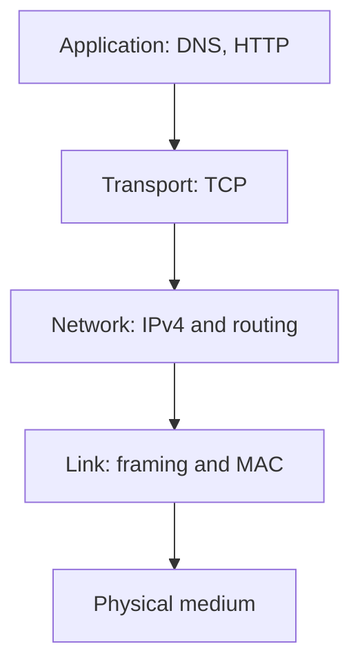

# Computer Networks

> **Paper:** CS · **Priority:** P0/P1

Networks move data across links with different scopes: link protocols deliver frames on one link, IP routes packets across networks, transport provides process-to-process service, and applications define useful exchanges. Use the 2027 syllabus scope in [coverage](../COVERAGE.md); older PYQs can include legacy protocols not named in the current syllabus.

| Order | Chapter | Focus |
|---|---|---|
| 1 | [Layering, switching, performance](layering-switching-performance.md) | Delay, throughput, switching |
| 2 | [Data link](data-link-layer.md) | Error detection and MAC |
| 3 | [Routing](routing.md) | Distance-vector and link-state |
| 4 | [IPv4 addressing](ipv4-addressing.md) | Subnets, CIDR, NAT |
| 5 | [TCP and transport](transport-layer-tcp.md) | Flow/congestion, sockets |
| 6 | [Application layer](application-layer.md) | DNS and HTTP |

Connections: [OS sockets](../13-operating-systems/processes-threads-syscalls.md) connect applications to transport; [graph algorithms](../08-algorithms/shortest-paths.md) underpin route calculation; [COA I/O](../10-computer-organization/io-interrupts-dma.md) covers device transfer.

[Cheatsheet](CHEATSHEET.md) · [Checkpoint](CHECKPOINT.md) · [Roadmap](../ROADMAP.md) · [Connections](../CONNECTIONS.md) · [Progress](../PROGRESS.md)
