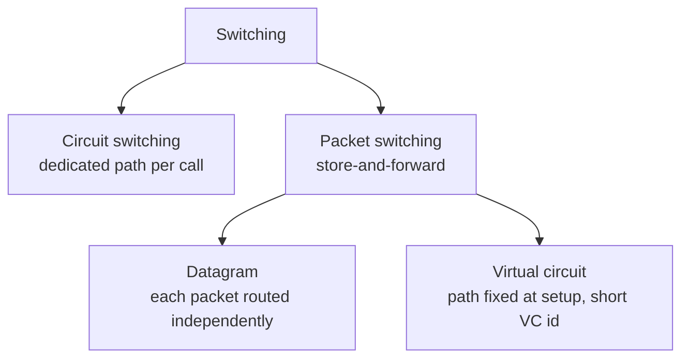

# Layering, Switching and Performance Metrics

> **Paper:** CS · **Priority:** P1 · **Plan topics:** Principles of layering; Circuit switching; Packet switching; Virtual circuit switching; Network performance metrics
> **Prerequisites:** [Computer Networks README](README.md) · **Leads to:** [Data link layer](data-link-layer.md), [Transport layer and TCP](transport-layer-tcp.md)

## Quick glance

- **Layering** splits a network into stacked services; each layer talks to its peer using a **protocol** and to the layer above/below through an **interface**. TCP/IP has 4 layers (5 in the teaching model), OSI has 7.
- **Encapsulation:** each layer adds its own header (the link layer also a trailer). PDU names: application = message, transport = segment (TCP) / datagram (UDP), network = packet/datagram, link = frame, physical = bits.
- **Devices:** hub/repeater = L1, bridge/switch = L2, router = L3, gateway = L7 (any layer above).
- **Circuit switching:** setup, dedicated reserved bandwidth, no queuing after setup, wasted when idle. **Packet switching:** store-and-forward, statistical sharing, queuing. **Virtual circuit:** packet switching with a pre-set path and per-VC state; packets carry only a short VC id.
- Message over $k$ links, rate $R$, $M$ bits as one unit: $k\cdot M/R$. Split into $n$ packets of $p$ bits: $(n + k - 1)\cdot p/R$ (**pipelining**).
- Delays: $d_{nodal} = d_{proc} + d_{queue} + d_{trans} + d_{prop}$; $d_{trans} = L/R$, $d_{prop} = d/v$ (about $2\times10^8$ m/s in cable).
- **Bandwidth-delay product** $= R \times RTT$ (bits "in flight" to keep the pipe full).
- **#1 trap:** bits vs bytes and $10^3$ vs $2^{10}$. Link rates use $10^3$ powers of ten ($1$ Mbps $= 10^6$ bit/s); memory sizes use $2^{10}$ unless stated.

---

## 1. Principles of layering

**Intuition.** Sending a letter: you write it, the post office sorts it, trucks move bags, and nobody at the truck level reads the letter. Each stage uses the services of the stage below and hides its own details from the stage above. A network does the same: if each layer only depends on the service of the layer below, any layer can be swapped (Wi-Fi for Ethernet, IPv4 for IPv6) without touching the rest.

**Definitions.**
- **Service:** what a layer offers to the layer above (e.g., "reliable byte stream").
- **Protocol:** rules two **peer** entities of the same layer on different machines follow.
- **Interface:** the boundary between adjacent layers on one machine.
- **Encapsulation:** layer $n$ treats the whole unit from layer $n+1$ as opaque payload and prepends its header.

### 1.1 The two stacks

| OSI (7) | TCP/IP (4) | 5-layer teaching model | PDU | Typical protocols | Address used |
| --- | --- | --- | --- | --- | --- |
| 7 Application | Application | Application | Message | HTTP, DNS, SMTP, FTP | URL / domain name |
| 6 Presentation | (in Application) | (in Application) | – | encryption, encoding | – |
| 5 Session | (in Application) | (in Application) | – | dialog control | – |
| 4 Transport | Transport | Transport | Segment (TCP) / Datagram (UDP) | TCP, UDP | Port number |
| 3 Network | Internet | Network | Packet / Datagram | IP, ICMP, routing | IP address |
| 2 Data link | Link (Network access) | Data link | Frame | Ethernet, Wi-Fi | MAC address |
| 1 Physical | | Physical | Bit | cables, signals | – |

**Responsibilities in one line each.**
- **Physical:** raw bits as signals. **Data link:** node-to-node delivery on one link, framing, error detection, medium access.
- **Network:** host-to-host delivery across many links (addressing, routing, fragmentation). **Transport:** process-to-process delivery (ports), reliability, flow and congestion control.
- **Application:** the user-visible protocol.

**Hop-by-hop vs end-to-end.** Layers 1-3 are hop-by-hop (routers implement them). Layers 4-7 are end-to-end (only the two hosts implement them). **Routers never look at the TCP header** (NAT and firewalls are the exception that breaks the rule).

### 1.2 Encapsulation example

A browser sends an HTTP request of 100 bytes over TCP/IP over Ethernet. Minimum headers: TCP 20 B, IP 20 B, Ethernet header 14 B + FCS 4 B.

```text
Application   [ HTTP data 100 B ]
Transport     [TCP 20][ HTTP data 100 ]                      = 120 B segment
Network       [IP 20][TCP 20][ HTTP data 100 ]               = 140 B packet
Link      [Eth 14][IP 20][TCP 20][ HTTP data 100 ][FCS 4]    = 158 B frame
```

Header overhead $= 58$ B out of 158 B, so useful fraction $= 100/158 = 63.3\%$. The receiver strips headers in reverse order (decapsulation). **A router only decapsulates up to layer 3**, re-encapsulates in a new frame for the next link.

### 1.3 Devices and the layer they operate at

| Device | Highest layer | Forwards using | Collision domains | Broadcast domains |
| --- | --- | --- | --- | --- |
| Repeater / hub | 1 | nothing (copies bits to all ports) | 1 total | 1 |
| Bridge / L2 switch | 2 | MAC address | 1 per port | 1 total (no VLAN) |
| Router | 3 | IP address | 1 per port | 1 per port |
| Gateway | up to 7 | protocol translation | – | – |

### 1.4 Header sizes to remember

| Header | Size |
| --- | --- |
| Ethernet header / trailer (FCS) | 14 B / 4 B |
| IPv4 header | 20 B (minimum), up to 60 B |
| TCP header | 20 B (minimum), up to 60 B |
| UDP header | 8 B |

---

## 2. Switching: how data crosses a network of links

A source and destination are rarely directly connected. **Switching** decides how a path through intermediate nodes is used.



### 2.1 Circuit switching

**Idea.** Before data flows, a path is established and **resources (a frequency band via FDM, or a time slot via TDM) are reserved end-to-end**. Think of a landline phone call.

Phases: (1) **circuit establishment** (signalling travels to the destination and back), (2) **data transfer** (constant rate, no queuing, no per-packet header, in-order), (3) **teardown**.

Properties:
- **Guaranteed rate and constant delay**; no congestion once admitted.
- **Idle capacity is wasted**: reserved even when silent. Bad for bursty data.
- A call may be **blocked** at setup if no free circuit exists.
- Delay for one message: $T_{circuit} = T_{setup} + \dfrac{M}{R} + k\cdot T_p$ (transmission once, propagation over $k$ links; no store-and-forward delay).

**FDM/TDM sharing.** On a link of 1.536 Mbps with TDM of 24 slots, each circuit gets 64 kbit/s. Time to send a 640,000-bit file on one circuit: $640000/64000 = 10$ s, plus setup (say 500 ms) = 10.5 s.

### 2.2 Packet switching (datagram)

**Idea.** Split the message into packets. Each packet carries the destination address and is routed independently. **Each router receives the entire packet before forwarding it (store-and-forward)** and queues packets when the outgoing link is busy.

- Resources are **shared on demand (statistical multiplexing)**: efficient for bursty traffic.
- No setup; packets of a flow can take different paths and arrive **out of order**.
- Delay is variable; packets are dropped if router buffers overflow.
- **Header overhead on every packet.**

**Statistical multiplexing example.** A 1 Mbps link; each user needs 100 kbps when active and is active 10% of the time. Circuit switching supports $1000/100 = 10$ users. Packet switching supports 35 users with the probability of more than 10 active users simultaneously being tiny (about $0.0004$), so users can be about 3.5 times more.

### 2.3 Virtual-circuit (VC) switching

**Idea.** A hybrid: packet switching with a **path fixed at setup**. A setup phase picks the path and installs a **VC table entry in every switch on the path**: (incoming port, incoming VC id) $\to$ (outgoing port, outgoing VC id). Packets carry only the short VC id, not the full destination address, and the id is **rewritten at each hop (label swapping)**. (ATM, Frame Relay, MPLS work this way.)

```text
Host A --[VC 7]--> S1 --[VC 3]--> S2 --[VC 9]--> Host B
S1 table: (port1, 7) -> (port2, 3)      S2 table: (port1, 3) -> (port4, 9)
```

- Packets of one VC follow the same path, so **arrive in order**; routers keep **per-connection state**.
- Resources (buffers, bandwidth) can optionally be reserved at setup, giving QoS.
- If a switch on the path fails, the VC is broken and must be re-set up.
- Setup costs one round trip, so very short transfers are inefficient.

### 2.4 Comparison

| Feature | Circuit | Datagram packet | Virtual circuit |
| --- | --- | --- | --- |
| Setup | Yes | No | Yes |
| Path | Fixed | Per packet | Fixed per VC |
| Resource reservation | Dedicated | None | Optional |
| Address in each packet | No | Full destination | Short VC id |
| Order | In order | May reorder | In order |
| Router state | Per call | None (only routing table) | Per VC |
| Store-and-forward | No | Yes | Yes |
| Bandwidth utilisation | Poor for bursty | Good | Good |
| Failure of a node | Call lost | Packets rerouted | VC lost |

### 2.5 Worked example: message switching vs packet switching (GATE favourite)

A message of $M = 12000$ bits is sent from source to destination through 2 intermediate routers (so $k = 3$ links), each link $R = 1$ Mbps. Ignore propagation, queuing and headers.

**Whole message (message switching).** Each router waits for the full message before forwarding.

$$T = k \cdot \frac{M}{R} = 3 \times \frac{12000}{10^6} = 36 \text{ ms}$$

**Packets of $p = 1000$ bits** ($n = 12$ packets). Packet transmission time $t = 1$ ms. The first packet takes $k t = 3$ ms to arrive. Each later packet arrives one $t$ after the previous (pipelining), so the last packet arrives at

$$T = (k + n - 1)\,t = (3 + 12 - 1) \times 1 = 14 \text{ ms}$$

```text
time(ms)   0  1  2  3  4  5 ...                      13 14
link1      P1 P2 P3 P4 P5 P6 ...   P12
link2         P1 P2 P3 P4 P5 ...   P11 P12
link3            P1 P2 P3 P4 ...   P10 P11 P12   (last bit arrives at 14 ms)
```

**Effect of packet size** (same example, no header):

| Packet size p (bits) | n | $(n + k - 1)\cdot p/R$ |
| --- | --- | --- |
| 12000 | 1 | 36 ms |
| 6000 | 2 | 24 ms |
| 3000 | 4 | 18 ms |
| 2000 | 6 | 16 ms |
| 1000 | 12 | 14 ms |
| 500 | 24 | 13 ms |
| 100 | 120 | 12.2 ms |

**Smaller packets always reduce the delay without headers**, with the lower limit $M/R = 12$ ms.

**With a header of $h = 100$ bits per packet** (packet total $= p + h$): the total time is $(n + k - 1)(p + h)/R$. Using $p = 1000$: $14 \times 1100/10^6 = 15.4$ ms.

**Optimal packet size with headers.** Let $T(p) = \dfrac{(M/p + k - 1)(p + h)}{R}$. Setting $dT/dp = 0$ gives

$$p_{opt} = \sqrt{\frac{M\,h}{k-1}}$$

Example: $M = 10800$ bits, $h = 100$ bits, $k = 4$ links: $p_{opt} = \sqrt{10800 \times 100/3} = \sqrt{360000} = 600$ bits, so $n = 18$ packets of 700 bits: $T = (18 + 3) \times 700 / R = 14700/R$. Check neighbours: $p = 900$ gives $(12+3)\times1000 = 15000$; $p = 300$ gives $(36+3)\times 400 = 15600$. So 600 is the minimum.

### 2.6 Worked example: circuit vs packet total time

$M = 10^6$ bits, 3 links of 1 Mbps, 5 ms propagation per link. Circuit setup takes 20 ms. Packets are 10000 bits with 500 bits header, ignore queuing.

- Circuit: $20 + 10^6/10^6\text{ s} + 3\times 5 = 20 + 1000 + 15 = 1035$ ms.
- Packet: $n = 100$ packets, each 10500 bits so $t = 10.5$ ms. Time $= (n + k - 1)t + k T_p = 102 \times 10.5 + 15 = 1071 + 15 = 1086$ ms.

Packet switching is slower here because of header overhead; its advantage is sharing, not raw speed.

---

## 3. Network performance metrics

### 3.1 Bandwidth, throughput, goodput

- **Bandwidth (link rate) $R$:** maximum bits per second a link can transmit.
- **Throughput:** the rate actually achieved end-to-end; limited by the **bottleneck link**: $\min(R_1, R_2, \dots)$ (and by protocol, e.g., window/RTT).
- **Goodput:** useful application bytes per second (excludes headers and retransmissions).

### 3.2 The four components of nodal delay

$$d_{nodal} = d_{proc} + d_{queue} + d_{trans} + d_{prop}$$

| Delay | Meaning | Formula |
| --- | --- | --- |
| Processing | examine header, error check, choose port | microseconds, usually given |
| Queuing | waiting in the output buffer | depends on load; traffic intensity $La/R$ ($a$ = packet arrival rate, $L$ = packet length) near 1 makes it blow up |
| **Transmission** | push all bits of the packet onto the wire | $d_{trans} = L / R$ |
| **Propagation** | bit travelling the wire | $d_{prop} = d / v$ ($v \approx 2\times10^8$ m/s in copper/fibre, $3\times10^8$ m/s in vacuum) |

**Transmission depends on packet size and rate; propagation depends on distance and medium. Doubling the rate halves transmission delay but does not change propagation delay.**

**Worked example.** A 1500-byte packet over a 100 Mbps link of length 2000 km: $d_{trans} = 12000/10^8 = 120\ \mu s$; $d_{prop} = 2\times10^6/2\times10^8 = 10$ ms. Propagation dominates by a factor of about 83. Over a 1 km LAN link, $d_{prop} = 5\ \mu s$ and transmission dominates.

### 3.3 End-to-end delay over $k$ links with store-and-forward

Ignoring processing and queuing, $L$ bits, $N$ routers between ($k = N + 1$ links): $d = k\,(L/R) + \sum d_{prop}$. A sender pushes the first bit out at time 0, the last bit is out at $L/R$, and each router adds $L/R + d_{prop}$.

### 3.4 Round-trip time and bandwidth-delay product

- **RTT** $\approx 2\,d_{prop}$ plus transmission, processing and queuing delays on the path.
- **Bandwidth-delay product (BDP)** $= R \times RTT$ (or $R \times$ one-way delay for the "pipe capacity" in one direction). It is the maximum number of bits "in flight". To fully utilise a link, **window $\ge$ BDP**.

**Worked example.** $R = 100$ Mbps, RTT $= 40$ ms: BDP $= 10^8 \times 0.04 = 4\times10^6$ bits $= 500{,}000$ bytes. A sender with a 64 KB window gets $65536\times 8 / 0.04 = 13.1$ Mbps, only 13% utilisation.

### 3.5 Utilisation

For one packet of $L$ bits and then waiting for an acknowledgement (stop-and-wait):

$$U = \frac{d_{trans}}{d_{trans} + RTT} = \frac{1}{1 + 2a}, \quad a = \frac{T_p}{T_t}$$

(derived and extended to windows in [Data link layer](data-link-layer.md)).

**Worked example.** $L = 1000$ B, $R = 1$ Mbps, one-way propagation 15 ms: $T_t = 8$ ms, RTT $= 30$ ms, $U = 8/(8+30) = 21.05\%$ and throughput $= 0.2105$ Mbps.

### 3.6 Units traps

| Quantity | Convention |
| --- | --- |
| Link rate: kbps, Mbps, Gbps | **powers of 10**: 1 Mbps $= 10^6$ bit/s |
| File / packet sizes: KB, MB | **Ambiguous**: networking questions usually say "1 KB = 1024 B" or "1000 B" explicitly. If unstated for a file, GATE usually takes $2^{10}$ multiples for sizes, $10^3$ for rates |
| Byte | 8 bits |
| ms, $\mu$s | $10^{-3}$, $10^{-6}$ s |

Check every number: **bits for transmission time, bytes for headers.** Convert before dividing.

---

## Formulas and facts to memorise

| Item | Formula/fact | When to use |
| --- | --- | --- |
| Transmission delay | $L/R$ | time to put a packet on the wire |
| Propagation delay | $d/v$ | time for a bit to travel |
| Message over $k$ links | $k\,M/R$ | no packetisation |
| Packets over $k$ links | $(n + k - 1)\,p/R$ | pipelined store-and-forward |
| Circuit switching time | $T_{setup} + M/R + kT_p$ | compare to packet |
| Optimal packet size | $\sqrt{Mh/(k-1)}$ | minimise delay with headers |
| BDP | $R \times RTT$ | window needed to fill pipe |
| Stop-and-wait utilisation | $1/(1+2a)$ | single-frame-in-flight |
| Hub / switch / router layer | 1 / 2 / 3 | device questions |
| PDUs | bit, frame, packet, segment, message | layer naming |

## GATE traps

- **Forgetting store-and-forward.** For a single packet over $k$ links the time is $k\,L/R$, not $L/R$.
- **Pipelining formula:** it is $(n + k - 1)$ packet times, **not** $n \times k$.
- **Counting links vs routers:** with $N$ intermediate routers there are $N + 1$ links.
- **Mixing bits and bytes**, or using $1024$ for a rate. Mbps is $10^6$.
- **Header overhead:** with headers, smaller packets are not always better; there is an optimum.
- **Circuit switching has no store-and-forward delay** and no per-packet header, but pays setup time.
- **Virtual circuit is not circuit switching:** no dedicated bandwidth is guaranteed; it still queues and statistically multiplexes.
- **Switch vs router domains:** a switch separates collision domains but not broadcast domains; a router separates both.
- A **hub** is Layer 1 (no MAC knowledge); a **bridge/switch** is Layer 2.

## Connections

- [Data link layer](data-link-layer.md) — transmission/propagation ratio $a$ drives efficiency of stop-and-wait, GBN and CSMA/CD.
- [Transport layer and TCP](transport-layer-tcp.md) — BDP determines the window needed; sliding-window throughput $= W/RTT$.
- [IPv4 addressing](ipv4-addressing.md) — the network layer is where datagram forwarding and header overhead live.
- [Routing](routing.md) — datagram forwarding needs routing tables; VCs use label tables.
- [Application layer](application-layer.md) — HTTP page-load times use RTTs and transmission delays.
- [Operating systems: processes, threads, IPC](../13-operating-systems/processes-threads-syscalls.md) — sockets are the OS interface to this stack.
- [Probability basics](../02-probability-statistics/probability-basics.md) — statistical multiplexing is a binomial tail calculation.
- [Computer organization: I/O](../10-computer-organization/io-interrupts-dma.md) — same latency/bandwidth reasoning for buses.

## Practice

**Q1 (MCQ).** Which device forwards frames using MAC addresses and creates a separate collision domain per port?
(A) Hub (B) Repeater (C) Switch (D) Router

<details><summary>Answer</summary>

**Answer:** (C)  
**Solution:** A switch is a Layer-2 device that learns MAC addresses and forwards selectively, so each port is its own collision domain. Hubs and repeaters are Layer 1 (one collision domain). A router does separate collision domains but forwards by IP address (Layer 3).

</details>

**Q2 (NUM).** A packet of 2000 bits is sent over 4 links, each of 1 Mbps, store-and-forward, with negligible propagation. Find the end-to-end delay in ms.

<details><summary>Answer</summary>

**Answer:** 8 ms  
**Solution:** each link $2000/10^6 = 2$ ms; $4\times 2 = 8$ ms.

</details>

**Q3 (NUM).** A 24000-bit message is split into 6 equal packets (no headers) and sent over 3 links, each 2 Mbps; ignore propagation. Find the delay in ms.

<details><summary>Answer</summary>

**Answer:** 16 ms  
**Solution:** $p = 4000$ bits, $t = 4000/(2\times10^6) = 2$ ms. $T = (n + k - 1)t = (6 + 3 - 1)\times 2 = 16$ ms. (Unsplit message would take $3\times 12 = 36$ ms.)

</details>

**Q4 (MCQ).** Which statement about virtual-circuit switching is TRUE?
(A) Each packet carries the full destination address. (B) Packets of one VC may arrive out of order. (C) Switches keep state per virtual circuit. (D) Bandwidth is always dedicated.

<details><summary>Answer</summary>

**Answer:** (C)  
**Solution:** VC switches hold a table entry per VC. Packets carry only a short VC id (A false), follow one path so arrive in order (B false), and bandwidth is optionally reserved, not dedicated (D false).

</details>

**Q5 (NUM).** A link has $R = 1$ Gbps and RTT $= 50$ ms. Find the bandwidth-delay product in KB, taking 1 KB = 1000 B.

<details><summary>Answer</summary>

**Answer:** 6250 KB  
**Solution:** $10^9\times 0.05 = 5\times10^7$ bits $= 6.25\times10^6$ B $= 6250$ KB.

</details>

**Q6 (MSQ).** Select all correct statements.
(A) Propagation delay depends on packet length. (B) Transmission delay depends on link rate. (C) Doubling the link rate halves transmission delay. (D) Queuing delay is always zero in circuit switching after setup.

<details><summary>Answer</summary>

**Answer:** (B), (C), (D)  
**Solution:** propagation $= d/v$ is independent of packet length (A false). Transmission $= L/R$ (B, C true). In circuit switching the path is reserved so there is no queuing during data transfer (D true).

</details>

**Q7 (NUM).** A message of 9600 bits goes over 5 links of 1 Mbps with packets of 800 bits payload plus 100 bits header. Find the delay in ms (ignore propagation).

<details><summary>Answer</summary>

**Answer:** 14.4 ms  
**Solution:** $n = 9600/800 = 12$ packets; each is 900 bits so $t = 0.9$ ms; $T = (n + k - 1)\,t = (12 + 5 - 1)\times 0.9 = 16\times0.9 = 14.4$ ms. (Using $n + k = 17$ would wrongly give 15.3 ms.)

</details>

**Q8 (NUM, hard).** For $M = 40000$ bits, $h = 400$ bits and $k = 5$ links, find the optimal payload size per packet in bits.

<details><summary>Answer</summary>

**Answer:** 2000 bits  
**Solution:** $p_{opt} = \sqrt{Mh/(k-1)} = \sqrt{40000\times400/4} = \sqrt{4\times10^6} = 2000$.

</details>
