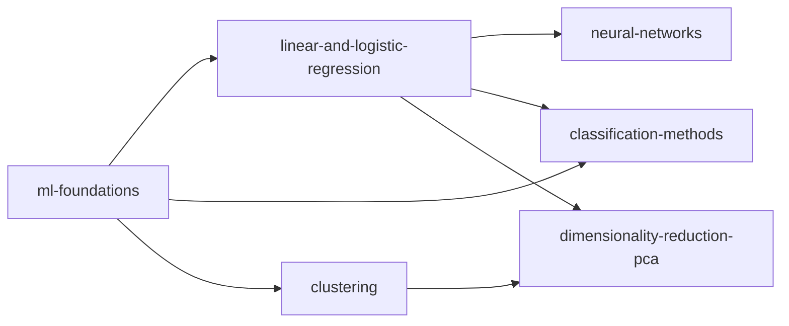

# 16 · Machine Learning

**Paper:** DA only · **Approximate GATE weightage:** 15–20 marks of the 100-mark DA paper (one of the two or three heaviest subject blocks; questions are mostly numerical or "which statement is true").

**Prerequisites:** [02 Probability & Statistics](../02-probability-statistics/README.md) (Bayes, Gaussian, expectation, MLE flavour) · [03 Linear Algebra](../03-linear-algebra/README.md) (projections, eigenvectors, SVD) · [04 Calculus & Optimization](../04-calculus-optimization/README.md) (gradients, minima) · [06 Python Programming](../06-python-programming/README.md) (tracing code that calls models).
**Leads to:** [17 Artificial Intelligence](../17-artificial-intelligence/README.md) (naive Bayes is a Bayesian network; search and probabilistic reasoning).

## Why this subject matters / mental model

Machine learning is **function fitting under uncertainty**: choose a model family, define a loss that measures disagreement with data, minimise it, then check on unseen data whether you learned the pattern or memorised noise. Every chapter here is an instance of that loop:

- regression and classification = *which loss, which family*;
- bias-variance and cross-validation = *how to judge and tune the family*;
- clustering and PCA = the same loop *without labels*.

GATE asks for hand computation on tiny datasets (a regression line, a k-NN vote, an information gain, one k-means iteration, a dendrogram merge, eigenvalues of a 2x2 covariance) and for conceptual comparisons (bias vs variance, ridge vs OLS, LOOCV vs k-fold). Practise the arithmetic; the concepts are short.

## Reading order

| Chapter | Priority | Plan topics covered |
| --- | --- | --- |
| [ml-foundations.md](ml-foundations.md) | P0 | Regression vs classification problems; Bias-variance trade-off; Leave-one-out cross-validation; k-fold cross-validation |
| [linear-and-logistic-regression.md](linear-and-logistic-regression.md) | P0 | Simple linear regression; Multiple linear regression; Ridge regression; Logistic regression |
| [classification-methods.md](classification-methods.md) | P0 | k-nearest neighbours; Naive Bayes classifier; Linear discriminant analysis; Support vector machines; Decision trees |
| [neural-networks.md](neural-networks.md) | P1 | Multi-layer perceptron; Feed-forward neural networks |
| [clustering.md](clustering.md) | P0 | Clustering; k-means; k-medoids; Hierarchical clustering: top-down; Hierarchical clustering: bottom-up; Single-linkage clustering; Multiple-linkage clustering |
| [dimensionality-reduction-pca.md](dimensionality-reduction-pca.md) | P0 | Dimensionality reduction; Principal component analysis |

## Dependencies inside the section

## Connections to other subjects

- [03 Linear Algebra: projections and SVD](../03-linear-algebra/orthogonality-projections-svd.md) — OLS is a projection; PCA is an SVD.
- [03 Linear Algebra: eigenvalues](../03-linear-algebra/eigenvalues-and-eigenvectors.md) — principal components are eigenvectors of the covariance matrix.
- [02 Probability: Bayes](../02-probability-statistics/probability-basics.md) — naive Bayes, LDA, MLE.
- [04 Calculus: maxima-minima](../04-calculus-optimization/maxima-minima-optimization.md) — gradient descent, Lagrange multipliers (SVM).
- [08 Algorithms: MST](../08-algorithms/minimum-spanning-trees.md) — single-linkage clustering equals Kruskal stopped early.
- [17 AI: probabilistic reasoning](../17-artificial-intelligence/probabilistic-reasoning.md) — naive Bayes as a Bayesian network.
- [06 Python](../06-python-programming/README.md) — array and loop tracing for numpy-style code.

## Files

[CHEATSHEET.md](CHEATSHEET.md) · [CHECKPOINT.md](CHECKPOINT.md)

[Roadmap](../ROADMAP.md) · [Connections](../CONNECTIONS.md) · [Progress](../PROGRESS.md)
