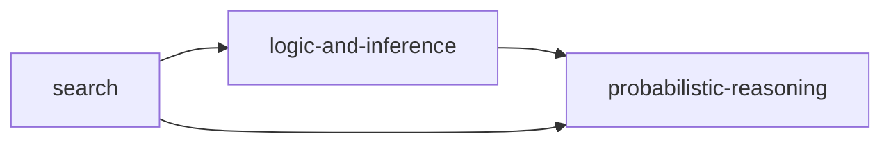

# 17 · Artificial Intelligence

**Paper:** DA only · **Approximate GATE weightage:** 8–12 marks of the 100-mark DA paper (search and Bayesian-network questions are the most frequent; logic and sampling appear less often).

**Prerequisites:** [01 Discrete Mathematics](../01-discrete-mathematics/README.md) (propositional and first-order logic) · [02 Probability & Statistics](../02-probability-statistics/README.md) (Bayes, independence) · [07 Data Structures](../07-data-structures/README.md) and [08 Algorithms](../08-algorithms/README.md) (queues, heaps, BFS/DFS, Dijkstra) · [16 Machine Learning](../16-machine-learning/README.md) (naive Bayes).
**Leads to:** end of the syllabus; it ties together logic, graph algorithms and probability.

## Why this subject matters / mental model

Classical AI is **an agent choosing actions with incomplete information**, in three flavours that match the three chapters:

- **Search**: the world is a graph; find a good path (uninformed, informed with a heuristic, or against an opponent).
- **Logic**: the world is a set of true/false statements; derive what must be true (entailment, resolution, chaining, unification).
- **Probability**: the world is uncertain; represent beliefs compactly (Bayesian networks with conditional independence) and answer queries exactly (variable elimination) or approximately (sampling).

GATE questions are mostly hand traces: node-expansion order, a heuristic's admissibility, an alpha-beta count, a resolution step, an MGU, a d-separation check, or one probability from a small network. Know the algorithm precisely and the tie-breaking rule used in the question.

## Reading order

| Chapter | Priority | Plan topics covered |
| --- | --- | --- |
| [search.md](search.md) | P0 | Uninformed search; Informed search; Adversarial search |
| [logic-and-inference.md](logic-and-inference.md) | P1 | Propositional logic; Predicate logic |
| [probabilistic-reasoning.md](probabilistic-reasoning.md) | P0 | Conditional independence; Representation of conditional independence; Exact inference via variable elimination; Approximate inference via sampling |

## Dependencies inside the section

(The three chapters can be read independently; logic is the special case of probability with only certain facts.)

## Connections to other subjects

- [08 Algorithms: graph traversals](../08-algorithms/graph-traversals.md) and [shortest paths](../08-algorithms/shortest-paths.md) — BFS/DFS, UCS = Dijkstra, A\*.
- [07 Data Structures: heaps](../07-data-structures/heaps.md) — priority queues for UCS/A\*.
- [01 Discrete Mathematics: propositional logic](../01-discrete-mathematics/propositional-logic.md) and [first-order logic](../01-discrete-mathematics/first-order-logic.md) — syntax and equivalences used by the inference algorithms.
- [02 Probability: basics](../02-probability-statistics/probability-basics.md) — the probability toolkit for Bayesian networks.
- [16 ML: classification methods](../16-machine-learning/classification-methods.md) — naive Bayes is a one-parent Bayesian network.
- [11 Theory of Computation](../11-theory-of-computation/turing-machines-and-undecidability.md) — FOL entailment is semi-decidable.

## Files

[CHEATSHEET.md](CHEATSHEET.md) · [CHECKPOINT.md](CHECKPOINT.md)

[Roadmap](../ROADMAP.md) · [Connections](../CONNECTIONS.md) · [Progress](../PROGRESS.md)
