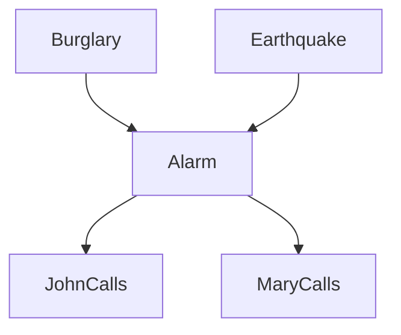

# Probabilistic reasoning: conditional independence, Bayesian networks, inference

> **Paper:** DA · **Priority:** P0 · **Plan topics:** Conditional independence; Representation of conditional independence; Exact inference via variable elimination; Approximate inference via sampling
> **Prerequisites:** [Probability basics](../02-probability-statistics/probability-basics.md) · [Random variables and moments](../02-probability-statistics/random-variables-and-moments.md) · [Naive Bayes](../16-machine-learning/classification-methods.md) · **Leads to:** [CHECKPOINT](CHECKPOINT.md)

## Quick glance

- **Joint distribution** over $n$ binary variables has $2^n-1$ free numbers. Everything is computable from it by **marginalisation** (sum out) and **conditioning** ($P(X\mid e)=P(X,e)/P(e)$).
- $X\perp Y\mid Z$ iff $P(X,Y\mid Z)=P(X\mid Z)P(Y\mid Z)$ (equivalently $P(X\mid Y,Z)=P(X\mid Z)$). Marginal independence and conditional independence are **different**: neither implies the other.
- **Bayesian network** = DAG + CPT $P(X_i\mid\text{Parents}(X_i))$ per node. Joint $=\prod_iP(X_i\mid\text{Pa}(X_i))$. Parameters for binary nodes: $\sum_i2^{|\text{Pa}(X_i)|}$.
- **d-separation**: chain $A\to B\to C$ and fork $A\leftarrow B\to C$ are **blocked by observing $B$**; collider $A\to B\leftarrow C$ is **blocked unless $B$ (or a descendant) is observed** (explaining away).
- **Markov blanket** of $X$ = parents, children, children's other parents; $X$ is independent of everything else given it.
- **Exact inference**: enumeration (sum the joint) or **variable elimination** (multiply factors, sum out hidden variables one at a time; order affects cost). NP-hard in general, linear for polytrees.
- **Approximate inference**: prior sampling, **rejection sampling** (discard samples inconsistent with evidence), **likelihood weighting** (fix evidence, weight by evidence likelihood), **Gibbs sampling** (MCMC, resample one variable given its Markov blanket).
- #1 trap: **observing a collider (or its descendant) makes its parents dependent**; observing a chain/fork middle makes ends independent.

## 1. Probability toolkit

**Joint, marginal, conditional.** $P(X)=\sum_yP(X,y)$ (marginalisation). $P(X\mid e)=\alpha\,P(X,e)$ with $\alpha=1/P(e)$ (normalisation). **Chain rule**: $P(X_1,\dots,X_n)=\prod_iP(X_i\mid X_1,\dots,X_{i-1})$. **Bayes**: $P(H\mid E)=P(E\mid H)P(H)/P(E)$.

**Cost of the full joint** for $n$ binary variables: $2^n$ entries ($2^n-1$ free). For $n=30$ that is over $10^9$: we need structure.

## 2. Conditional independence

**Definition.** $X\perp Y\mid Z$ if $P(x,y\mid z)=P(x\mid z)P(y\mid z)$ for all values with $P(z)>0$. Equivalent: $P(x\mid y,z)=P(x\mid z)$: once $Z$ is known, $Y$ tells nothing more about $X$.

**Worked example (dependent marginally, independent conditionally).** $Z\in\{0,1\}$ with $P(Z=1)=0.5$; $P(X=1\mid Z=1)=0.8$, $P(X=1\mid Z=0)=0.2$; $P(Y=1\mid Z=1)=0.9$, $P(Y=1\mid Z=0)=0.1$; $X,Y$ independent given $Z$ by construction.
- $P(X=1)=0.5(0.8)+0.5(0.2)=0.5$; $P(Y=1)=0.5(0.9)+0.5(0.1)=0.5$.
- $P(X=1,Y=1)=0.5(0.8\cdot0.9)+0.5(0.2\cdot0.1)=0.36+0.01=0.37$.
- $P(X=1)P(Y=1)=0.25\ne0.37$: **$X$ and $Y$ are marginally dependent** (they share a common cause $Z$), yet **conditionally independent given $Z$**.

**Conversely**, independent causes can become dependent given a common effect (section 3). Conditional independence is what lets us factor the joint: it is the engine behind naive Bayes (features independent given class) and Bayesian networks.

## 3. Representing conditional independence: Bayesian networks

**Definition.** A Bayesian network is a **directed acyclic graph** with one node per random variable and, for each node, a **conditional probability table (CPT)** $P(X_i\mid\text{Pa}(X_i))$. The semantics:

$$P(x_1,\dots,x_n)=\prod_{i=1}^nP(x_i\mid\text{pa}(x_i))$$

Each node is conditionally independent of its non-descendants given its parents (the **local Markov property**).

**Running example (burglary-alarm).** $B$ (burglary) and $E$ (earthquake) are parents of $A$ (alarm); $A$ is the parent of $J$ (John calls) and $M$ (Mary calls).

| CPT | Values |
| --- | --- |
| $P(B)$ | $0.001$ |
| $P(E)$ | $0.002$ |
| $P(A\mid B,E)$ | TT: $0.95$, TF: $0.94$, FT: $0.29$, FF: $0.001$ |
| $P(J\mid A)$ | A: $0.90$, $\neg$A: $0.05$ |
| $P(M\mid A)$ | A: $0.70$, $\neg$A: $0.01$ |

**Factorisation**: $P(B,E,A,J,M)=P(B)P(E)P(A\mid B,E)P(J\mid A)P(M\mid A)$.
Example entry: $P(j,m,a,\neg b,\neg e)=0.90\cdot0.70\cdot0.001\cdot0.999\cdot0.998=0.000628$.

**Parameter counting.** Binary nodes: $1+1+4+2+2=\mathbf{10}$ numbers, versus $2^5-1=31$ for the full joint. A node with $k$ binary parents needs $2^k$ numbers. Savings grow exponentially for sparse graphs; a fully connected DAG needs $2^n-1$.

**Naive Bayes as a Bayesian network**: the class $C$ is the single parent of every feature $F_j$; $P(C,F_1..F_d)=P(C)\prod_jP(F_j\mid C)$ (see [classification methods](../16-machine-learning/classification-methods.md)). Parameters: $1+2d$ for binary features.

### 3.1 d-separation

$X$ and $Y$ are **d-separated** by a set $Z$ (hence $X\perp Y\mid Z$ in every distribution that factorises over the graph) iff **every** undirected path between them is **blocked** by $Z$. A path is blocked if it contains:
- a **chain** $\to M\to$ or a **fork** $\leftarrow M\to$ with $M\in Z$; or
- a **collider** $\to M\leftarrow$ with $M\notin Z$ **and no descendant of $M$ in $Z$**.

| Structure | Path | Independent when | Dependent when |
| --- | --- | --- | --- |
| Chain | $A\to B\to C$ | $B$ observed | $B$ unobserved |
| Fork (common cause) | $A\leftarrow B\to C$ | $B$ observed | $B$ unobserved |
| Collider (common effect) | $A\to B\leftarrow C$ | $B$ and descendants **unobserved** | $B$ (or a descendant) observed |

**Worked checks in the alarm network.**
- $B\perp E$ (no evidence): path $B\to A\leftarrow E$ is a collider, unobserved: **independent**.
- $B\perp E\mid A$: collider observed: **dependent** (explaining away).
- $B\perp E\mid J$: $J$ is a descendant of the collider $A$: **dependent**.
- $J\perp M\mid A$: fork on $A$ observed: **independent**. $J\perp M$ with no evidence: fork unobserved: **dependent**.
- $B\perp J\mid A$: chain $B\to A\to J$ blocked by $A$: **independent**.

**Explaining away, numerically.** Using the CPTs: $P(b)=0.001$; given the alarm, $P(b\mid a)=0.374$; additionally learning an earthquake occurred, $P(b\mid a,e)=0.0033$; learning there was *no* earthquake, $P(b\mid a,\neg e)=0.485$. The earthquake "explains away" the alarm, so the burglary becomes less likely.

**Markov blanket** of $X$: parents, children, and children's other parents. $MB(A)=\{B,E,J,M\}$; $MB(E)=\{A,B\}$ (child $A$ and co-parent $B$); $MB(B)=\{A,E\}$.

**Equivalent networks**: $A\to B\to C$, $A\leftarrow B\to C$, $A\leftarrow B\leftarrow C$ encode the same independencies; the collider $A\to B\leftarrow C$ differs.

## 4. Exact inference

**Task.** Query variable $X$, evidence $e$, hidden variables $Y$: $P(X\mid e)=\alpha\sum_yP(X,e,y)$.

### 4.1 Enumeration

Sum the factored joint over all hidden variables. For $P(B\mid j,m)$ (hidden: $E,A$):

$$P(b\mid j,m)=\alpha\,P(b)\sum_eP(e)\sum_aP(a\mid b,e)P(j\mid a)P(m\mid a)$$

Compute the unnormalised values:
- $B=\text{true}$: $\sum_{e,a}\ldots\times P(b)=0.00059224$
- $B=\text{false}$: $0.00149186$
- Sum $=0.00208410=P(j,m)$. **$P(b\mid j,m)=0.00059224/0.00208410=\mathbf{0.2842}$.**

Each of the two values sums $2\times2=4$ terms over $(E,A)$; enumeration repeats identical sub-computations (e.g. $P(j\mid a)P(m\mid a)$) across branches.

### 4.2 Variable elimination (VE)

**Idea.** Write each CPT as a **factor** (table over its variables); evidence restricts factors; repeatedly (i) **multiply** all factors containing a hidden variable, (ii) **sum it out**, producing a new smaller factor; at the end multiply the remaining factors over the query and normalise. Computation is reused instead of repeated.

**Operations.**
- **Restriction**: set evidence variables to their observed values.
- **Pointwise product**: $f(X,Y)\cdot g(Y,Z)=h(X,Y,Z)$.
- **Sum-out**: $\sum_yh(x,y,z)$.

**Worked example.** Query $P(B\mid j,m)$; elimination order $E$ then $A$.

*Factors (after restriction):* $f_B(B)$; $f_E(E)$; $f_A(A,B,E)=P(A\mid B,E)$; $f_J(A)=P(j\mid A)$: $(a:0.90,\ \neg a:0.05)$; $f_M(A)=P(m\mid A)$: $(a:0.70,\ \neg a:0.01)$.

*Step 1, eliminate $E$:* $f_1(A,B)=\sum_eP(e)P(A\mid B,e)$.

| $A$ | $B$ | $f_1(A,B)$ |
| --- | --- | --- |
| T | T | $0.998(0.94)+0.002(0.95)=0.94002$ |
| T | F | $0.998(0.001)+0.002(0.29)=0.001578$ |
| F | T | $0.05998$ |
| F | F | $0.998422$ |

*Step 2, eliminate $A$:* $f_2(B)=\sum_af_J(a)f_M(a)f_1(a,B)$.
- $B=T$: $0.9\cdot0.7\cdot0.94002+0.05\cdot0.01\cdot0.05998=0.592213+0.000030=0.592243$.
- $B=F$: $0.63\cdot0.001578+0.0005\cdot0.998422=0.000994+0.000499=0.001493$.

*Step 3:* multiply by $f_B$: $B=T$: $0.001\cdot0.592243=0.00059224$; $B=F$: $0.999\cdot0.001493=0.00149186$. Normalise: **$P(b\mid j,m)=0.2842$**, matching enumeration.

**Order matters.** Eliminating a variable creates a factor over all its neighbours in the current interaction graph; the largest factor size gives the cost ($\text{treewidth}$). A bad order can create exponentially larger factors. Finding the best order is NP-hard; heuristics: min-degree, min-fill. For this network any order is cheap; in a chain $X_1\to\dots\to X_n$ eliminating from one end costs $O(nk^2)$ ($k$ = domain size) while a naive order may build big factors.

**Complexity.** Exact inference in general Bayesian networks is **NP-hard** (#P-hard to count); VE is exponential in the treewidth of the elimination order; **polytrees** (singly connected: at most one undirected path between any pair) admit linear-time inference.

**Irrelevant variables.** A hidden leaf that is neither query nor evidence can be dropped (it sums to 1). Example: for $P(J\mid b)$, $M$ is irrelevant.

## 5. Approximate inference by sampling

When exact inference is too expensive, estimate probabilities from random samples. Error shrinks as $1/\sqrt N$ regardless of network size.

### 5.1 Direct (prior) sampling

Sample each variable in **topological order** from $P(X_i\mid\text{pa}(X_i))$ given the already-sampled parents. The fraction of samples with $X=x$ estimates $P(x)$. Consistent, but cannot use evidence.

### 5.2 Rejection sampling

Generate prior samples; **reject those inconsistent with the evidence**; estimate $P(X\mid e)$ from the rest. **Inefficient when evidence is rare**: only a fraction $P(e)$ of samples survive. For $e=(j,m)$: $P(j,m)=0.002084$, so roughly $99.8\%$ of samples are thrown away; for 10,000 samples expect about 21 survivors.

### 5.3 Likelihood weighting

Fix the evidence variables to their observed values (never sample them); sample the others in topological order; give each sample a **weight** equal to the product of the evidence variables' probabilities given their sampled parents. Estimate by weighted counts $\sum w\cdot1[x]/\sum w$.

**Worked example.** Query $P(B\mid j,m)$; evidence $J=T$, $M=T$. Weight $=P(j\mid A)P(m\mid A)$.
- Sample $B=F,E=F,A=F$: weight $=0.05\cdot0.01=0.0005$.
- Sample $B=F,E=F,A=T$ (rare: $P(a\mid\neg b,\neg e)=0.001$): weight $=0.90\cdot0.70=0.63$.
- Sample $B=T,E=F,A=T$: weight $0.63$.
Samples with $A=T$ carry far more weight than those with $A=F$, which is what corrects for the evidence. All $N$ samples are used (none rejected), but weights can become very uneven when evidence is unlikely given the sampled parents, and evidence **downstream** of a variable does not influence how that variable is sampled.

### 5.4 Gibbs sampling (MCMC)

Fix evidence. Start with a random assignment of the non-evidence variables. Repeatedly **pick a non-evidence variable $X$ and resample it from $P(X\mid MB(X))$** (conditioned on the current values of its Markov blanket); every visited state counts as a sample. The process is a Markov chain whose **stationary distribution is $P(\text{hidden}\mid e)$**; the chain needs a **burn-in** and consecutive samples are correlated.

*One Gibbs step.* Resample $B$ given $E=F$, $A=T$: $P(b\mid a,\neg e)\propto P(b)P(a\mid b,\neg e)=0.001\cdot0.94=0.00094$; $P(\neg b\mid a,\neg e)\propto0.999\cdot0.001=0.000999$. Normalise: $P(b\mid a,\neg e)=0.485$ (matches the exact value above). Draw $B=T$ with probability $0.485$.

| Method | Uses evidence? | Wasted samples | Notes |
| --- | --- | --- | --- |
| Prior sampling | no | — | for $P(x)$ |
| Rejection | by discarding | $1-P(e)$ | simple, exact in the limit |
| Likelihood weighting | fixes evidence | none (low weights) | weights can degenerate |
| Gibbs / MCMC | conditions on MB | burn-in | works with hard evidence; correlated samples |

## Formulas and facts to memorise

| Item | Formula/fact | When to use |
| --- | --- | --- |
| Conditional independence | $P(x,y\mid z)=P(x\mid z)P(y\mid z)$ | definition checks |
| BN joint | $\prod_iP(x_i\mid\text{pa}_i)$ | all numeric questions |
| BN parameters (binary) | $\sum_i2^{|\text{Pa}_i|}$ | counting |
| Full joint | $2^n-1$ free values | comparison |
| Collider rule | blocked unless it or a descendant is observed | d-separation |
| Chain/fork rule | blocked iff the middle node is observed | d-separation |
| Markov blanket | parents + children + co-parents | Gibbs, independence |
| Enumeration | sum joint over hidden variables, normalise | small networks |
| VE | restrict, multiply, sum out; cost $\sim$ largest factor | order questions |
| Rejection | acceptance rate $=P(e)$ | efficiency |
| Likelihood weight | $\prod_{e}P(e\mid\text{pa}(e))$ | weighted counts |
| Gibbs | resample $X\sim P(X\mid MB(X))$ | MCMC |

## GATE traps

- Observing a **collider** (or any descendant of it) *creates* dependence; observing a chain/fork middle node *removes* it. Check **every** path and every descendant of colliders.
- Marginal independence and conditional independence are unrelated in general: examples exist both ways (section 2 and the alarm network).
- Count CPT parameters as $2^{\#\text{parents}}$ per **binary** node (free parameters), not $2^{\#\text{parents}+1}$ (that would count the complement rows too, which the question may specify).
- Forgetting to normalise: enumeration and VE give *unnormalised* values; divide by their sum.
- In VE, restrict evidence **first**; and sum out only the *hidden* variables, never the query or the evidence.
- Rejection sampling discards on the **evidence** only; wrong-valued query samples are kept (they estimate the distribution).
- Likelihood weighting: the evidence variables are fixed, **not sampled**, and each contributes a weight factor. Non-evidence variables are sampled from their CPTs ignoring downstream evidence.
- Gibbs sampling conditions on the **Markov blanket**, which includes **children's other parents**.
- Exact inference is NP-hard in general (polytrees are the efficient exception); elimination order matters for cost but not for the answer.
- A DAG is required: no directed cycles. Edges encode *possible* dependence; a missing edge is the independence statement.

## Connections

- [Probability basics](../02-probability-statistics/probability-basics.md) — Bayes, marginalisation, independence definitions.
- [Random variables and moments](../02-probability-statistics/random-variables-and-moments.md) — conditional expectation and distributions; sampling averages estimate expectations.
- [Classification methods](../16-machine-learning/classification-methods.md) — naive Bayes is a one-parent Bayesian network; LDA/QDA are generative models with Gaussian CPTs.
- [Statistical inference](../02-probability-statistics/statistical-inference.md) — Monte Carlo error $1/\sqrt N$ (CLT) for sampling-based inference.
- [Logic and inference](logic-and-inference.md) — Bayesian networks generalise propositional KBs with uncertainty; inference by enumeration mirrors model checking.
- [Search](search.md) — Gibbs sampling is a stochastic local search; elimination order is a search for a low-cost order.
- [Graph theory](../01-discrete-mathematics/graph-theory.md) — DAGs, paths, polytrees, treewidth; d-separation is a graph-reachability test.
- [Graph traversals](../08-algorithms/graph-traversals.md) — the d-separation test can be implemented as a BFS on the graph.

## Practice

**Q1 (NAT).** A Bayesian network over binary variables: $A$ (no parents), $B$ (parent $A$), $C$ (parents $A,B$), $D$ (parent $C$). How many free parameters does it have?

Answer

**Answer:** 9. **Solution:** $A:1$, $B:2$, $C:4$, $D:2$; total $9$ (versus $2^4-1=15$ for the full joint).

**Q2 (MCQ).** In $X\to Z\leftarrow Y$, which holds? (a) $X\perp Y\mid Z$ (b) $X\perp Y$ (c) neither (d) both.

Answer

**Answer:** (b). **Solution:** collider: unconditionally independent; conditioning on $Z$ makes them dependent.

**Q3 (MCQ).** In the chain $A\to B\to C\to D$, which independence holds? (a) $A\perp D$ (b) $A\perp D\mid C$ (c) $A\perp C$ (d) $B\perp D\mid A$.

Answer

**Answer:** (b). **Solution:** observing $C$ blocks the only path $A\to B\to C\to D$. (a), (c) are dependent through the chain; (d) the path $B\to C\to D$ is unblocked.

**Q4 (NAT).** Network $X\to Y$, $P(X=1)=0.4$, $P(Y=1\mid X=1)=0.9$, $P(Y=1\mid X=0)=0.2$. Find $P(X=1\mid Y=1)$ (3 decimals).

Answer

**Answer:** 0.750. **Solution:** $P(Y=1)=0.4(0.9)+0.6(0.2)=0.36+0.12=0.48$; $P(X=1\mid Y=1)=0.36/0.48=0.75$.

**Q5 (MCQ).** Likelihood weighting for $P(B\mid j,m)$: the weight of a sample with $A=\text{false}$ is (a) $0.05\times0.01$ (b) $0.9\times0.7$ (c) $0.001$ (d) $1$.

Answer

**Answer:** (a). **Solution:** weight $=P(j\mid\neg a)P(m\mid\neg a)=0.05\cdot0.01=0.0005$.

**Q6 (NAT).** In the alarm network, the number of variables in $MB(E)$.

Answer

**Answer:** 2. **Solution:** $E$ has child $A$ whose other parent is $B$: $MB(E)=\{A,B\}$; $E$ has no parents.

**Q7 (NAT).** Rejection sampling with evidence probability $P(e)=0.04$. Out of 5000 prior samples, how many are expected to be accepted?

Answer

**Answer:** 200. **Solution:** $5000\times0.04=200$.

**Q8 (MSQ).** In the alarm network, which hold? (a) $B\perp E$ (b) $B\perp E\mid A$ (c) $J\perp M\mid A$ (d) $J\perp B\mid A$.

Answer

**Answer:** (a), (c), (d). **Solution:** (b) is false: $A$ is a collider between $B$ and $E$; conditioning on it makes them dependent (explaining away).

**Q9 (NAT, VE).** In the VE example, what is $f_1(T,F)=\sum_eP(e)P(a\mid\neg b,e)$?

Answer

**Answer:** 0.001578. **Solution:** $0.998\cdot0.001+0.002\cdot0.29=0.000998+0.00058$.

