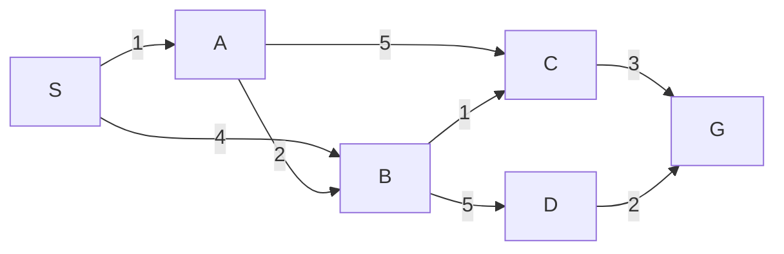

# Search: uninformed, informed and adversarial

> **Paper:** DA · **Priority:** P0 · **Plan topics:** Uninformed search; Informed search; Adversarial search
> **Prerequisites:** [Graph traversals](../08-algorithms/graph-traversals.md) · [Shortest paths](../08-algorithms/shortest-paths.md) · [Heaps](../07-data-structures/heaps.md) · **Leads to:** [Logic and inference](logic-and-inference.md) · [Probabilistic reasoning](probabilistic-reasoning.md)

## Quick glance

- A **search problem** = initial state, actions, transition model, goal test, path cost. A solution is an action sequence; an optimal one has least path cost.
- **Uninformed**: BFS (shallowest first, queue), UCS (least $g$, priority queue), DFS (stack, $O(bm)$ space), DLS, IDS (DFS with growing limit: BFS's completeness and optimality with DFS's $O(bd)$ space), bidirectional ($O(b^{d/2})$).
- **Informed**: greedy best-first orders by $h(n)$ (not optimal); **A\*** orders by $f=g+h$; optimal if $h$ is **admissible** ($h\le h^*$) for tree search and **consistent** ($h(n)\le c(n,n')+h(n')$) for graph search. Consistent $\Rightarrow$ admissible.
- $h=0$ turns A\* into UCS. A larger admissible $h$ (dominance) expands no more nodes.
- **Adversarial**: minimax on a game tree; **alpha-beta** prunes without changing the root value; best case $O(b^{m/2})$ with perfect move ordering, worst case $O(b^m)$.
- Local search (hill climbing, simulated annealing) keeps one state and ignores the path.
- #1 trap: apply the **goal test when a node is expanded** (popped), not when generated, for UCS/A\*; and know the tie-breaking rule used in a trace question.

## 1. Problem formulation

**State space** (graph of states), **actions** $A(s)$, **transition** $\text{Result}(s,a)$, **step cost** $c(s,a,s')\ge0$, **goal test**. Branching factor $b$, solution depth $d$ (shallowest goal), maximum depth $m$.

**Tree search vs graph search.** Tree search may re-expand a state reached by several paths (and loops forever on cycles). **Graph search** keeps an **explored/closed set** and skips states already expanded. Generic loop: pick a node from the **frontier (open list)**, goal-test it, expand it, add children.

| Strategy = frontier data structure | |
| --- | --- |
| BFS | FIFO queue |
| DFS | LIFO stack |
| UCS | priority queue by $g$ |
| Greedy | priority queue by $h$ |
| A\* | priority queue by $f=g+h$ |

**Measures**: completeness (finds a solution if one exists), optimality (least cost), time and space complexity (nodes generated/stored).

## 2. Uninformed search

| Algorithm | Complete? | Optimal? | Time | Space |
| --- | --- | --- | --- | --- |
| BFS | yes (finite $b$) | yes if all step costs equal | $O(b^d)$ | $O(b^d)$ |
| UCS | yes if every step cost $\ge\varepsilon>0$ | yes | $O(b^{1+\lfloor C^*/\varepsilon\rfloor})$ | same |
| DFS | no in infinite/cyclic tree search; yes in finite graph search | no | $O(b^m)$ | $O(bm)$ |
| Depth-limited (limit $\ell$) | no if $\ell<d$ | no | $O(b^\ell)$ | $O(b\ell)$ |
| Iterative deepening (IDS) | yes | yes if equal step costs | $O(b^d)$ | $O(bd)$ |
| Bidirectional BFS | yes | yes (unit cost) | $O(b^{d/2})$ | $O(b^{d/2})$ |

**Why IDS is not wasteful.** Nodes at depth $d$ are generated once, at depth $d-1$ twice, ... : $N_{IDS}=(d+1)+d\,b+(d-1)b^2+\dots+b^d$. For $b=10$, $d=5$: $6+50+400+3000+20000+100000=123{,}456$ versus $111{,}111$ for BFS up to depth 5. The overhead is about 11%: most work is at the deepest level.

**Worked trace.** Directed weighted graph (children expanded in alphabetical order; start $S$, goal $G$):



*BFS (graph search, goal test on expansion).* Frontier queue:
- Expand $S$ $\to$ queue $[A,B]$; expand $A$ $\to$ $[B,C]$ ($B$ already in frontier); expand $B$ $\to$ $[C,D]$; expand $C$ $\to$ $[D,G]$; expand $D$; expand $G$ = goal.
- **Expansion order: S, A, B, C, D, G.** Path found: $S\to A\to C\to G$ (fewest edges = 3), **cost $1+5+3=9$, not the cheapest** (BFS ignores weights).

*DFS (stack, alphabetical).* Expansion order: **S, A, B, C, G**; path $S\to A\to B\to C\to G$ (cost 7 here by luck). DFS stack depth never exceeds the path length.

*UCS (expand lowest $g$).* $S(0)$; then $A(1)$, $B(4)$; expand $A$: $B$ improves to $g=3$, $C(6)$; expand $B(3)$: $C$ improves to $4$, $D(8)$; expand $C(4)$: $G(7)$; expand $G(7)$.
**Order: S, A, B, C, G; optimal cost 7 via $S\to A\to B\to C\to G$.**

## 3. Informed search

**Heuristic** $h(n)$ = estimated cost from $n$ to a goal, $h(\text{goal})=0$.
- **Admissible**: $h(n)\le h^*(n)$ (never overestimates the true remaining cost).
- **Consistent (monotone)**: $h(n)\le c(n,n')+h(n')$ for every edge: a triangle inequality. Consistent $\Rightarrow$ admissible (induction from the goal) $\Rightarrow$ $f$ is **non-decreasing along any path**, so when A\* expands a node it has already found the optimal $g$ to it.
- Example heuristics (8-puzzle): $h_1$ = misplaced tiles, $h_2$ = sum of Manhattan distances. Both admissible; $h_2\ge h_1$ everywhere: **$h_2$ dominates $h_1$**, so A\* with $h_2$ never expands more nodes. Heuristics from **relaxed problems** are admissible.

**Greedy best-first** (order by $h$): fast, **not optimal, not complete in tree search** (loops), $O(b^m)$ worst case.

**A\*** (order by $f=g+h$).

**Worked trace (same graph).** $h$: $S=6$, $A=5$, $B=3$, $C=3$, $D=2$, $G=0$. True costs $h^*$: $S=7$, $A=6$, $B=4$, $C=3$, $D=2$. So $h\le h^*$ everywhere (admissible). Consistency: edge checks e.g. $h(S)=6\le1+h(A)=6$ ✓, $h(A)=5\le2+h(B)=5$ ✓, $h(B)=3\le1+h(C)=4$ ✓, $h(B)=3\le5+h(D)$ ✓, $h(C)=3\le3+0$ ✓, $h(D)=2\le2+0$ ✓, $h(S)\le4+h(B)=7$ ✓, $h(A)\le5+h(C)$ ✓: consistent.

*Greedy*: expand $S$ (children $A:h5$, $B:h3$); lowest $h$ is $B$; expand $B$ ($C:3$, $D:2$) $\to$ $D$; expand $D$ $\to$ $G$. **Order: S, B, D, G; cost $4+5+2=11$ (not optimal).**

*A\** (open list shows $(\text{node},g,f)$):

| Step | Expand | Open after expansion | Closed |
| --- | --- | --- | --- |
| 0 | — | $(S,0,6)$ | — |
| 1 | $S$ | $(A,1,6),(B,4,7)$ | $S$ |
| 2 | $A$ | $(B,3,6)$ [improved], $(C,6,9)$ | $S,A$ |
| 3 | $B$ | $(C,4,7)$ [improved], $(D,8,10)$ | $S,A,B$ |
| 4 | $C$ | $(G,7,7),(D,8,10)$ | $S,A,B,C$ |
| 5 | $G$ | goal popped: **cost 7** | |

**Expansion order: S, A, B, C, G**; path $S\to A\to B\to C\to G$, cost 7, optimal. $D$ is never expanded because $f(D)=10>7$.

*Inadmissible heuristic*: set $h(B)=9$ (true $h^*(B)=4$). $f(B)=3+9=12$ so $B$ is shelved; A\* expands $S,A,C,G$ and returns cost $1+5+3=9$: **suboptimal**.

**Optimality conditions.**

| Setting | Needs |
| --- | --- |
| A\* tree search | $h$ admissible |
| A\* graph search (no re-opening) | $h$ consistent (or re-open closed nodes on improvement) |
| Completeness | finite $b$, step costs $\ge\varepsilon$ |

A\* expands every node with $f<C^*$, some with $f=C^*$, none with $f>C^*$. Space is exponential (all generated nodes stored): **IDA\*** does iterative deepening on an $f$-cutoff to get $O(bd)$ space.

**Local search.** Keep only the current state; useful when the path does not matter (8-queens, scheduling).
- **Hill climbing**: move to the best neighbour; stop when none is better. Can get stuck at local maxima, ridges, plateaus. Random restarts help.
- **Simulated annealing**: accept a worse move with probability $e^{\Delta E/T}$ ($\Delta E<0$), lowering $T$ over time. E.g. $\Delta E=-2$, $T=1$: $e^{-2}=0.135$. A slow enough cooling schedule reaches the global optimum with probability $\to1$.
- **Beam search**: keep the best $k$ states per level; incomplete.

## 4. Adversarial search (games)

**Setting.** Two players, **zero-sum**, perfect information, alternating moves. **MAX** maximises the utility, **MIN** minimises it. Game tree with terminal utilities.

**Minimax value**: leaf = utility; MAX node = max of children; MIN node = min of children. Optimal play against an optimal opponent. Time $O(b^m)$, space $O(bm)$ (DFS). Complete for finite trees.

**Worked example.** Root MAX, then MIN, then MAX, then 8 leaves left to right: $3,5,\ 6,9,\ 1,2,\ 0,-1$.

```text
              MAX
           /        \
        MIN          MIN
       /   \        /    \
    MAX    MAX    MAX    MAX
   /  \   /  \   /  \   /  \
  3   5  6   9  1   2  0   -1
```

- Lowest MAX layer: $\max(3,5)=5$, $\max(6,9)=9$, $\max(1,2)=2$, $\max(0,-1)=0$.
- MIN layer: $\min(5,9)=5$, $\min(2,0)=0$.
- Root: $\max(5,0)=\mathbf5$. Best move: left.

**Alpha-beta pruning.** Maintain $\alpha$ = best (largest) value MAX can already guarantee on the path, $\beta$ = best (smallest) value MIN can guarantee. At a node: **if $\alpha\ge\beta$, stop exploring its remaining children** (the node cannot influence the root). It returns the **same root value** as minimax.

Trace (left-to-right), values as $(\alpha,\beta)$:
1. Root $(-\infty,\infty)\to$ left MIN $\to$ left MAX: leaf $3$ ($\alpha=3$), leaf $5$ (value 5). Returns 5.
2. Left MIN: $\beta=5$. Next child MAX with $(-\infty,5)$: leaf $6$ gives value $\ge6$, so $\alpha=6\ge\beta=5$: **prune leaf $9$**. Returns $6$; MIN value $\min(5,6)=5$.
3. Root: $\alpha=5$. Right MIN $(5,\infty)$ $\to$ MAX $(5,\infty)$: leaf 1, then leaf 2 $\to$ value 2. Right MIN: $\beta=2\le\alpha=5$: **prune the whole second MAX subtree (leaves $0,-1$)**.
4. Root value $5$.

Leaves evaluated: $3,5,6,1,2$ (5 of 8); **pruned: $9,0,-1$**. Note leaves $1$ and $2$ could not be pruned: the pruning test only fires once a value beyond the bound is seen.

**Move ordering.** Best case (best moves first): $O(b^{m/2})$, i.e. doubling the searchable depth. Random ordering: about $O(b^{3m/4})$. Worst case (worst moves first): no pruning, $O(b^m)$. If we reverse the order of children in the example, more pruning may occur; the root value stays 5.

**Beyond.** Depth-limited minimax with an evaluation function for large games; **expectiminimax** adds **chance nodes** whose value is the probability-weighted average of children: e.g. a chance node with outcomes $(0.5\to3,\ 0.5\to7)$ has value $5$. Alpha-beta pruning needs bounds on the evaluation range with chance nodes.

## Formulas and facts to memorise

| Item | Formula/fact | When to use |
| --- | --- | --- |
| BFS | $O(b^d)$ time & space; optimal for unit cost | table questions |
| DFS | $O(b^m)$ time, $O(bm)$ space | memory questions |
| IDS | $O(b^d)$ time, $O(bd)$ space | memory + optimality |
| Bidirectional | $O(b^{d/2})$ | complexity |
| UCS | expand min $g$; $b^{1+\lfloor C^*/\varepsilon\rfloor}$ | weighted graphs |
| A\* | $f=g+h$ | traces |
| Admissible | $h\le h^*$ | tree-search optimality |
| Consistent | $h(n)\le c(n,n')+h(n')$ | graph-search optimality |
| Dominance | $h_2\ge h_1$ $\Rightarrow$ A\* with $h_2$ expands $\le$ nodes | heuristic comparison |
| Minimax | $O(b^m)$ time, $O(bm)$ space | game trees |
| Alpha-beta | best case $O(b^{m/2})$; prune when $\alpha\ge\beta$ | pruning questions |
| Annealing | accept worse with $e^{\Delta E/T}$ | local search |

## GATE traps

- BFS finds the **shallowest** goal, not the cheapest; it is optimal only for equal step costs.
- DFS is **not** complete (infinite or cyclic spaces in tree search) and **not** optimal, but has tiny memory.
- UCS/A\* test the goal when a node is **popped**, not generated; testing early can return a suboptimal path.
- Tie-breaking (alphabetical, FIFO among equal $f$) determines the reported expansion order: use the rule stated.
- Admissible does not imply consistent. A\* graph search without re-opening needs consistency.
- With $h=0$ A\* behaves as UCS; with $h=h^*$ it expands only nodes on an optimal path (ties aside). **Inadmissible $h$ can give suboptimal answers.**
- Greedy best-first minimises $h$ only; it is neither optimal nor (in tree search) complete.
- Alpha-beta never changes the minimax value, only the work. Pruning decisions are tested with $\alpha\ge\beta$ (equality prunes); child order matters.
- Alpha-beta cannot prune at the first child of a node when $\alpha,\beta$ are still infinite.
- Hill climbing is incomplete (local maxima); simulated annealing escapes via downhill moves.

## Connections

- [Graph traversals](../08-algorithms/graph-traversals.md) — BFS/DFS are the uninformed searches, with the same queue/stack.
- [Shortest paths](../08-algorithms/shortest-paths.md) — UCS is Dijkstra's algorithm; A\* is Dijkstra with a heuristic potential (a consistent $h$ makes reduced edge weights non-negative).
- [Heaps](../07-data-structures/heaps.md) — the priority queue behind UCS, greedy and A\*.
- [Trees and BSTs](../07-data-structures/trees-and-bst.md) — game trees and search trees; node counts with branching factor $b$.
- [Asymptotic analysis](../08-algorithms/asymptotic-analysis.md) — the exponential growth $b^d$ vs $b^{d/2}$, geometric-series arguments.
- [Logic and inference](logic-and-inference.md) — inference as search (resolution, backward chaining) with the same completeness concerns.
- [Probabilistic reasoning](probabilistic-reasoning.md) — expectiminimax averages over chance nodes; sampling vs exact inference mirrors local vs systematic search.
- [Clustering](../16-machine-learning/clustering.md) — random restarts and local optima appear in k-means too.

## Practice

**Q1 (NAT).** Branching factor $b=3$, shallowest goal at depth $d=3$. How many nodes does BFS generate, including the root, if it generates all nodes up to depth 3? 

<details><summary>Answer</summary>

**Answer:** 40. **Solution:** $1+3+9+27=40$.

</details>

**Q2 (MCQ).** Which uninformed search is complete and optimal for equal step costs and uses $O(bd)$ memory? (a) BFS (b) DFS (c) IDS (d) bidirectional BFS.

<details><summary>Answer</summary>

**Answer:** (c). **Solution:** IDS combines both properties with DFS-like memory.

</details>

**Q3 (NAT).** Iterative deepening with $b=2$, $d=3$: how many nodes are generated in total (counting every regeneration)?

<details><summary>Answer</summary>

**Answer:** 26. **Solution:** $(d+1)+d\,b+(d-1)b^2+b^3\cdot1=4+6+8+8=26$.

</details>

**Q4 (MCQ).** A\* graph search with a heuristic that is admissible but **not** consistent (and no re-opening of closed nodes) (a) is always optimal (b) may return a suboptimal path (c) never terminates (d) is equivalent to BFS.

<details><summary>Answer</summary>

**Answer:** (b). **Solution:** a closed node may have been reached by a non-optimal path; consistency prevents this.

</details>

**Q5 (NAT).** On the graph of this chapter, with greedy best-first search and the given $h$, how many nodes (including $S$ and $G$) are expanded?

<details><summary>Answer</summary>

**Answer:** 4. **Solution:** expansion order $S,B,D,G$; $G$ is popped as goal. (The path cost 11 is not optimal.)

</details>

**Q6 (NAT).** Using the minimax tree from section 4 but with leaves $4,7,\ 2,9,\ 5,1,\ 8,6$, what is the root value?

<details><summary>Answer</summary>

**Answer:** 7. **Solution:** MAX layer: $\max(4,7)=7$, $\max(2,9)=9$, $\max(5,1)=5$, $\max(8,6)=8$. MIN layer: $\min(7,9)=7$, $\min(5,8)=5$. Root $\max(7,5)=7$.

</details>

**Q7 (NAT).** In the same tree ($4,7,2,9,5,1,8,6$) with alpha-beta left to right, how many leaves are evaluated?

<details><summary>Answer</summary>

**Answer:** 6. **Solution:** left MIN: first MAX gives $7$ (leaves 4,7), $\beta=7$; second MAX with $(-\infty,7)$: leaf 2, then leaf 9 gives $9\ge7$ so it needs to evaluate both (leaf 2 gives only $\alpha=2<7$, leaf 9 gives $\alpha=9\ge\beta$, nothing remains to prune). Left MIN value $7$. Right MIN $(\alpha=7)$: first MAX $(7,\infty)$: leaf 5 then leaf 1 $\to5$; MIN $\beta=5\le7$: prune the second MAX (leaves 8, 6). Leaves evaluated: $4,7,2,9,5,1=6$; pruned: $8,6$.

</details>

**Q8 (MSQ).** Which statements are true? (a) Consistent heuristics are admissible. (b) UCS is A\* with $h=0$. (c) DFS tree search is complete on finite acyclic trees. (d) Alpha-beta can change the minimax root value.

<details><summary>Answer</summary>

**Answer:** (a), (b), (c). **Solution:** (d) is false: pruning only skips branches that cannot affect the root value.

</details>
