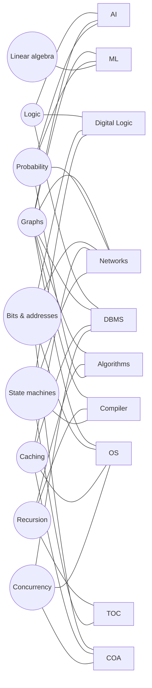

# Connections — the same ideas across subjects

GATE subjects are not separate boxes. About fifteen core ideas keep coming back under different names. Once you have learned an idea in one subject, you have half-learned it everywhere else it appears. This page lists each recurring idea ("thread"), shows where it turns up, and says what carries over. Every chapter's own **Connections** list points back into these threads.



---

## 1. Logic: one algebra, four costumes

**What carries over:** truth tables, De Morgan's laws, CNF/DNF and quantifiers are the same objects in every subject. Only the notation changes.

Where | What it is called there | Link
--- | --- | ---
Discrete Maths | Propositional connectives, tautologies, equivalences | [propositional-logic](01-discrete-mathematics/propositional-logic.md)
Digital Logic | Boolean algebra; minterms = DNF terms, maxterms = CNF clauses; NAND/NOR = functionally complete sets | [boolean-algebra-and-minimization](09-digital-logic/boolean-algebra-and-minimization.md)
Discrete Maths | First-order logic: ∀, ∃, nested quantifiers | [first-order-logic](01-discrete-mathematics/first-order-logic.md)
DBMS | Tuple relational calculus *is* first-order logic over tuples; SQL `NOT EXISTS` encodes ∀ ("for all courses…" = "there is no course that…") | [relational-model-algebra-calculus](14-databases/relational-model-algebra-calculus.md), [sql](14-databases/sql.md)
DBMS | SQL `NULL` uses three-valued logic: `UNKNOWN` breaks two-valued laws such as "p ∨ ¬p is always true" | [sql](14-databases/sql.md)
AI | Knowledge bases, entailment, resolution refutation, unification | [logic-and-inference](17-artificial-intelligence/logic-and-inference.md)
Compiler | Short-circuit evaluation of boolean expressions | [intermediate-code-generation](12-compiler-design/intermediate-code-generation.md)
C | `&&`, `||` short-circuit; bitwise `& | ^ ~` act as Boolean algebra on each bit | [c-basics-and-expressions](05-c-programming/c-basics-and-expressions.md)

**Example:** "Every student has taken some course" is `∀s ∃c Took(s,c)`. In TRC this becomes `{s | Student(s) ∧ ∃c (Course(c) ∧ Took(s,c))}`. "A student who has taken *every* course" becomes relational-algebra division, or a double `NOT EXISTS` in SQL. All three are the same quantifier pattern.

---

## 2. Graphs: the most reused structure in the syllabus

**What carries over:** vertices, edges, paths, cycles, DAGs and traversal. If you can run BFS, DFS, Dijkstra and topological sort in your sleep, half of OS, DBMS, CN, Compiler and AI questions become graph questions.

Graph idea | Appears as | Link
--- | --- | ---
Degree, connectivity, colouring, matching | Pure graph theory | [graph-theory](01-discrete-mathematics/graph-theory.md)
Adjacency matrix vs list | Cost of every graph algorithm | [graphs](07-data-structures/graphs.md)
BFS / DFS | Traversals; uninformed search in AI (BFS, DFS, iterative deepening) | [graph-traversals](08-algorithms/graph-traversals.md), [search](17-artificial-intelligence/search.md)
Dijkstra | Shortest paths; **link-state routing** (every router runs Dijkstra); **uniform-cost search** in AI; A* is Dijkstra plus a heuristic | [shortest-paths](08-algorithms/shortest-paths.md), [routing](15-computer-networks/routing.md), [search](17-artificial-intelligence/search.md)
Bellman–Ford | **Distance-vector routing** is distributed Bellman–Ford; count-to-infinity happens because it is distributed | [shortest-paths](08-algorithms/shortest-paths.md), [routing](15-computer-networks/routing.md)
MST (Kruskal) | **Single-linkage clustering** merges clusters in the same order Kruskal adds edges, so cutting the MST gives the clusters | [minimum-spanning-trees](08-algorithms/minimum-spanning-trees.md), [clustering](16-machine-learning/clustering.md)
Cycle detection | **Deadlock** = cycle in the resource-allocation / wait-for graph; **non-serializable** schedule = cycle in the precedence graph | [deadlocks](13-operating-systems/deadlocks.md), [transactions-and-concurrency](14-databases/transactions-and-concurrency.md)
Topological sort | Serial order equivalent to a conflict-serializable schedule; evaluation order of attributes in SDTs; linear extension of a poset | [graph-traversals](08-algorithms/graph-traversals.md), [syntax-directed-translation](12-compiler-design/syntax-directed-translation.md), [posets-and-lattices](01-discrete-mathematics/posets-and-lattices.md)
Graph colouring | **Register allocation** = colouring the interference graph; minimum registers = chromatic number | [graph-theory](01-discrete-mathematics/graph-theory.md), [optimization-and-dataflow](12-compiler-design/optimization-and-dataflow.md)
Directed graph of blocks | **Control-flow graph** of basic blocks; data-flow analysis iterates over it | [intermediate-code-generation](12-compiler-design/intermediate-code-generation.md)
Labelled directed graph | **Finite automata** are graphs whose edges carry symbols | [regular-languages-and-finite-automata](11-theory-of-computation/regular-languages-and-finite-automata.md)
DAG + probabilities | **Bayesian networks**; d-separation is a reachability question | [probabilistic-reasoning](17-artificial-intelligence/probabilistic-reasoning.md)
DAG for expressions | DAG representation of basic blocks finds **common subexpressions** | [optimization-and-dataflow](12-compiler-design/optimization-and-dataflow.md)

---

## 3. Recursion, recurrences and stacks

**What carries over:** a recursive program, a recurrence relation, a recursion tree, a call stack and a pushdown automaton are five views of one mechanism.

```text
 C/Python recursive function  ──trace──►  recursion tree  ──count──►  recurrence T(n)
          │                                                              │
     each call pushes                                              solve with
     an activation record                                    characteristic roots /
          ▼                                                     Master theorem
   runtime stack (compiler)  ◄──same LIFO──►  stack DS  ◄──same LIFO──►  PDA (TOC)
```

Where | Role | Link
--- | --- | ---
C / Python | Tracing recursive output; counting calls | [functions-recursion-structures](05-c-programming/functions-recursion-structures.md), [python-oop-recursion-tracing](06-python-programming/python-oop-recursion-tracing.md)
Discrete Maths | Solving recurrences; counting with recurrences (e.g. bit strings with no "00" follow Fibonacci) | [recurrences-and-generating-functions](01-discrete-mathematics/recurrences-and-generating-functions.md)
Algorithms | Master theorem; divide-and-conquer; DP = recursion + memo table | [asymptotic-analysis](08-algorithms/asymptotic-analysis.md), [divide-and-conquer](08-algorithms/divide-and-conquer.md), [dynamic-programming](08-algorithms/dynamic-programming.md)
Data Structures | Stack; infix→postfix; recursion ↔ explicit stack | [arrays-stacks-queues](07-data-structures/arrays-stacks-queues.md)
Compiler | Activation records; recursive-descent parsing; static vs dynamic scoping | [runtime-environments](12-compiler-design/runtime-environments.md), [parsing](12-compiler-design/parsing.md)
TOC | A PDA is a finite automaton plus one stack. That stack is exactly what lets it match aⁿbⁿ or balanced parentheses | [context-free-languages-and-pda](11-theory-of-computation/context-free-languages-and-pda.md)

---

## 4. Trees everywhere

**What carries over:** a tree on n nodes has n − 1 edges, and a balanced tree with fan-out f and N leaves has height ≈ log_f N. That second fact explains B+ trees, multilevel page tables, inode indirect blocks and the DNS hierarchy.

Tree | Subject | Link
--- | --- | ---
Free trees, Cayley's formula, spanning trees | Discrete Maths | [graph-theory](01-discrete-mathematics/graph-theory.md)
Binary trees, BST, AVL, heaps | Data Structures | [trees-and-bst](07-data-structures/trees-and-bst.md), [heaps](07-data-structures/heaps.md)
Catalan numbers: distinct BSTs, stack permutations, matrix-chain parenthesisations | DM ↔ DS ↔ Algorithms | [combinatorics](01-discrete-mathematics/combinatorics.md)
Recursion trees; Huffman trees; decision-tree lower bound for sorting | Algorithms | [asymptotic-analysis](08-algorithms/asymptotic-analysis.md), [greedy-algorithms](08-algorithms/greedy-algorithms.md), [searching-and-sorting](08-algorithms/searching-and-sorting.md)
B / B+ trees (high fan-out, disk blocks) | DBMS | [file-organization-and-indexing](14-databases/file-organization-and-indexing.md)
Multilevel page tables; UNIX inode indirect blocks | OS | [memory-management](13-operating-systems/memory-management.md), [file-systems-and-disk-scheduling](13-operating-systems/file-systems-and-disk-scheduling.md)
Parse trees, syntax trees, annotated parse trees | TOC, Compiler | [context-free-languages-and-pda](11-theory-of-computation/context-free-languages-and-pda.md), [syntax-directed-translation](12-compiler-design/syntax-directed-translation.md)
Decision trees (entropy splits); dendrograms | ML | [classification-methods](16-machine-learning/classification-methods.md), [clustering](16-machine-learning/clustering.md)
Game trees (minimax, alpha–beta); search trees | AI | [search](17-artificial-intelligence/search.md)
DNS namespace; concept hierarchies (city → state → country) | CN, Data Warehousing | [application-layer](15-computer-networks/application-layer.md), [data-warehousing-and-preprocessing](14-databases/data-warehousing-and-preprocessing.md)

---

## 5. Counting and probability

**What carries over:** the counting techniques of discrete maths become the probability of the uniform case. Linearity of expectation with indicator variables then solves "expected number of …" questions in any subject.

Use | Link
--- | ---
Permutations, combinations, stars and bars, inclusion–exclusion, derangements | [combinatorics](01-discrete-mathematics/combinatorics.md)
Counting relations / functions on n elements ↔ counting Boolean functions (2^(2^n)) ↔ counting super keys | [sets-relations-functions](01-discrete-mathematics/sets-relations-functions.md), [boolean-algebra-and-minimization](09-digital-logic/boolean-algebra-and-minimization.md), [relational-model-algebra-calculus](14-databases/relational-model-algebra-calculus.md)
Probability, Bayes, expectation | [probability-basics](02-probability-statistics/probability-basics.md), [random-variables-and-moments](02-probability-statistics/random-variables-and-moments.md)
Expected probes in hashing; expected collisions (birthday problem) | [hashing](08-algorithms/hashing.md)
Randomised quicksort expected comparisons | [searching-and-sorting](08-algorithms/searching-and-sorting.md)
Slotted/pure ALOHA throughput (binomial → Poisson); CSMA/CD backoff | [data-link-layer](15-computer-networks/data-link-layer.md)
Naive Bayes = Bayes' theorem + conditional independence | [classification-methods](16-machine-learning/classification-methods.md)
Bayesian networks, variable elimination, sampling | [probabilistic-reasoning](17-artificial-intelligence/probabilistic-reasoning.md)
Page-fault rate and cache hit ratio enter as probabilities in effective access time | [virtual-memory](13-operating-systems/virtual-memory.md), [memory-hierarchy-and-cache](10-computer-organization/memory-hierarchy-and-cache.md)

---

## 6. Bits, addresses and splitting a number into fields

**What carries over:** one skill, used constantly. Take an n-bit number and split it into fields of known widths. 2^k items need k bits, and a field of k bits addresses 2^k things.

Split | Fields | Link
--- | --- | ---
Cache address | tag \| index (set) \| block offset | [memory-hierarchy-and-cache](10-computer-organization/memory-hierarchy-and-cache.md)
Virtual address | page number(s) per level \| page offset | [memory-management](13-operating-systems/memory-management.md)
IPv4 address with CIDR /k | network prefix (k bits) \| host part (32 − k bits) | [ipv4-addressing](15-computer-networks/ipv4-addressing.md)
Instruction word | opcode \| mode \| register \| address; expanding opcodes | [instruction-sets-and-addressing](10-computer-organization/instruction-sets-and-addressing.md)
Microinstruction | control fields \| condition \| next address | [alu-and-control-unit](10-computer-organization/alu-and-control-unit.md)
IEEE 754 float | sign \| biased exponent \| mantissa | [number-representation-and-arithmetic](09-digital-logic/number-representation-and-arithmetic.md)
B+ tree node in a disk block | p pointers + (p − 1) keys must fit in one block | [file-organization-and-indexing](14-databases/file-organization-and-indexing.md)
Memory chips | address lines = log₂(words); chips = total ÷ chip size; decoder for chip select | [memory-hierarchy-and-cache](10-computer-organization/memory-hierarchy-and-cache.md)

Related: two's complement and overflow show up again in C integer behaviour ([c-basics-and-expressions](05-c-programming/c-basics-and-expressions.md)). CRC is polynomial division with XOR, the same mod-2 arithmetic as Boolean XOR ([data-link-layer](15-computer-networks/data-link-layer.md)).

---

## 7. Caching and locality

**What carries over:** the formula `effective time = hit × fast + miss × (slow [+ fast])` and the same replacement policies (FIFO, LRU, optimal) appear at every level of the system.

Level | Cache of … | Link
--- | --- | ---
CPU cache | main memory | [memory-hierarchy-and-cache](10-computer-organization/memory-hierarchy-and-cache.md)
TLB | page table | [memory-management](13-operating-systems/memory-management.md)
Main memory under virtual memory | disk; page replacement = cache replacement; Belady's anomaly | [virtual-memory](13-operating-systems/virtual-memory.md)
Database buffer pool and B+ tree upper levels | disk blocks | [file-organization-and-indexing](14-databases/file-organization-and-indexing.md)
DNS resolver cache (TTL), HTTP caches / conditional GET | remote servers | [application-layer](15-computer-networks/application-layer.md)
Memoization in DP; `functools.lru_cache` in Python | recomputation | [dynamic-programming](08-algorithms/dynamic-programming.md), [python-oop-recursion-tracing](06-python-programming/python-oop-recursion-tracing.md)

Row-major array traversal hits the cache and column-major traversal misses. This ties [arrays-stacks-queues](07-data-structures/arrays-stacks-queues.md) to the cache chapter.

---

## 8. Concurrency, conflicts and ordering

**What carries over:** two operations conflict when they touch the same item and at least one of them writes. That one rule defines pipeline hazards, race conditions, conflict serializability and data dependences.

Conflict | COA pipeline | OS | DBMS | Compiler
--- | --- | --- | --- | ---
Read after write | RAW hazard (true dependence) | race on shared variable | W→R conflict edge | flow dependence
Write after read | WAR hazard (anti-dependence) | race | R→W conflict edge | anti-dependence
Write after write | WAW hazard (output dependence) | lost update | W→W conflict edge | output dependence

Links: [pipelining](10-computer-organization/pipelining.md) · [synchronization](13-operating-systems/synchronization.md) · [transactions-and-concurrency](14-databases/transactions-and-concurrency.md) · [optimization-and-dataflow](12-compiler-design/optimization-and-dataflow.md).

Deadlock has the same four conditions in the OS ([deadlocks](13-operating-systems/deadlocks.md)) and under DBMS two-phase locking. Wait-die and wound-wait are deadlock *prevention* by ordering, just as the OS breaks circular wait by ordering resources.

---

## 9. State machines

**What carries over:** a set of states, transitions on inputs, and possibly outputs.

Machine | Subject | Link
--- | --- | ---
DFA / NFA, minimisation | TOC | [regular-languages-and-finite-automata](11-theory-of-computation/regular-languages-and-finite-automata.md)
Mealy / Moore machines, counters, sequence detectors | Digital Logic | [sequential-circuits](09-digital-logic/sequential-circuits.md)
Lexer = DFA built from token regexes | Compiler | [lexical-analysis](12-compiler-design/lexical-analysis.md)
LR parser = DFA of item sets plus a stack (so: a PDA) | Compiler ↔ TOC | [parsing](12-compiler-design/parsing.md)
Process state diagram (new, ready, running, waiting, terminated) | OS | [processes-threads-syscalls](13-operating-systems/processes-threads-syscalls.md)
Transaction states (active, partially committed, committed, failed, aborted) | DBMS | [transactions-and-concurrency](14-databases/transactions-and-concurrency.md)
TCP connection states; congestion-control phases (slow start, avoidance, fast recovery) | CN | [transport-layer-tcp](15-computer-networks/transport-layer-tcp.md)
Microprogram sequencer / hardwired control state counter | COA | [alu-and-control-unit](10-computer-organization/alu-and-control-unit.md)

---

## 10. Relations, orders and lattices

**What carries over:** a relation is a set of tuples, and an order relation gives you a Hasse diagram.

Idea | Appears as | Link
--- | --- | ---
Relation ⊆ A × B | A **table** in the relational model is literally a relation; Cartesian product and joins are set operations | [sets-relations-functions](01-discrete-mathematics/sets-relations-functions.md), [relational-model-algebra-calculus](14-databases/relational-model-algebra-calculus.md)
Functions | **Functional dependencies** X → Y ("X determines Y" = Y is a function of X) | [constraints-and-normalization](14-databases/constraints-and-normalization.md)
Closure of a relation | **Attribute closure** X⁺; transitive closure = reachability (Floyd–Warshall / Warshall) | [constraints-and-normalization](14-databases/constraints-and-normalization.md), [shortest-paths](08-algorithms/shortest-paths.md)
Equivalence relations / partitions | **DFA minimisation** merges equivalent states (Myhill–Nerode); connected components; union–find in Kruskal | [regular-languages-and-finite-automata](11-theory-of-computation/regular-languages-and-finite-automata.md), [minimum-spanning-trees](08-algorithms/minimum-spanning-trees.md)
Partial orders | Topological sort; precedence graphs; happens-before; concept hierarchies in data warehousing | [posets-and-lattices](01-discrete-mathematics/posets-and-lattices.md)
Lattices | Data-flow analysis runs on a lattice (the constant-propagation lattice); Boolean algebra is a complemented distributive lattice | [optimization-and-dataflow](12-compiler-design/optimization-and-dataflow.md), [boolean-algebra-and-minimization](09-digital-logic/boolean-algebra-and-minimization.md)
Countability and diagonalisation | The halting problem uses the same diagonal argument as "the reals are uncountable" | [sets-relations-functions](01-discrete-mathematics/sets-relations-functions.md), [turing-machines-and-undecidability](11-theory-of-computation/turing-machines-and-undecidability.md)

---

## 11. Linear algebra inside machine learning

**What carries over:** almost every DA model is a matrix computation.

ML idea | Linear-algebra fact underneath | Links
--- | --- | ---
Least-squares linear regression | ŷ = Py with projection matrix P = X(XᵀX)⁻¹Xᵀ; normal equations | [orthogonality-projections-svd](03-linear-algebra/orthogonality-projections-svd.md) → [linear-and-logistic-regression](16-machine-learning/linear-and-logistic-regression.md)
Ridge regression | XᵀX + λI is always invertible for λ > 0: every eigenvalue shifts up by λ | [eigenvalues-and-eigenvectors](03-linear-algebra/eigenvalues-and-eigenvectors.md) → [linear-and-logistic-regression](16-machine-learning/linear-and-logistic-regression.md)
PCA | Eigenvectors of the covariance matrix = right singular vectors of the centred data | [eigenvalues-and-eigenvectors](03-linear-algebra/eigenvalues-and-eigenvectors.md), [orthogonality-projections-svd](03-linear-algebra/orthogonality-projections-svd.md) → [dimensionality-reduction-pca](16-machine-learning/dimensionality-reduction-pca.md)
Data compression | Low-rank SVD approximation | [orthogonality-projections-svd](03-linear-algebra/orthogonality-projections-svd.md) → [data-warehousing-and-preprocessing](14-databases/data-warehousing-and-preprocessing.md)
Neural network layer | y = σ(Wx + b); a stack of purely linear layers collapses to a single matrix | [neural-networks](16-machine-learning/neural-networks.md)
Convexity of the loss | Positive semidefinite Hessian / quadratic form ≥ 0 | [matrices-and-determinants](03-linear-algebra/matrices-and-determinants.md), [maxima-minima-optimization](04-calculus-optimization/maxima-minima-optimization.md)
Covariance, correlation | Covariance matrix is symmetric PSD | [random-variables-and-moments](02-probability-statistics/random-variables-and-moments.md)

---

## 12. Optimisation

Idea | Where | Link
--- | --- | ---
f′(x) = 0, second-derivative test, convexity | Calculus | [maxima-minima-optimization](04-calculus-optimization/maxima-minima-optimization.md)
Gradient descent on squared / cross-entropy loss | Regression, logistic regression, backpropagation | [linear-and-logistic-regression](16-machine-learning/linear-and-logistic-regression.md), [neural-networks](16-machine-learning/neural-networks.md)
Maximise the margin | SVM | [classification-methods](16-machine-learning/classification-methods.md)
Minimise within-cluster distance | k-means (coordinate descent; local optimum only) | [clustering](16-machine-learning/clustering.md)
Greedy vs dynamic programming | Discrete optimisation: when a local choice is safe (cut property, exchange argument) and when you must tabulate | [greedy-algorithms](08-algorithms/greedy-algorithms.md), [dynamic-programming](08-algorithms/dynamic-programming.md)
Maximise the probability of the data (MLE) | Logistic regression, naive Bayes, Gaussian fitting | [ml-foundations](16-machine-learning/ml-foundations.md)

---

## 13. Statistics in the data pipeline (DA)

Pre-processing step | Statistics behind it | Links
--- | --- | ---
z-score normalisation | Standardising a random variable, Z = (X − μ)/σ | [data-warehousing-and-preprocessing](14-databases/data-warehousing-and-preprocessing.md) ↔ [continuous-distributions](02-probability-statistics/continuous-distributions.md)
Feature scaling for k-NN / SVM / PCA | Distances and variances depend on units | [classification-methods](16-machine-learning/classification-methods.md), [dimensionality-reduction-pca](16-machine-learning/dimensionality-reduction-pca.md)
Sampling (SRS, stratified, cluster) | Sampling distributions, CLT, confidence intervals | [statistical-inference](02-probability-statistics/statistical-inference.md)
Approximate inference by sampling | Law of large numbers, rejection sampling, likelihood weighting | [probabilistic-reasoning](17-artificial-intelligence/probabilistic-reasoning.md)
Discretisation / binning | Histograms; decision-tree split points; entropy-based binning | [classification-methods](16-machine-learning/classification-methods.md)
Entropy | Decision-tree information gain ↔ Huffman's average code length (entropy is the lower bound) | [greedy-algorithms](08-algorithms/greedy-algorithms.md)
Measures: distributive / algebraic / holistic | Sum and count are distributive; mean = sum/count is algebraic; median is holistic | [data-warehousing-and-preprocessing](14-databases/data-warehousing-and-preprocessing.md)

---

## 14. Search, from arrays to AI

Binary search on a sorted array → BST search → B+ tree search (one disk block per level) → BFS/DFS on graphs → uninformed search (BFS, UCS, DFS, IDS) → informed search (A*) → adversarial search (minimax, alpha–beta). Each step adds one idea: ordering, then branching, then disk-awareness, then arbitrary graphs, then costs, then heuristics, then an opponent.
Links: [searching-and-sorting](08-algorithms/searching-and-sorting.md) · [trees-and-bst](07-data-structures/trees-and-bst.md) · [file-organization-and-indexing](14-databases/file-organization-and-indexing.md) · [graph-traversals](08-algorithms/graph-traversals.md) · [search](17-artificial-intelligence/search.md).

---

## 15. Queues and scheduling

The queue data structure ([arrays-stacks-queues](07-data-structures/arrays-stacks-queues.md)) is the ready queue in CPU scheduling ([cpu-scheduling](13-operating-systems/cpu-scheduling.md)) and the frontier in BFS. It is also the router buffer behind queuing delay ([layering-switching-performance](15-computer-networks/layering-switching-performance.md)) and the request queue in disk scheduling ([file-systems-and-disk-scheduling](13-operating-systems/file-systems-and-disk-scheduling.md)). A priority queue (heap) runs Dijkstra, Prim, Huffman, SJF/priority scheduling and A*.

---

## Same word, different meaning (a common source of lost marks)

Word | Meaning A | Meaning B | Meaning C
--- | --- | --- | ---
Normalisation | DB schema decomposition into 1NF…BCNF ([constraints-and-normalization](14-databases/constraints-and-normalization.md)) | Scaling data values: min–max, z-score ([data-warehousing-and-preprocessing](14-databases/data-warehousing-and-preprocessing.md)) | Normalised floating-point mantissa ([number-representation-and-arithmetic](09-digital-logic/number-representation-and-arithmetic.md))
Independence | Linear independence of vectors | Statistical independence of events/RVs | Conditional independence in Bayesian networks
Projection | π in relational algebra (pick columns) | Orthogonal projection of a vector onto a subspace | Projecting data onto principal components
Selection | σ in relational algebra (pick rows) | Selection sort | Selecting the k-th smallest element
Kernel | OS kernel (privileged mode) | Null space of a matrix | SVM kernel function
Heap | Heap data structure (priority queue) | Heap memory region (malloc) | —
Frame | Page frame in physical memory | Data-link layer frame | Stack frame (activation record)
Segment | Memory segmentation | TCP segment | —
Window | TCP sliding / congestion window | Sliding-window protocols at the data link layer | —
Pipelining | Instruction pipelining (COA) | HTTP pipelining over a persistent connection | —
Partition | Quicksort partition step | Partition of a set (equivalence classes) | Variable partitions in memory allocation
Consistency | ACID consistency (invariants hold) | Consistent heuristic in A* (h(n) ≤ c(n,n′) + h(n′)) | —
Logic | Propositional / first-order logic | Digital logic circuits | AI knowledge representation
Order (of a B-tree) | Max children per node (most common GATE usage) | Min children / keys, in some textbooks | Order of a group element (DM)

[Roadmap](ROADMAP.md) · [Coverage](COVERAGE.md) · [Progress](PROGRESS.md)
