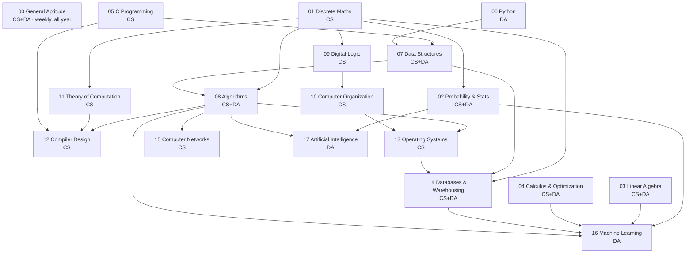

# Roadmap

The order follows the Master Study Plan: **Mathematics → Programming → Algorithms → CS Core → Systems → Data Science & AI**. Read the arrows as "is used by", not "must be finished before". You can start Data Structures while Linear Algebra is still in progress. Before starting a subject, though, finish the P0 chapters of everything that points into it.

## Phase plan

Phase | Sections (plan order) | Exit check
--- | --- | ---
**1 · Mathematics** | [01 Discrete](01-discrete-mathematics/README.md) → [02 Probability](02-probability-statistics/README.md) → [03 Linear Algebra](03-linear-algebra/README.md) → [04 Calculus](04-calculus-optimization/README.md) | Each section's CHECKPOINT ≥ 70%. You can count relations/functions, apply Bayes, find eigenvalues fast, and check continuity/differentiability.
**2 · Programming** | [05 C](05-c-programming/README.md) (CS) · [06 Python](06-python-programming/README.md) (DA) | You trace pointer, static-variable, and recursion programs without running them.
**3 · Algorithms** | [07 Data Structures](07-data-structures/README.md) → [08 Algorithms](08-algorithms/README.md) | You solve recurrences, build heaps/BSTs by hand, and trace Dijkstra/Prim/Kruskal/DP tables.
**4 · CS Core** | [09 Digital Logic](09-digital-logic/README.md) → [10 COA](10-computer-organization/README.md) → [11 TOC](11-theory-of-computation/README.md) → [12 Compiler](12-compiler-design/README.md) | You compute cache splits, pipeline stalls, minimal DFAs, and LR tables.
**5 · Systems** | [13 OS](13-operating-systems/README.md) → [14 DBMS](14-databases/README.md) → [15 CN](15-computer-networks/README.md) | You do Gantt charts, page faults, Banker's, normalization, serializability, subnetting, and TCP windows.
**6 · Data Science & AI** | [16 ML](16-machine-learning/README.md) → [17 AI](17-artificial-intelligence/README.md) | You can run k-means/linkage/PCA by hand, trace A* and alpha-beta, and do variable elimination.
**All year** | [00 General Aptitude](00-general-aptitude/README.md) | 2–3 short sessions a week; 15 easy marks.

## Paper-specific tracks

Both papers share Probability, Linear Algebra, Calculus, Data Structures, Algorithms and DBMS (the `CS+DA` sections). If you are writing both papers, study the shared sections once, at the depth the DA paper needs: DA goes deeper into statistics, linear algebra and warehousing.

- **CS only:** 00 → 01 → 02 → 03 → 04 → 05 → 07 → 08 → 09 → 10 → 11 → 12 → 13 → 14 → 15. Skip 06, 16, 17, and the warehousing chapter of 14.
- **DA only:** 00 → 02 → 03 → 04 → 06 → 07 → 08 → 14 → 16 → 17. Discrete maths is not in DA, but [propositional](01-discrete-mathematics/propositional-logic.md) and [first-order logic](01-discrete-mathematics/first-order-logic.md) support AI logic, and [combinatorics](01-discrete-mathematics/combinatorics.md) supports counting in probability.

## Revision cycles

1. **Cycle 1 (learning):** chapter by chapter, with Practice questions and PYQs per topic.
2. **Cycle 2 (consolidation):** CHECKPOINT per section; re-read only chapters you scored poorly on; full-subject PYQs by year.
3. **Cycle 3 (speed):** CHEATSHEETs + GATE traps lists + full-length mocks under time. See [EXAM-STRATEGY.md](EXAM-STRATEGY.md).

[Connections](CONNECTIONS.md) · [Coverage](COVERAGE.md) · [Progress](PROGRESS.md) · [Cheat sheets](CHEATSHEETS.md)
